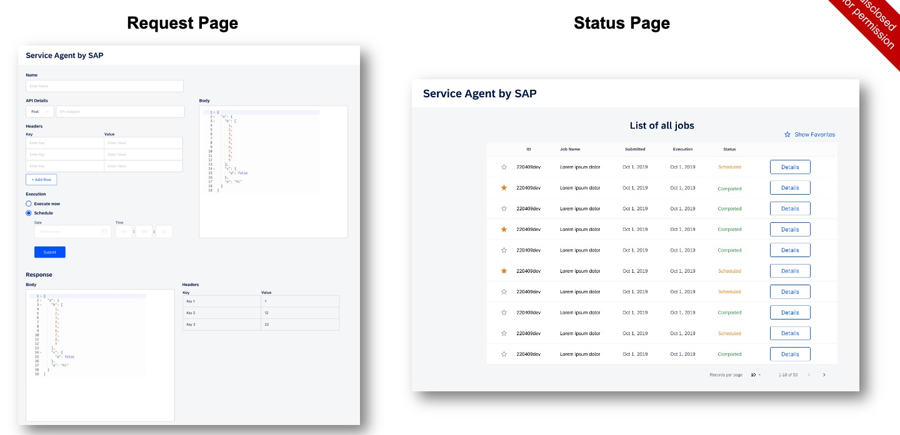

# event-service-agent-kata

## Requirements

### User Story

**As a user,**

- I need a multi-tenancy agent executing service calls in a unified way supporting at least one message protocol (e.g. HTTP).
- I need a user interface allowing me to trigger immediate and defined scheduled calls including execution status.
- I want to be able to filter already created service calls and tag the important ones to find them more easily.
  

### Base Assumptions

- free choice of technologies and frameworks for the implementation
- Outgoing requests are mocked to be able to test the service agent offline
- Existing (web-)services can be used to demo real requests

## User Interface Mockup



---

## Design

- [Domain](./docs/design/domain.md) (Problem Space)
- [Modules & Interactions](./docs/design/modules-and-interactions.md) (Solution Space)
  - [API Module](./docs/design/modules/api.md)
  - [Orchestration Module](./docs/design/modules/orchestration.md)
  - [Execution Module](./docs/design/modules/execution.md)
  - [Timer Module](./docs/design/modules/timer.md)

- [Ports](./docs/design/ports.md)
- [Messages Catalog](./docs/design/messages.md)

---

## Architectural Decision Records (ADRs)

- [README](./docs/decisions/README.md)

---

## Plan

- [Plan](./docs/plan/plan.md)
- [Kanban](./docs/plan/kanban.md)

---

## Development

### Prerequisites

This project uses **Bun** (>=1.3.0) as the runtime and package manager. See [devEngines](./package.json) for specific version requirements.

### Installation

```bash
bun install
```

### Available Scripts

- `bun run test` - Run tests in watch mode
- `bun run test --run` - Run tests once (CI mode)
- `bun run type-check` - TypeScript type checking across all workspaces
- `bun run lint` - Lint code with Biome
- `bun run format` - Format code with Biome
- `bun run check` - Run Biome checks with auto-fix
- `bun run doc-check` - Validate TSDoc documentation (see below)
- `bun run doc-check:examples` - Type-check code examples in JSDoc/TSDoc blocks (see below)

### Documentation Validation

This project uses **Deno's doc tooling** to validate TSDoc comments and `@example` blocks, even though the project runs on Bun. This approach:

- **Prevents documentation rot**: Ensures code examples in documentation stay in sync with API changes
- **Validates `@example` blocks**: Checks TypeScript syntax in documentation examples
- **Type-checks documentation examples**: Validates that code in JSDoc blocks is type-correct with `deno check --doc-only`
- **Catches missing documentation**: Identifies public APIs without proper JSDoc
- **Leverages best-in-class tooling**: Uses Deno's built-in documentation validation without adding Node.js/Bun dependencies

**Running locally:**

```bash
# Requires Deno 2.5+ to be installed

# Validate JSDoc structure and completeness
bun run doc-check

# Type-check code examples in documentation
bun run doc-check:examples
```

**In CI**: Documentation validation runs automatically in pull request workflows:

- `doc-check` - Validates JSDoc structure (configured as `continue-on-error: true`)
- `doc-check:examples` - Type-checks code examples in JSDoc blocks (configured as `continue-on-error: true`)

**Future directions**: As the ecosystem matures, we may migrate to native Bun/Node.js solutions or extract `@example` blocks as executable unit tests.
