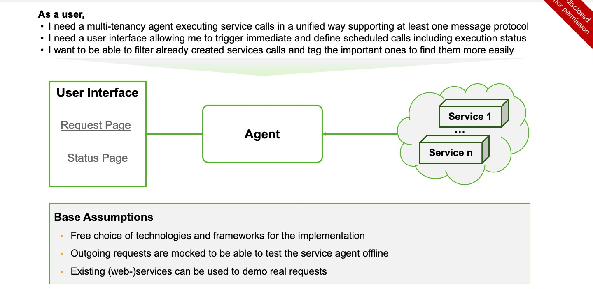

# event-service-agent-kata

## Requirements

### User Story

**As a user,**

- I need a multi-tenancy agent executing service calls in a unified way supporting at least one message protocol (e.g. HTTP).
- I need a user interface allowing me to trigger immediate and defined scheduled calls including execution status.
- I want to be able to filter already created service calls and tag the important ones to find them more easily.
  

### Base Assumptions

- free choice of technologies and frameworks for the implementation
- Outgoing requests are mocked to be able to test the service agent offline
- Existing (web-)services can be used to demo real requests

## User Interface Mockup

---

## Design

- [Domain](./docs/design/domain.md) (Problem Space)
- [Bounded Contexts](./docs/design/bounded-contexts.md) (Solution Space)

  - [API Context](./docs/design/contexts/api.md)
  - [Orchestration Context](./docs/design/contexts/orchestration.md)
  - [Execution Context](./docs/design/contexts/execution.md)
  - [Timer Context](./docs/design/contexts/timer.md)

- [Ports](./docs/design/ports.md)
- [Messages Catalog](./docs/design/messages.md)

---

## Architectural Decision Records (ADRs)

- [README](./docs/decisions/README.md)

---

## Plan

- [Plan](./docs/plan/plan.md)
- [Kanban](./docs/plan/kanban.md)
