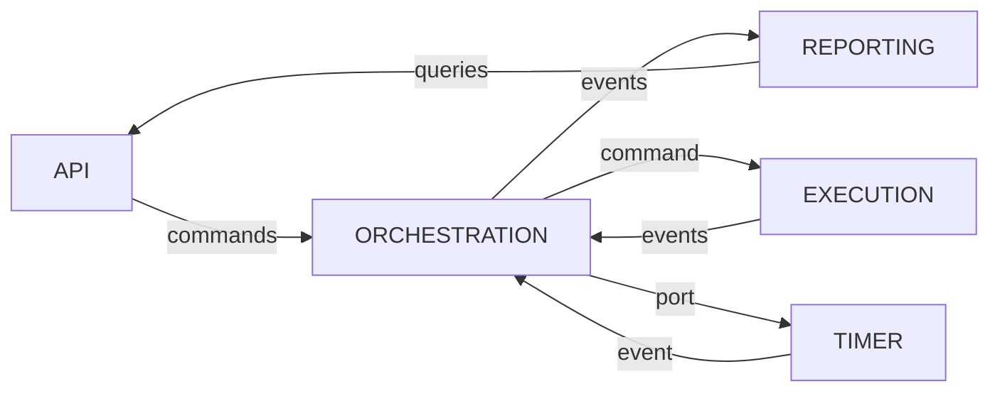
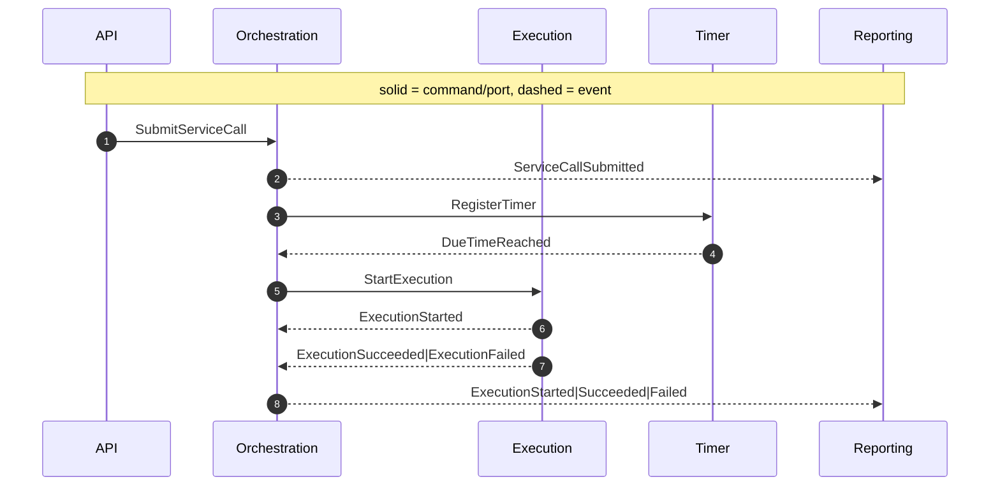
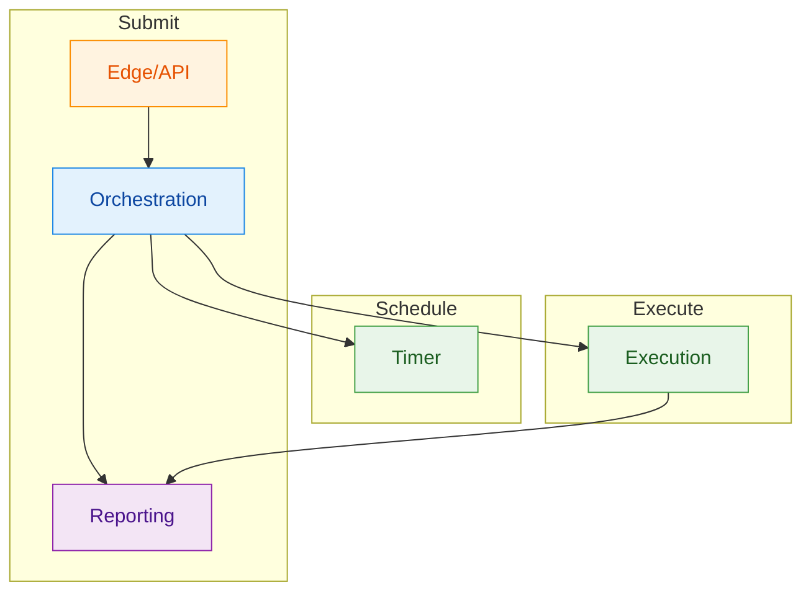

# Bounded Contexts

Overview

- [Edge/API] (Delivery): Handles HTTP, validation, mapping to domain commands and queries.
- [Orchestration] (Core): Owns `ServiceCall` lifecycle and cross-cutting policies.
- [Execution] (Supporting/Supplier): Performs actual HTTP call and outcome capture.
- [Timer] (Infrastructure/Supplier): Schedules and emits [DueTimeReached].
- [Reporting] (Read/Conformist): Builds read models for queries.

Context Map

Swimlane (Roles & Flows)

Responsibility Matrix (lightweight)

- API: validation, idempotency surface, HTTP mapping
- Orchestration: invariants, policy, idempotency, state transitions
- Execution: HTTP call, response/error mapping
- Timer: due handling
- Reporting: projections

Message Index

- Orchestration:
  - [SubmitServiceCall],
  - [ServiceCallSubmitted],
  - [ServiceCallScheduled],
  - [StartExecution],
  - [RegisterTimer]
- Execution:
  - [StartExecution],
  - [ExecutionStarted],
  - [ExecutionSucceeded],
  - [ExecutionFailed]
- Timer:
  - [RegisterTimer],
  - [DueTimeReached]
- Reporting: consumes all domain events (see above), no commands
- API (Edge): produces [SubmitServiceCall]

ES-first MVP Note

- Events are the source of truth in the event store; consumers subscribe and update projections.
- Repository is optional for snapshotting; add only if rebuild becomes expensive.

Ports Used (overview)

- Orchestration: [Clock], [EventStore], [Timer](./ports.md#timerport), [Repository] (optional)
- Execution: [HttpClient], [EventStore], [Clock]
- Timer: [Clock], [EventStore]
- Reporting: [EventStore], [ReadStore]
- API: [ReadStore]

[DueTimeReached]: ./messages.md#duetimereached
[ExecutionFailed]: ./messages.md#executionfailed
[ExecutionStarted]: ./messages.md#executionstarted
[ExecutionSucceeded]: ./messages.md#executionsucceeded
[RegisterTimer]: ./messages.md#registertimer
[ServiceCallScheduled]: ./messages.md#servicecallscheduled
[ServiceCallSubmitted]: ./messages.md#servicecallsubmitted
[StartExecution]: ./messages.md#startexecution
[SubmitServiceCall]: ./messages.md#submitservicecall
[Edge/API]: ./contexts/api.md
[Execution]: ./contexts/execution.md
[Orchestration]: ./contexts/orchestration.md
[Reporting]: ./contexts/reporting.md
[Timer]: ./contexts/timer.md
[Clock]: ./ports.md#clockport
[EventStore]: ./ports.md#eventstoreport
[HttpClient]: ./ports.md#httpclientport
[ReadStore]: ./ports.md#readstore
[Repository]: ./ports.md#repository
