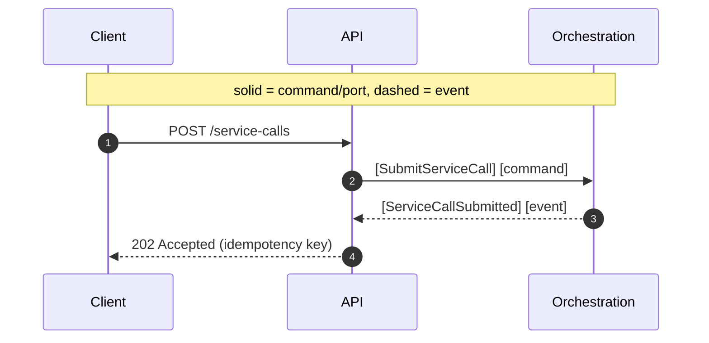
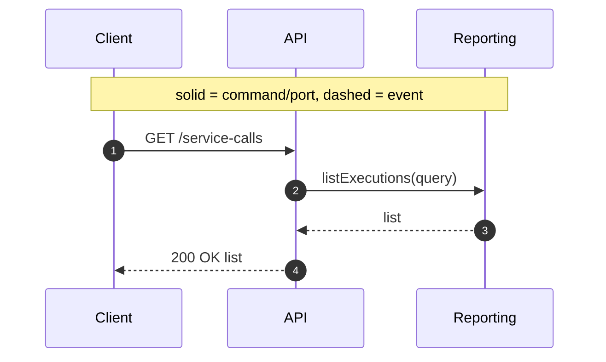

# API (Edge) Context (Contracted)

Responsibility

- Accept external requests, validate, map to commands/queries.

Interfaces

- POST `/api/tenants/:tenantId/service-calls` [SubmitServiceCall]
- GET `/api/tenants/:tenantId/service-calls` (list with filters)
- GET `/api/tenants/:tenantId/service-calls/:serviceCallId` (detail)

Sequence (Submit)

Sequence (Query List)

Inputs/Outputs Recap

- Inputs: HTTP requests (submit, list, detail)
- Outputs: HTTP responses
- Ports: `Reporting` (queries via ReadStore)

Messages

- [SubmitServiceCall]
- [ServiceCallSubmitted]

## Ports Used

- [ReadStore] (via Reporting): see `../ports.md#readstore`

[SubmitServiceCall]: ../messages.md#submitservicecall
[ServiceCallSubmitted]: ../messages.md#servicecallsubmitted
[ReadStore]: ../ports.md#readstore
