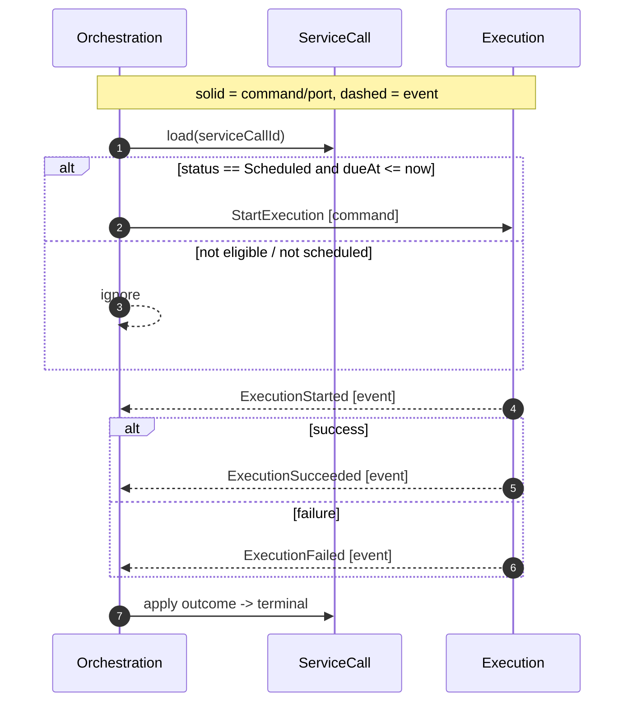

# Orchestration Context (Contracted)

Responsibility

- Own the `ServiceCall` lifecycle and invariants.
- Decide scheduling, guard start conditions, and finalize outcomes.

Core Model

- **Aggregate**: ServiceCall
  - Identity: `(tenantId, serviceCallId)`
  - State: name, submittedAt, dueAt, requestSpec, status (Scheduled|Running|Succeeded|Failed), tags, startedAt?, finishedAt?, outcome meta
  - Invariants: single attempt, legal transitions, terminal immutability, dueAt eligibility

Commands (intent)

- [SubmitServiceCall] `{ tenantId, name, dueAt, requestSpec, tags? }`
- [StartExecution] `{ tenantId, serviceCallId }` (issued to Execution as a command)

Events (facts)

- [ServiceCallSubmitted] `{ name, requestSpec\*, submittedAt, tags? }`
- [ServiceCallScheduled] `{ dueAt }`
- [ExecutionStarted] `{ startedAt }`
- [ExecutionSucceeded] `{ finishedAt, responseMeta }`
- [ExecutionFailed] `{ finishedAt, errorMeta }`

Policies

- On [ServiceCallScheduled]:
  IF `dueAt <= now`
  THEN publish [DueTimeReached];
  ELSE [RegisterTimer].
- On [DueTimeReached]:
  IF `status == Scheduled` AND `dueAt <= now`
  THEN issue [StartExecution].
- On outcomes: apply to drive terminal state.

Ports

- EventStore.append(event)
- TimerPort.schedule({ id, tenantId, dueTimeMs })
- Clock.now() for guards
- Repository (optional): load/save snapshots if needed

Read Side (collaboration)

- Reporting consumes events to build Executions List and Execution Detail models.

Out-of-Scope (here)

- HTTP specifics, retry policies, cancellation.

Acceptance (MVP)

- For any submitted ServiceCall, the context ensures exactly one of Succeeded/Failed is eventually reached and observable.

Sequence (Scheduled → StartExecution → Outcome)

Inputs/Outputs Recap

- Inputs:
  - [SubmitServiceCall] (command),
  - [DueTimeReached] (event),
  - [ExecutionStarted] OR [ExecutionSucceeded] OR [ExecutionFailed] (events)
- Outputs:
  - [ServiceCallSubmitted] (event),
  - [ServiceCallScheduled] (event),
  - [StartExecution] (command),
  - [RegisterTimer] (port effect)
- Ports: [EventStore], [TimerPort], [Clock], [Repository] (optional)
- Read Side: none directly (Reporting consumes events)

Messages

- [SubmitServiceCall]
- [ServiceCallSubmitted]
- [ServiceCallScheduled]
- [StartExecution]
- [RegisterTimer]
- [DueTimeReached]

Load from stream

- On handling commands or due events, Orchestration reconstructs the `ServiceCall` by loading its stream from `EventStorePort` and folding events in order to current state. If available, a recent snapshot (via optional `Repository`) may be read first, then remaining events applied. This keeps writes append-only and ensures invariants derive solely from the event history.

[SubmitServiceCall]: ../messages.md#submitservicecall
[ServiceCallSubmitted]: ../messages.md#servicecallsubmitted
[ServiceCallScheduled]: ../messages.md#servicecallscheduled
[StartExecution]: ../messages.md#startexecution
[RegisterTimer]: ../messages.md#registertimer
[DueTimeReached]: ../messages.md#duetimereached
[ExecutionStarted]: ../messages.md#executionstarted
[ExecutionSucceeded]: ../messages.md#executionsucceeded
[ExecutionFailed]: ../messages.md#executionfailed
[EventStore]: ../ports.md#eventstoreport
[TimerPort]: ../ports.md#timerport
[Clock]: ../ports.md#clockport
[Repository]: ../ports.md#repository
