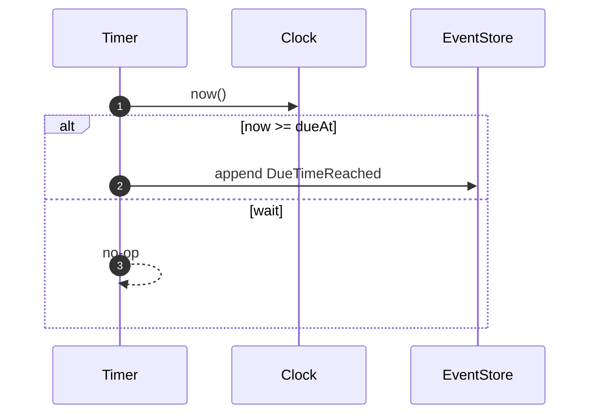

# Timer Context (Contracted)

Responsibility

- Track future due times and emit [DueTimeReached] when time arrives.

Model

- TimerEntry: `(tenantId, serviceCallId, dueAt, registeredAt, status)`

Policies

- On [RegisterTimer]: store or update TimerEntry keyed by `(tenantId, serviceCallId)` with `dueAt`.
- Scheduler loop: at tick, for entries with `dueAt <= now` and `status == armed`, publish [DueTimeReached] and mark as fired.

Ports

- Clock.now() to evaluate eligibility
- EventStore.append([DueTimeReached]) on fire
- EventStore.subscribe(fromPosition) to drive the scheduler or to ingest [RegisterTimer] if modeled as an event

Sequence (Register → Due → Publish)

Inputs/Outputs

- Inputs: [RegisterTimer]
- Outputs: [DueTimeReached]
- Ports:
  - [Clock]
  - [EventStore]

[RegisterTimer]: ../messages.md#registertimer
[DueTimeReached]: ../messages.md#duetimereached
[Clock]: ../ports.md#clockport
[EventStore]: ../ports.md#eventstoreport
