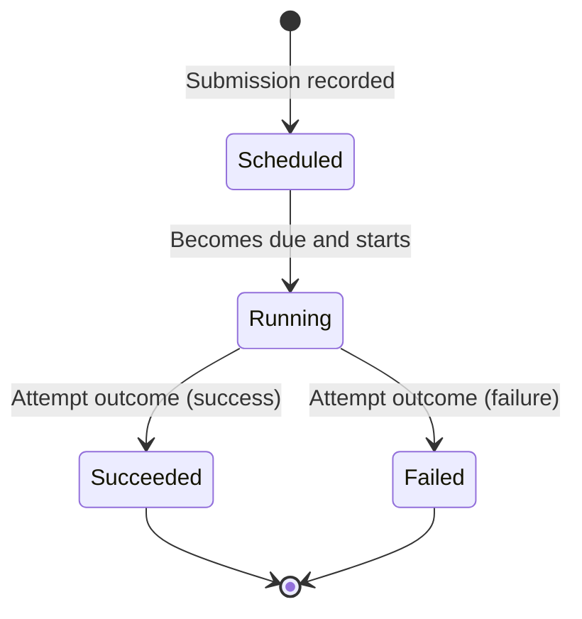

# Domain (Problem Space)

Purpose

- Contract the discovery into problem-space essentials: constraints, core concepts, and high-level workflows, independent of implementation or solution structures.

Constraints (MVP)

- Single attempt per Service Call; no retries/cancellations.
- HTTP is the only supported protocol.
- Due time semantics: execute at/after `dueAt`; if `dueAt <= now`, eligible immediately.
- Multi-tenancy: every action is tenant-scoped; all queries filter by `tenantId`.
- Minimal persistence of bodies/headers (size-limited snippets; redaction allowed).
- Event-driven, at-least-once delivery tolerance (design-time constraint).

Core Concepts (Ubiquitous Language)

- **Tenant**: logical owner of Service Calls.
- **Service Call**: intention to invoke an external service with a request spec and a due time.
- **Due Time** (`dueAt`): earliest instant at which execution may start.
- **Execution**: the single attempt to perform the Service Call.
- **Outcome/Status**: Scheduled | Running | Succeeded | Failed.
- **Tag**: label(s) associated at submission for later filtering.

Glossary (Problem-Space)

- Intention: the user’s desire to have a call executed.
- Eligibility: the condition that time has reached or passed `dueAt`.
- Attempt: one try to turn intention into an outcome.
- Outcome: the terminal result of an attempt (Succeeded/Failed).

> [!NOTE] **Tenancy**
>
> - **Scope**:
>   All operations are tenant-scoped.
>   Every command, event, and query includes `tenantId`.
>   Cross-tenant access is not permitted.
> - **Identity**:
>   The primary business identity is `(tenantId, serviceCallId)`.
>   Idempotency keys are per-tenant.
> - **Isolation**:
>   Read models and stores are logically partitioned by `tenantId`
>   Physical isolation (DB per tenant) is not required for MVP but must remain feasible.
> - **Storage/indexing**:
>   All primary indexes include `tenantId` first;
>   common secondary indexes: `(tenantId, status)`, `(tenantId, dueAt)`, `(tenantId, tags)`.
> - **Messaging**:
>   Topics/queues are either shared with `tenantId` in message envelopes or logically partitioned per tenant.
>   Consumers must filter by `tenantId`.
> - **API/auth**:
>   Authentication/authorization is out-of-scope for MVP;
>   however, all API routes embed `:tenantId` and handlers enforce scoping and idempotency within the tenant.
> - **Timers**:
>   Registrations carry `(tenantId, serviceCallId, dueAt)`.
>   Timer emissions include `tenantId` to preserve scoping on wakeup.
> - **Observability**:
>   Logs/metrics/traces annotate `tenantId` for correlation;

High-Level Workflows

- **Submission**
  - A tenant submits a Service Call with `name`, `requestSpec`, `dueAt`, and optional `tags`.
  - The system records the intent and marks it Scheduled.
- **Scheduling**
  - The system ensures a timer exists for `dueAt` (or treats it as due now).
- **Becoming Due**
  - At/after `dueAt`, the Service Call becomes eligible to start.
- **Execution**
  - Exactly one attempt is performed, producing either success (response metadata) or failure (error metadata).
- **Observation**
  - The tenant can list and filter calls by status, tags, and date; a detail view shows request/response summaries and timings.

Business State Diagram (Problem-Space)

Quality Attributes

- Correctness: one attempt; legal transitions only.
- Observability: state transitions represented as facts (events); projections for UI.
- Evolvability: protocol-agnostic value objects, timers and IO behind ports (not elaborated here).

Out-of-Scope (MVP)

- Retries/backoff, cancellation, editing requests, CRON-like schedules, authentication/egress policy.
