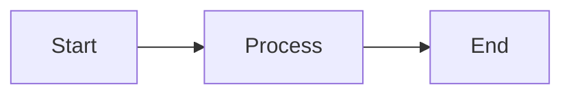

# Contributing Guide

[← Back to Documentation Home](index.md)

---

## Development Setup

### Prerequisites

This project uses **Bun** (>=1.3.0) as the runtime and package manager. See [devEngines](../package.json) for specific version requirements.

#### Option 1: Nix + direnv (Recommended)

The project includes a Nix flake that provides a reproducible development environment with all required tools (Bun, Deno, Biome).

**Setup:**

1. Install [Nix](https://nixos.org/download.html) with flakes enabled
2. Install [direnv](https://direnv.net/docs/installation.html)
3. Run `direnv allow` in the project root

The `.envrc` file automatically loads the Nix development shell when you enter the project directory. This ensures everyone uses the exact same tool versions.

**What it provides:**

- Bun 1.3+ runtime and package manager
- Deno 2.5+ for documentation validation
- Biome for code formatting and linting

See [`flake.nix`](../flake.nix) for the complete environment definition.

#### Option 2: Manual Installation

Alternatively, install the required tools manually:

### Installation

```bash
bun install
```

## Available Scripts

### Testing

- `bun run test` - Run tests in watch mode
- `bun run test --run` - Run tests once (CI mode)

### Type Checking

- `bun run type-check` - TypeScript type checking across all workspaces

### Linting

- `bun run lint` - Lint code with Biome
- `bun run check` - Run Biome checks with auto-fix

### Formatting

The project uses a **goal-based formatting pipeline** that orchestrates multiple tools to handle different contexts:

**Quick Reference:**

- `bun run format:code` - **Fast** (IDE/development) - Format source code only (~2s)
- `bun run format:docs` - Format documentation only (JSDoc + Markdown)
- `bun run format:all` - **Comprehensive** (CI/pre-commit) - Format everything (~10s)

**Atomic Scripts** (for targeted formatting):

- `bun run format:ts` - Format TypeScript/JavaScript/JSON source with Biome
- `bun run format:jsdoc` - Format JSDoc prose with Prettier
- `bun run format:jsdoc:examples` - Validate `@example` blocks with Deno
- `bun run format:markdown:structure` - Lint Markdown syntax with markdownlint
- `bun run format:markdown:prose` - Format Markdown prose with Prettier
- `bun run format:markdown:code` - Validate Markdown code blocks with Deno

**When to use which:**

- **During development**: `bun run format:code` (fast, source-only)
- **Before committing docs**: `bun run format:docs` (documentation-only)
- **Before pushing/CI**: `bun run format:all` (comprehensive validation)

See [Formatting Pipeline Design](./design/formatting-pipeline.md) for complete rationale and tool orchestration details.

### Documentation Validation

- `bun run docs:check` - Validate TSDoc documentation (see below)
- `bun run docs:test` - Run code examples in JSDoc/TSDoc `@example` blocks as tests
- `bun run docs:type-check` - Type-check code examples in JSDoc/TSDoc blocks (see below)
- `bun run docs:type-check:md` - Type-check TypeScript code blocks in markdown files
- `bun run docs:lint` - Lint markdown files with markdownlint

## Documentation Validation

This project uses **Deno's doc tooling** to validate TSDoc comments and `@example` blocks, even though the project runs on Bun. This approach:

- **Prevents documentation rot**: Ensures code examples in documentation stay in sync with API changes
- **Validates `@example` blocks**: Checks TypeScript syntax in documentation examples
- **Type-checks documentation examples**: Validates that code in JSDoc blocks is type-correct with `deno check --doc-only`
- **Catches missing documentation**: Identifies public APIs without proper JSDoc
- **Leverages best-in-class tooling**: Uses Deno's built-in documentation validation without adding Node.js/Bun dependencies

### Configuration

The repository includes a `deno.json` configuration file that defines:

- File inclusion/exclusion patterns (automatically excludes test files and vitest configs)
- Deno tasks for documentation validation
- Formatting and linting rules specific to Deno

This means doc validation commands automatically know which files to check without needing to specify glob patterns.

### Running Documentation Validation Locally

```bash
# Requires Deno 2.5+ to be installed

# Validate JSDoc structure and completeness
bun run docs:check
# Or directly with Deno
deno task docs:check

# Run code examples in JSDoc/TSDoc @example blocks as tests
bun run docs:test
# Or directly with Deno
deno task docs:test

# Type-check code examples in documentation
bun run docs:type-check
# Or directly with Deno
deno task docs:type-check

# Type-check TypeScript code blocks in markdown files
bun run docs:type-check:md
# Or directly with Deno
deno task docs:type-check:md
```

### CI Integration

Documentation validation runs automatically in pull request workflows:

- `docs:check` - Validates JSDoc structure (configured as `continue-on-error: true`)
- `docs:type-check` - Type-checks code examples in JSDoc blocks (configured as `continue-on-error: true`)
- `docs:type-check:md` - Type-checks TypeScript code blocks in markdown files (configured as `continue-on-error: true`)

### Future Directions

As the ecosystem matures, we may migrate to native Bun/Node.js solutions or extract `@example` blocks as executable unit tests.

## Git Hooks

This project uses [Lefthook](https://github.com/evilmartians/lefthook) for managing git hooks.

### Automatic Setup

Hooks are automatically installed when you run:

```bash
bun install
```

### Manual Installation

If hooks aren't working, reinstall them:

```bash
bun run prepare
```

### Pre-commit Hooks

Runs automatically before each commit:

- **Format**: Runs Biome formatter on staged files
- **Check**: Runs Biome linter on staged TypeScript files
- **Docs Check**: Validates documentation when `.md` files change
- **Type Check**: Validates types when `.ts` files change

### Pre-push Hooks

Runs automatically before pushing:

- **Tests**: Runs the full test suite

### Commit Message Validation

Enforces [Conventional Commits](https://www.conventionalcommits.org/):

- `feat: add new feature`
- `fix: resolve bug`
- `docs: update documentation`
- `style: format code`
- `refactor: restructure code`
- `test: add tests`
- `chore: update dependencies`

### Skipping Hooks

To skip hooks temporarily (use sparingly):

```bash
bun run hooks:skip  # Skip for single commit
# or
LEFTHOOK=0 git commit  # Environment variable approach
# or
git commit --no-verify  # Git native approach
```

### Running Hooks Manually

```bash
bun run hooks:run pre-commit  # Run pre-commit checks
bun run hooks:run pre-push    # Run pre-push checks
```

### IDE Integration

All hooks work seamlessly across:

- ✅ WebStorm/IntelliJ IDEA
- ✅ VSCode
- ✅ Cursor
- ✅ Zed

#### VSCode/Cursor Users

For YAML schema autocomplete, the `lefthook.yml` includes:

```yaml
# yaml-language-server: $schema=https://json.schemastore.org/lefthook.json
```

#### WebStorm Users

Enable YAML schema validation:

1. Settings → Languages & Frameworks → YAML → Schemas
2. Add: `https://json.schemastore.org/lefthook.json`
3. Map to: `lefthook.yml`

## Development Workflow

### TDD Cycle

This project follows strict Test-Driven Development (TDD):

1. **🔴 RED**: Write failing test
2. **🟢 GREEN**: Minimum code to pass
3. **🔵 REFACTOR**: Improve without changing behavior

See [Copilot Instructions](../.github/copilot-instructions.md) for detailed TDD workflow and commit discipline.

### Code Quality Gates

Before committing:

- [ ] All tests pass (`bun run test --run`)
- [ ] Type-checking passes (`bun run type-check`)
- [ ] Code is formatted (`bun run format:all`)
- [ ] Code is linted (`bun run check`)
- [ ] Documentation is valid (`bun run docs:check`)
- [ ] Documentation examples type-check (`bun run docs:type-check`)

**Fast pre-commit workflow** (for quick iterations):

```bash
bun run format:code && bun run check && bun run test --run
```

**Comprehensive pre-push workflow** (before CI):

```bash
bun run format:all && bun run check && bun run test --run && bun run type-check
```

## Writing Documentation

### Markdown Files

All documentation is written in Markdown and published to GitHub Pages using Jekyll.

### Mermaid Diagrams

The published documentation supports **Mermaid diagrams** for visualizing architecture, flows, and relationships. Diagrams are rendered client-side using Mermaid.js.

**Usage:** Use standard markdown code blocks with the `mermaid` language identifier:

````markdown

````

**Supported diagram types:**

- Flowcharts
- Sequence diagrams
- Class diagrams
- State diagrams
- Entity relationship diagrams
- And more (see [Mermaid documentation](https://mermaid.js.org/))

**Preview:**

- GitHub renders Mermaid diagrams automatically in markdown files
- Published docs (GitHub Pages) render diagrams client-side using Mermaid.js (similar output to GitHub's rendering)
- Local markdown previews may or may not support Mermaid depending on your editor

**Examples:** See existing ADRs in `docs/decisions/` for real-world examples of Mermaid diagrams.

## Architecture

This project follows Domain-Driven Design (DDD) and Hexagonal Architecture principles:

- **Domain Layer**: Pure business logic (Effect-TS patterns)
- **Application Layer**: Use cases and workflows
- **Infrastructure Layer**: Adapters for external systems

See the [design documentation](./design/) for detailed architecture guidelines.
