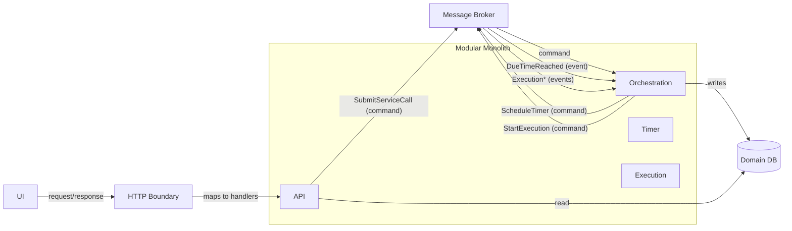
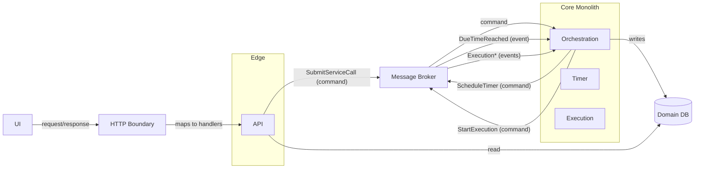
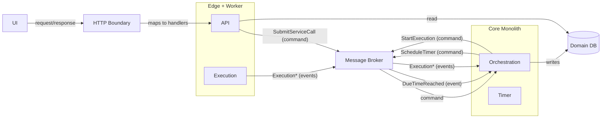
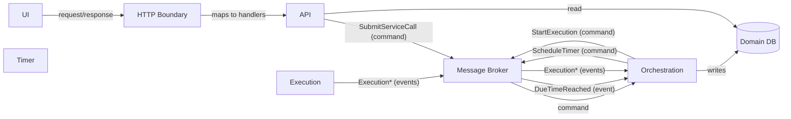

# ADR-0001: Topology — Modular Monolith vs Minimal Services

Status: Proposed

## Problem

- Decide the initial deployment topology for the Service Agent bounded context and define internal boundaries (which modules are inside the deployable vs outside), balancing evolvability with MVP simplicity.

## Context

- **Modules**: API (edge), Orchestration (single writer), Execution (worker), Timer, adapters (DB, Bus, Outbox). See [Modules & Interactions][modules] and [Domain][domain].
- **Constraints** (from design): single attempt; HTTP only; Orchestration is the only writer; DB is source of truth; outbox after-commit events; at-least-once delivery; per-aggregate ordering by `(tenantId, serviceCallId)`; multi-tenancy everywhere. See [Ports][ports] and [Messages][messages].
- **Preferences/assumptions**: real message broker from day one (no ad-hoc in-memory bus for production behavior); SQLite acceptable for MVP given single-writer pattern.
- **Gates**: Gate 01 (this ADR) precedes Gate 02 (Broker family) and Gate 03 (Timer strategy); topology impacts both.

### Evaluation Criteria

- **Operability**: simplicity for MVP and local demos; CI/dev ergonomics.
- **Single-writer + outbox locality**: Orchestration proximity to DB and transactional outbox simplicity.
- **Ordering/idempotency**: per-aggregate ordering and at-least-once tolerance across boundaries.
- **Scalability**: ability to scale Execution and API independently when needed.
- **Failure isolation**: fault blast radius and recovery characteristics.
- **Latency/overhead**: in-process vs cross-process messaging hops.
- **Evolvability**: strength of ports/Effect boundaries; ease of future extraction.
- **Observability**: logs/metrics/tracing complexity vs payoff at current stage.

### Options (Topologies with groupings and flows)

---

#### 1. Inside: API, Orchestration, Timer, Execution — Outside: UI

##### Trade-offs

- **Pros**: simplest ops; best dev ergonomics; fastest feedback; transactional outbox easiest (Orchestration near DB).
- **Cons**: no independent scaling; shared failure domain; requires discipline to keep module boundaries clean.
- **Notes**: matches MVP needs; all module communication still goes through the real broker for parity.

---

#### 2. Inside: Orchestration, Timer, Execution — Outside: UI, API

##### Trade-offs

- **Pros**: separates edge concerns early; API can scale/release independently; Orchestration remains close to DB.
- **Cons**: introduces a network boundary without immediate MVP pressure; Execution still not independently scalable.
- **Notes**: useful if API cadence or perimeters (e.g., gateway/auth) diverge from core.

---

#### 3. Inside: Orchestration, Timer — Outside: UI, API, Execution

##### Trade-offs

- **Pros**: Execution can scale and fault-isolate; preserves single-writer+outbox locality.
- **Cons**: higher infra and E2E complexity; requires broker integration earlier; more moving parts.
- **Notes**: good first extraction when execution throughput or isolation is the main pressure.

---

#### 4. Inside: none — Outside: UI, API, Orchestration, Timer, Execution (full services)

##### Trade-offs

- **Pros**: maximum flexibility and isolation; independent scaling for all modules.
- **Cons**: highest complexity and operational overhead now; slows MVP iteration; CI/dev burden.
- **Notes**: suitable when scale/ops drivers are already clear and pressing.

---

### Cross-Cutting Considerations

- **Broker choice** ([ADR-0002]): influences timer strategy and ops; real broker from day one ensures ordering/at-least-once semantics are exercised early.
- **Timer strategy** ([ADR-0003]): prefer broker-delayed messages where supported; otherwise a small Timer service becomes relevant.
- **Persistence** ([ADR-0004]): SQLite acceptable for MVP (single-writer); later migration path to Postgres remains open via ports.
- **Outbox** ([ADR-0008]): keep Orchestration co-located with DB to simplify transactional outbox and ordered publication.
- **Observability** ([ADR-0009]): start with structured logs/metrics; expand tracing once services split.

### Migration/Extraction Paths (from Option 1)

1. Extract Execution first: run Execution as a worker consuming `StartExecution` and emitting `Execution*`; keep Orchestration unchanged.
2. Extract API next: edge becomes separate; continues to publish `SubmitServiceCall` and read from DB.
3. Add Timer service only if broker delays are insufficient or accuracy/backlog constraints require it.

### Open Questions (to close before acceptance)

- Near-term throughput/concurrency targets for Execution and request rate for API?
- Any immediate need for API perimeter separation (auth/gateway), or distinct release cadence?
- Broker family preference (e.g., NATS JetStream vs RabbitMQ) given timer delegation and ops?

## Decision (TBD)

- To be finalized after discussion and (optional) short spikes to validate broker adapter and message flows.

## Consequences (TBD)

- To be documented once a specific topology is accepted.

## References

- Design: [Modules & Interactions][modules], [Domain][domain], [Ports][ports], [Messages][messages]
- Related ADRs: [ADR-0002] (Broker), [ADR-0003] (Timer), [ADR-0004] (Database), [ADR-0008] (Outbox), [ADR-0009] (Observability)

[modules]: ../design/modules-and-interactions.md
[domain]: ../design/domain.md
[ports]: ../design/ports.md
[messages]: ../design/messages.md
[ADR-0002]: ./ADR-0002-broker.md
[ADR-0003]: ./ADR-0003-timer.md
[ADR-0004]: ./ADR-0004-database.md
[ADR-0008]: ./ADR-0008-outbox.md
[ADR-0009]: ./ADR-0009-observability.md
