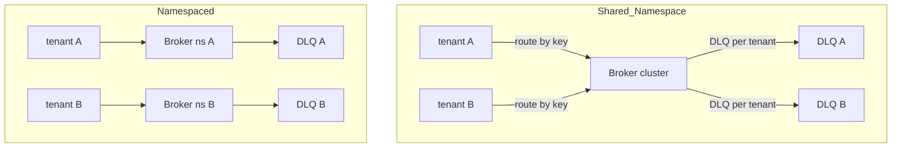
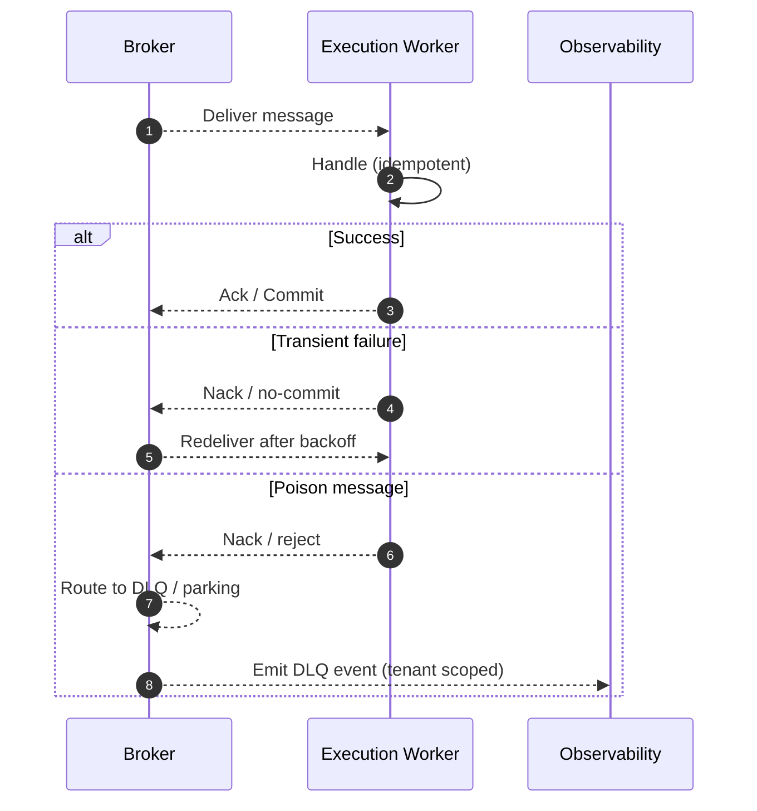
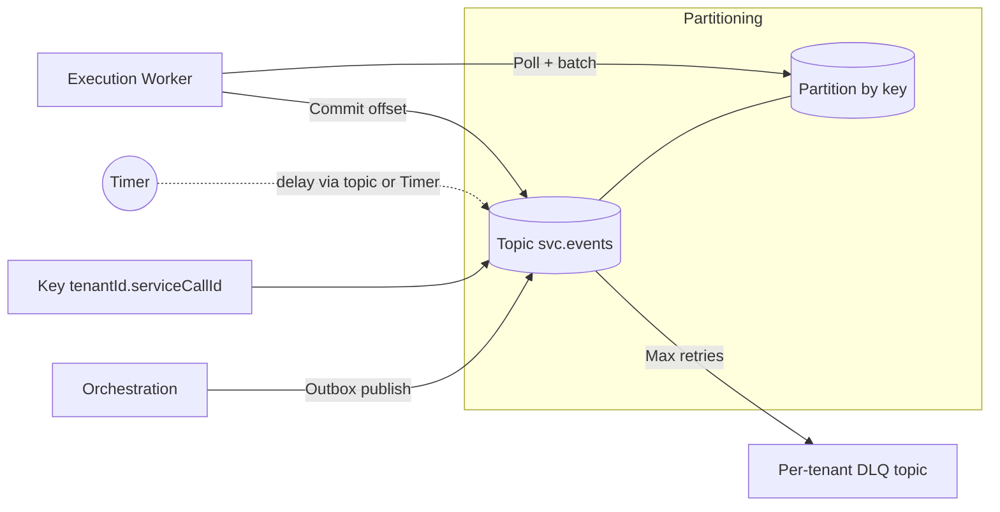
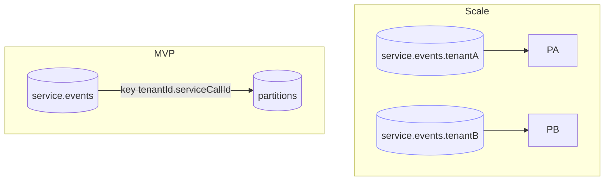
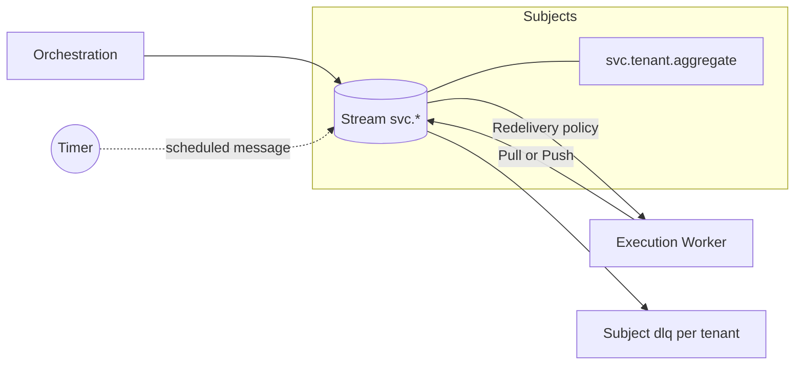
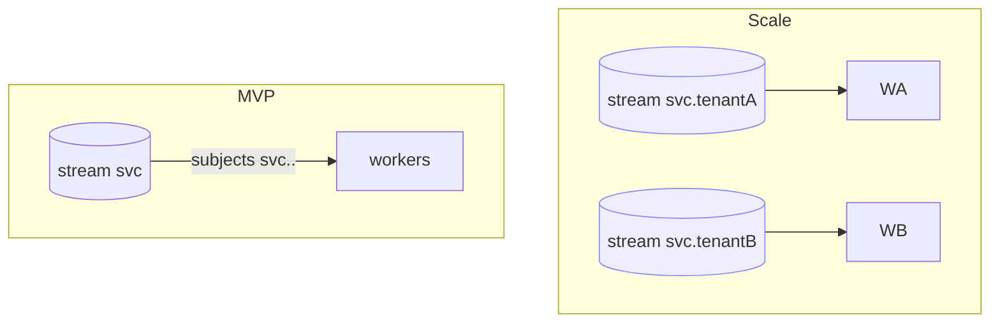
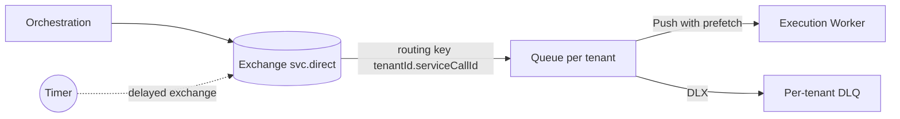
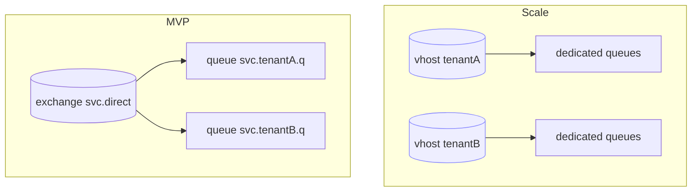

# ADR-0002 Appendix: Supporting Notes and Details

This appendix preserves background explanations, detailed diagrams, and option-specific primers removed from the main ADR to keep it essential and readable. Link from ADR: see `docs/decisions/ADR-0002-broker.md`.

## Conceptual Differences

### `Push` vs `Pull` Delivery

**Push**:

Broker delivers to consumers as capacity allows; consumer acks each message (or batches).
Backpressure via prefetch/window (e.g., RabbitMQ `basic.qos`, NATS JetStream push with flow control).
Simpler consumer loop; requires careful ack/retry handling and redelivery tuning.

**Pull**:

Consumer explicitly polls/pulls batches (e.g., Kafka, NATS JetStream pull).
Backpressure is natural (don’t pull → don’t receive).
Requires offset management and commit cadence; good for batch processing and precise throughput control.

**Impact on us**:

Either model works.
Pull aligns with single-writer orchestration that paces work;
Push simplifies reactive handlers.
(JetStream supports both; Kafka is pull; RabbitMQ is push-first).

### `Dumb` vs `Smart` Broker

**Dumb core**:
Minimal semantics (append log or simple queue), push most logic to clients/services.
Pros: predictability, portability;
Cons: more client responsibility (retries, DLQ, scheduling).

- Kafka leans dumb-log with smart clients.
- NATS Core is very thin; JetStream adds moderate features.
- RabbitMQ adds richer routing/queues but limited stream processing.

**Smart features**:
delayed delivery, dead lettering, redelivery policies, per-tenant quotas/limits, filtering/server-side selectors.
Pros: less bespoke infra (helps MVP);
Cons: coupling to broker-specific features and admin surface.

**Impact on us**:
Prefer a middle ground—use native delay/DLQ/quota if available, keep `EventBusPort` abstract to reduce lock-in.

### Core Abstractions

**Log/Stream** (Kafka, NATS JetStream Streams):
append-only, durable, indexed by offset/sequence.
Consumers track positions;
replay is first-class.
Ordering is per partition/subject shard.

**Queues** (RabbitMQ classic quorum/stream queues):
per-queue ordering with ack/delete on consume;
replay requires DLQ requeue or dedicated stream queues.

**Subjects/Topics/Exchanges**:
logical routing namespace.

- Kafka topics with partitions;
- NATS subjects with wildcards;
- Rabbit exchanges route to queues with bindings.

### Backpressure and Flow Control

- Push systems must implement prefetch/windowing to avoid overloading consumers; redelivery delays can smooth retries.
- Pull systems regulate rate by poll size/frequency.

End-to-end, we should propagate backpressure: consumer → outbox publisher pacing to avoid DB/backlog growth.

### Ordering Models

Per-aggregate ordering via keying/sharding is required.

- Kafka: partition key;
- NATS: subject shard;
- Rabbit: queue-per-key or careful binding with single-consumer semantics.
  Parallelism comes from many keys/partitions; single key remains ordered.

### Replay and Retention

Logs/streams excel at replay (offset-based).
Queues generally don’t unless using stream queues or DLQ requeue.
Our source of truth is the DB; we need moderate retention for recovery, not analytics.

### Delays, Retries, and DLQ

Native delay and redelivery policies reduce Timer complexity.

- Kafka typically uses delay topics or external scheduler;
- Rabbit uses delayed-exchange plugin;
- JetStream has scheduled messages and ack-based redelivery with policies. Per-tenant DLQs help isolation and debugging.

### Security and Multi-Tenancy Mechanics

- Kafka: ACLs on topics; client quotas; partitions scale.
- NATS: accounts/permissions; per-account limits; subjects per tenant.
- RabbitMQ: vhosts/users; per-vhost limits; per-tenant exchanges/queues possible.

These mechanisms influence how we provision per-tenant isolation at scale.

## Broker Styles & Use Cases

**Log/Stream** (Kafka, JetStream Streams):

- Strengths: ordered partitions/subjects, durable replay, consumer-position control.
- Use cases: event sourcing, large fan-out, replay-heavy workloads.
- Fit here: strong per-key ordering; delay varies (native in JetStream; patterns in Kafka).

**Subject routing** (NATS):

- Strengths: flexible routing via subjects/wildcards, simple multitenancy.
- Use cases: command/event, service-to-service messaging, fine-grained filtering.
- Fit here: easy per-tenant routes; native scheduled messages.

**Queues** (RabbitMQ):

- Strengths: push delivery, fine control with prefetch/DLX, vhost isolation.
- Use cases: task queues, request/reply, routing patterns.
- Fit here: workable delay via plugin; strict ordering with single-consumer queues.

## Visual Integration (Additional)

### Tenancy Isolation (shared vs namespaced)

### Failure / Redelivery (generic)

## Evaluation: Additional Attributes

- Replay model and retention windows (per-tenant replays; cursoring/replay tools).
- DLQ/parking and requeue tooling (prefer per-tenant DLQ and tenant-scoped replays).
- Flow control and backpressure (prefetch/pull, fair-sharing across tenants).
- Naming/scale limits (partitions/subjects/queues per cluster; provisioning automation APIs).
- Message size and compression support.
- Observability (per-tenant metrics, client traces, admin UX and APIs).
- Security and auth (TLS/mTLS, ACL granularity, credentials rotation).
- Managed offerings and migration/geo options.

## Options: Detailed Sections

### Kafka / Redpanda — Detailed

Key concepts (what to know):

- Topic, Partition, Key, Consumer group, Offset, Idempotent producer, Retention vs compaction, Rebalance, Delay pattern, DLQ.

---

#### Integration

#### Latency/Throughput

- ms to tens of ms p50 (batching/acks);
- excellent throughput and durable retention;
- ideal for heavy streams and long replays.

#### Implications for This Project

- Delays: no native per-message delay; either implement delay topics with scheduled consumers or build `Timer` (see ADR-0003) to schedule wake-ups.
- Pacing: pull-based consumption fits orchestrator pacing; use small batches and commit after idempotent handling to maintain at-least-once.
- Idempotent publish: enable idempotent producer with `acks=all`; carry `messageId` in headers for dedupe traces.
- Tenancy: start with a shared topic keyed by `tenantId.serviceCallId`; provide per-tenant DLQ topics using a `<topic>.<tenant>.dlq` convention.
- Dev parity: consider Redpanda locally to simplify Compose while keeping Kafka APIs.

#### Variants

- Separate topics per message type; delay via external scheduler; per-tenant topic namespace for stricter isolation.

#### MVP → Scale (diagram)

#### Risks & mitigations

- Rebalance pauses; Producer duplicates/in-flight; Delay complexity; Hot keys. See main ADR for short summary; this list provides details.

---

### NATS JetStream — Detailed

Key concepts (what to know)

- Stream, Subject, Consumer, Ack policy/ack wait, MaxDeliver/backoff, Deliver policy, Dedupe, Retention, Delay, Tenancy.

---

#### Integration

#### Latency/Throughput

- Sub-ms to low-ms p50 publish→consume under light batching;
- high sustained rates with low overhead;
- not aimed at very large, long-lived backlogs.

#### Implications for This Project

- Delays via native scheduling; prefer pull consumers; set `Msg-Id` for dedupe; per-tenant subjects and DLQ.

#### Variants

- Push consumers with flow control; per-tenant streams; durable consumers with explicit policies.

#### MVP → Scale (diagram)

---

### RabbitMQ — Detailed

Key concepts (what to know)

- Exchange, Binding, Queue, Queue types, Prefetch (QoS), Ack/Nack/Requeue, DLX + x-death, Delayed exchange / TTL+DLX, Single Active Consumer, Vhost.

---

#### Integration

#### Latency/Throughput

- Low-ms to single-digit ms p50; good throughput; ordering best with single consumer.

#### Implications for This Project

- Delayed exchange plugin parity; queue-per-tenant; prefetch tuning; DLX backoff.

#### Variants

- Queue-per-aggregate hotkeys; stream queues; TTL+DLX alternative.

#### MVP → Scale (diagram)

## Managed Cloud Offerings (Detailed)

### AWS

- Amazon MSK (Managed Kafka)
- Amazon MQ (RabbitMQ/ActiveMQ)
- SNS/SQS
- EventBridge

### Google Cloud

- Pub/Sub (+ Scheduler)
- Cloud Scheduler/Composer
- Confluent Cloud

Migration note: adapters remain valid against managed endpoints; provisioning/IaC and credentials change.

## Decision Framing: Notes and Sensitivity

### Notes on weights

- Tenancy isolation: High; Delayed delivery: High; Ordering under load: High.
- Dev ergonomics: Medium–High; Ops footprint: Medium; Long retention/replay: Medium (lower initial priority).
- Select one family for all environments; provide a dev Compose setup; keep `EventBusPort` neutral.

### Sensitivity notes

- If long retention weight increases (≥ 0.25), log-centric brokers (Kafka API family) improve relatively.
- If native per-message delay matters more, brokers with built-in scheduling (JetStream) gain.
- If strongest isolation UI/controls matter, queue-centric brokers with vhosts and DLX features (RabbitMQ) gain.

## Operational Considerations (Detailed)

- Provisioning as code; quotas and fairness; monitoring; retention; security; local parity; upgrades/evolution.

## Tenancy & Routing Strategy (Detailed)

- RoutingStrategy mapping; producer partition/subject/routing key; consumer filtering; DLQ/parking.
