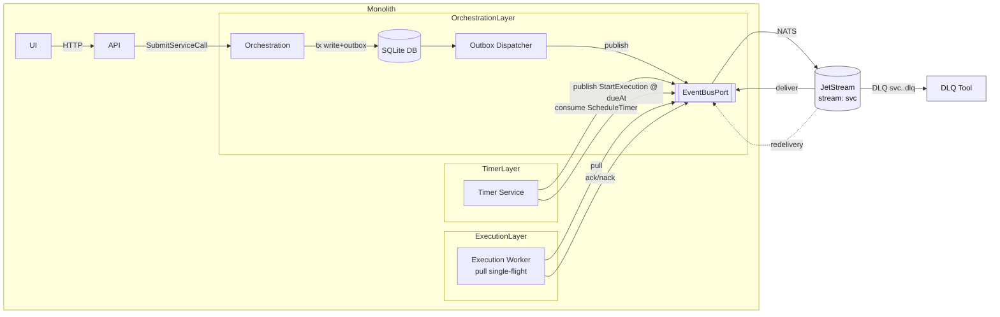
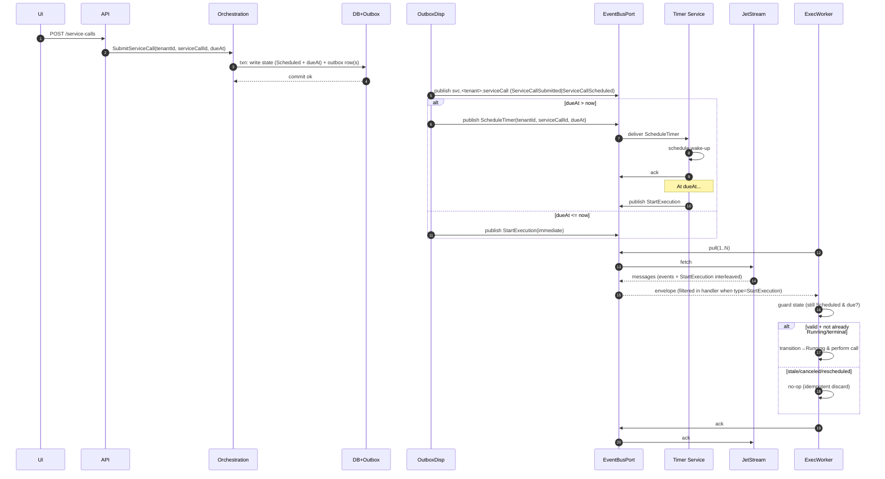

# ADR-0002: Message Broker

Status: Accepted

## Executive Summary

- Goal: choose a broker that preserves per-aggregate ordering, supports at-least-once delivery with clear redelivery/DLQ, enables multi-tenant isolation, and (ideally) offers native delayed delivery to minimize Timer scope.
- Decision: Adopt NATS JetStream as the message broker for MVP and near-term evolution.
- Constraints: Modular Monolith; DB is source of truth; transactional outbox; identity keyed by `tenantId.serviceCallId`.
- Key criteria (weighted): tenancy isolation (0.25), delayed delivery (0.25), ordering under load (0.20), dev ergonomics (0.15), ops footprint (0.10), retention/replay (0.05).
- Corrected understanding: NATS JetStream does NOT support native per-message delayed delivery. All three broker options (Kafka/Redpanda, NATS JetStream, RabbitMQ) require external Timer service for scheduling.
- Alternatives considered: Kafka/Redpanda — excellent ordering/retention but heavier ops footprint. RabbitMQ — delayed-exchange plugin (closest to native) but ordering constraints with single-consumer queues. NATS JetStream chosen for best developer experience, simplest operations, and clean subject-based multi-tenancy, with decision to build broker-agnostic Timer service (~300 lines) for architectural flexibility.
- What must be validated: ordering at load, Timer service accuracy, tenant isolation/noisy neighbor behavior, redelivery/DLQ flows, and local dev parity.

## Non-goals

- Exactly-once end-to-end semantics (target at-least-once with idempotent handlers).
- Cross-region active-active replication.
- Analytics-scale long-term retention (broker sized for recovery; DB is source of truth).
- Serverless/managed-only features that break local parity.
- Per-message global ordering beyond the aggregate key contract.

## Problem

Choose a broker family that satisfies:

- Per-aggregate ordering using key `(tenantId, serviceCallId)`.
- At-least-once delivery with clear redelivery and DLQ/parking patterns.
- Multi-tenancy isolation in routing, quotas, and ACLs to prevent noisy neighbors.
- (Preferably) broker-native delayed delivery to reduce the need for a Timer service.
- Reasonable dev ergonomics (local Compose), observability, and operational footprint.

## Context

- Domain constraints (see [Domain]): single writer (Orchestration), DB as source of truth, at-least-once tolerance, multi-tenancy everywhere.
- Messaging conventions (see [Messages]): unique `messageId`, identity `(tenantId, serviceCallId)`, per-aggregate ordering, outbox after-commit publication.
- Topology (see [ADR-0001]): Modular Monolith initially, real broker from day one; Timer may be broker-delegated (see [ADR-0003]).
- Tenancy goals:
  - Identity: `tenantId` present in every envelope; used for routing/partitioning.
  - Isolation: per-tenant quotas/limits and ACLs where feasible; avoid per-tenant infra sprawl unless automated.
  - Observability: per-tenant metrics/log correlation; DLQ per tenant preferred.

### Evaluation Criteria

- **Tenancy isolation** (0.25): ACLs, quotas, per-tenant retention; feasibility at N tenants.
- **Delayed delivery** (0.25): native scheduling, accuracy, backlog characteristics.
- **Ordering under load** (0.20): per-aggregate order with restarts and concurrency.
- **Developer ergonomics** (0.15): local setup, SDK quality, documentation.
- **Operational footprint** (0.10): durability, manageability, HA path, resource usage.
- **Retention/replay** (0.05): replay model and retention sufficient for recovery.

Additional Attributes: see Appendix for extended comparison dimensions.

### Conceptual Primer

- Delivery: pull (Kafka; NATS pull) vs push (RabbitMQ; NATS push). Both work; MVP leans pull for pacing.
- Semantics: prefer native delay/DLQ/quotas when available; keep ports neutral.
- Ordering: per key via partition/subject/queue; key = `tenantId.serviceCallId`.
- Replay: logs/streams excel; queues rely on DLQ/stream queues; DB remains source of truth.
  For full explanations, see Appendix.

### Broker Styles & Use Cases

**Log/Stream** (Kafka, JetStream Streams):

- **Strengths**: ordered partitions/subjects, durable replay, consumer-position control.
- **Use cases**: event sourcing, large fan-out, replay-heavy workloads.
- **Fit here**: strong per-key ordering; delay varies (native in JetStream; patterns in Kafka).

**Subject routing** (NATS):

- **Strengths**: flexible routing via subjects/wildcards, simple multitenancy, lightweight operations.
- **Use cases**: command/event, service-to-service messaging, fine-grained filtering.
- **Fit here**: easy per-tenant routes; requires external Timer service for delayed delivery.

**Queues** (RabbitMQ):

- **Strengths**: push delivery, fine control with prefetch/DLX, vhost isolation.
- **Use cases**: task queues, request/reply, routing patterns.
- **Fit here**: workable delay via plugin; strict ordering with single-consumer queues.

**Push vs Pull**: see Conceptual Differences. Both work; MVP leans pull for orchestrator pacing.

**Dumb vs Smart**: see Conceptual Differences. Use native delay/DLQ/quotas where available; keep ports neutral.

### Visual

#### Common Flow (baseline)


For Tenancy isolation and failure/redelivery diagrams, see Appendix.

## Options

### 1. Kafka / Redpanda

#### Characteristics

- **Ordering**: per-partition order; use partition key `tenantId.serviceCallId`.
- **Tenancy**:
  - Shared: single topic; ACLs at topic level; quotas per client.
  - Namespaced: topic per tenant; stronger retention/ACL control; more entities to manage.
- **Delays**: no native per-message delay; implement delay topics or external scheduler.
- **Dev/Ops**: heavier footprint; mature tooling; strong durability, storage, and observability ecosystem.

#### Trade-offs

**Pros**:

- Excellent throughput/durability;
- strong partition ordering;
- rich ecosystems (Connect, Schema Registry alternatives if needed later).

**Cons**:

- No native delay increases Timer scope (see [ADR-0003]).
- Higher operational complexity for MVP.

#### Integration

Use the Common Flow in this ADR; per-broker visuals are available in the Appendix.

#### Latency/Throughput

See Appendix for detailed latency notes.

#### Implications for This Project

- **Delays**: no native per-message delay; either implement delay topics with scheduled consumers or build `Timer` (see [ADR-0003]) to schedule wake-ups.
- **Pacing**: pull-based consumption fits orchestrator pacing; use small batches and commit after idempotent handling to maintain at-least-once.
- **Idempotent publish**: enable idempotent producer with `acks=all`; carry `messageId` in headers for dedupe traces.
- **Tenancy**: start with a shared topic keyed by `tenantId.serviceCallId`; provide per-tenant DLQ topics using a `<topic>.<tenant>.dlq` convention.
- **Dev parity**: consider Redpanda locally to simplify Compose while keeping Kafka APIs.

#### Variants

See Appendix for variants and alternative patterns.

#### Tenant separation and routing (MVP → scale)

- MVP layout
  - Topic: `service.events` (shared)
  - Partition key: `tenantId.serviceCallId` (strict per-aggregate ordering)
  - Consumer group: one group for execution workers
  - DLQ: per-tenant topic `service.events.<tenant>.dlq`
  - Delay: external Timer publishes at `dueAt` back into `service.events` (or a dedicated delay topic pattern)
- Scale-up path
  - Per-tenant topics when retention/ACL/quotas must differ
  - Increase partitions for hot tenants (in per-tenant topics) while keeping small tenants on the shared topic
  - Use client quotas to contain noisy neighbors
- One vs many topics
  - Start with one shared topic; split only when policy or load isolation requires it

For a diagrammed view, see Appendix (Kafka MVP→Scale).

#### Recommended defaults (MVP)

- One topic `service.events`, 12–24 partitions
- Partition key: `tenantId.serviceCallId`
- Producer: idempotent on, `acks=all`
- Consumer: manual commit, small batches, commit after handle
- DLQ: `service.events.<tenant>.dlq`
- Delay: Timer service publishes at `dueAt`

#### Risks & mitigations

- Rebalance pauses: consumers may stall briefly during group rebalances. Mitigate by keeping handler latency low, enabling cooperative-sticky assignor, and monitoring rebalance frequency.
- Producer duplicates/in-flight: on failures, duplicates may occur despite idempotent producer. Carry `messageId` in headers and make handlers idempotent; use idempotent producer + `acks=all`.
- Delay complexity: lack of native delay expands `Timer` scope. Mitigate with a thin scheduler that re-publishes to the main topic at `dueAt` and clear backpressure/limits.
- Hot keys: a single hot `tenantId.serviceCallId` partition limits throughput. Consider splitting very hot aggregates across derived keys only if domain permits, or isolate hot tenants into dedicated topics with more partitions.

#### Scoring

| Criterion        | Weight | Score | Weighted |
| ---------------- | :----: | :---: | -------: |
| Tenancy          |  0.25  |   4   |     1.00 |
| Delayed delivery |  0.25  |   2   |     0.50 |
| Ordering         |  0.20  |   5   |     1.00 |
| Dev ergonomics   |  0.15  |   3   |     0.45 |
| Ops footprint    |  0.10  |   2   |     0.20 |
| Retention/replay |  0.05  |   5   |     0.25 |
| Total            |        |       |     3.40 |

---

### 2. NATS JetStream

#### Characteristics

- **Ordering**: subjects/streams with ordered consumers; shard by `svc.<tenantId>.<aggregate>`.
- **Tenancy**:
  - Shared: one stream with per-tenant subjects; consumers subscribe to `svc.<tenantId>.>`.
  - Namespaced: stream per tenant or account-level isolation; quotas via account limits.
- **Delays**: no native per-message delayed delivery; requires external Timer service (same as Kafka).
- **Dev/Ops**: lightweight; simple local setup; good client ergonomics.

#### Trade-offs

**Pros**:

- Excellent developer ergonomics (SDK quality, documentation, local setup);
- lightweight operational footprint (single binary, minimal resources);
- easy multitenant routing via subjects;
- strong ordering semantics with subject-based sharding.

**Cons**:

- No native per-message delayed delivery (requires external Timer service, same as Kafka);
- stream/consumer management needs care at high tenant counts;
- different semantics than Kafka for long retention.

#### Integration

Use the Common Flow in this ADR; per-broker visuals are available in the Appendix.

#### Latency/Throughput

See Appendix for detailed latency notes.

#### Implications for This Project

- **Delays**: NATS JetStream does NOT have native per-message delayed delivery. External Timer service is required to schedule wake-ups and publish messages at `dueAt` (same approach as Kafka).
- Pacing: prefer pull consumers to propagate backpressure; optionally use push for reactive handlers.
- Idempotent publish: set `Msg-Id` to envelope `messageId` to leverage JetStream dedupe window.
- Tenancy: shared stream with per-tenant subjects at MVP; per-tenant DLQ via subject suffix (e.g., `.dlq`).
- Scale: cap stream/consumer cardinality by enforcing subject patterns and quotas.

#### Variants

See Appendix for variants and alternative patterns.

#### Tenant separation and routing (MVP → scale)

- MVP layout
  - Stream: `svc` (covers subjects `svc.>`)
  - Subject: `svc.<tenantId>.<aggregate>`
  - Consumer: durable, pull-based for pacing (one per worker group)
  - DLQ: subject `svc.<tenantId>.dlq`
  - Delay: external Timer service publishes at `dueAt`
- Scale-up path
  - Per-tenant stream when policies/retention must differ
  - Account-level isolation for stronger multi-tenancy controls and quotas
  - Cap subject cardinality with a constrained subject schema
- One vs many streams
  - Start with one shared stream; split to per-tenant streams or accounts only for policy or load isolation

For a diagrammed view, see Appendix (NATS MVP→Scale).

#### Recommended defaults (MVP)

- Stream `svc` (subjects `svc.>`)
- Subjects: `svc.<tenantId>.<aggregate>`
- Durable pull consumers, explicit acks; ack wait 5–30s depending on handler SLA
- MaxDeliver 3–5 with exponential backoff; per-tenant DLQ subject `svc.<tenant>.dlq`
- Delay via external Timer service that publishes at `dueAt`

#### Scoring

| Criterion        | Weight | Score | Weighted |
| ---------------- | :----: | :---: | -------: |
| Tenancy          |  0.25  |   4   |     1.00 |
| Delayed delivery |  0.25  |   2   |     0.50 |
| Ordering         |  0.20  |   4   |     0.80 |
| Dev ergonomics   |  0.15  |   5   |     0.75 |
| Ops footprint    |  0.10  |   5   |     0.50 |
| Retention/replay |  0.05  |   3   |     0.15 |
| Total            |        |       |     3.70 |

---

### 3. RabbitMQ (+ delayed-exchange plugin)

#### Characteristics

- **Ordering**: per-queue order with single consumer; multiple consumers may affect ordering.
- **Tenancy**:
  - Shared: one exchange; routing key `tenantId.serviceCallId` with consumer-bound queues.
  - Namespaced: vhost per tenant or per-tenant exchanges/queues; strong ACLs; more entities.
- **Delays**: via delayed-exchange plugin; workable but adds dependency.
- **Dev/Ops**: moderate footprint; flexible routing; mature management UI.

#### Trade-offs

**Pros**:

- Flexible routing,
- workable delayed delivery with plugin,
- strong vhost-based isolation story.

**Cons**:

- Ordering nuances across consumers;
- plugin dependency;
- less natural for long-lived retention.

#### Integration

Use the Common Flow in this ADR; per-broker visuals are available in the Appendix.

#### Latency/Throughput

See Appendix for detailed latency notes.

#### Implications for This Project

- Delays: ensure delayed-exchange plugin parity across environments; otherwise fall back to `Timer`.
- Ordering: favor queue-per-tenant with single-consumer semantics for strict per-tenant order; serialize per-aggregate work within the worker to preserve order, trading parallelism for consistency.
- Pacing: tune `prefetch` for flow control; use dead-lettering with backoff for poison messages.
- Tenancy: strong isolation via vhosts at the cost of provisioning complexity; per-tenant DLQs via DLX bindings.

#### Variants

See Appendix for variants and alternative patterns.

#### Tenant separation and routing (MVP → scale)

- MVP layout
  - Exchange: `svc.direct`
  - Queue: per-tenant `svc.<tenantId>.q`
  - Binding: routing key = `tenantId.serviceCallId` (or a pattern if aggregate is part of the key)
  - Consumer: single consumer per queue for strict ordering
  - DLQ: per-tenant via DLX to `svc.<tenantId>.dlq`
  - Delay: delayed-exchange plugin (preferred) or TTL + DLX
- Scale-up path
  - vhost per tenant when stronger isolation/ACLs/quotas are needed
  - Dedicated queue for “hot” aggregates within a tenant; serialize per-aggregate inside worker if sharing
  - Tune `prefetch` and use backoff policies to protect workers
- One vs many queues
  - Start with one queue per tenant; add hot-aggregate queues only as needed to balance isolation vs complexity

For a diagrammed view, see Appendix (RabbitMQ MVP→Scale).

#### Recommended defaults (MVP)

- Exchange `svc.direct`
- Queue per tenant: `svc.<tenant>.q`
- Single consumer per queue; prefetch 5–10 (lower if handler latency spikes)
- DLX per tenant: `svc.<tenant>.dlq`
- Retries via DLX with `x-death` cap 3–5 and backoff
- Delay via delayed-exchange plugin (fallback: TTL+DLX)

#### Scoring

| Criterion        | Weight | Score | Weighted |
| ---------------- | :----: | :---: | -------: |
| Tenancy          |  0.25  |   4   |     1.00 |
| Delayed delivery |  0.25  |   4   |     1.00 |
| Ordering         |  0.20  |   3   |     0.60 |
| Dev ergonomics   |  0.15  |   4   |     0.60 |
| Ops footprint    |  0.10  |   4   |     0.40 |
| Retention/replay |  0.05  |   2   |     0.10 |
| Total            |        |       |     3.70 |

---

### 4. Managed Cloud Offerings (condensed)

AWS/GCP options exist (MSK/Confluent, Amazon MQ, Pub/Sub, SNS/SQS/EventBridge). For MVP we prefer local parity and minimal friction; adapters keep a path to managed later. See Appendix for details.

Why not for MVP

- Local parity and developer loop: we want the same semantics locally via Docker Compose; cloud services introduce divergence and slower feedback.
- Cost and provisioning friction: managed services add infra overhead and IAM/permission setup, slowing iteration.
- Feature fit: our current priorities (simple multi-tenant routing, native delays if possible, modest retention) are satisfied by self-hostable options with lighter ops.
- Portability: keeping adapters broker-family-oriented (Kafka API, NATS, AMQP) preserves an easy path to managed offerings later.

---

## Decision Framing

### Scoring recap

- Kafka/Redpanda: 3.40
- RabbitMQ (+ delayed-exchange): 3.70
- NATS JetStream: 3.70

**Corrected understanding:** All three broker options require external Timer service for delayed delivery. NATS JetStream does NOT have native per-message delayed delivery. RabbitMQ's delayed-exchange plugin scores higher (4/5) but introduces plugin dependency and ordering constraints.

### Acceptance checklist

Original criteria retained here for audit; superseded by post-decision validation summary above.

- Ordering validated under load across N tenants with key `tenantId.serviceCallId`.
- Delayed delivery accuracy within target bound for 1s–5m windows.
- Redelivery and DLQ behavior verified and tenant-scoped.
- Noisy neighbor isolation confirmed via quotas/limits.
- Local development parity (Compose) for the chosen broker.

### Decision

Adopt NATS JetStream for MVP and near-term evolution. Rationale:

**Corrected evaluation:** Initial analysis incorrectly assumed NATS JetStream had native per-message delayed delivery. Investigation revealed this capability does NOT exist. All three broker options (Kafka, NATS, RabbitMQ) require an external Timer service for scheduling.

**Decision with corrected scores (NATS 3.70, tied with RabbitMQ):**

Since all brokers require Timer service (~300 lines), the choice prioritizes:

- **Excellent developer ergonomics (5/5)**: Outstanding SDK quality, clear documentation, fastest local setup, intuitive subject-based routing.
- **Lightweight operational footprint (5/5)**: Single binary, minimal resource usage, simple management, low cognitive overhead.
- **Strong ordering semantics (4/5)**: Subject-based sharding with ordered consumers; worker single-flight pattern preserves per-aggregate order while allowing controlled concurrency.
- **Solid multi-tenancy support (4/5)**: Subject wildcards enable clean per-tenant routing without infrastructure sprawl; account-level isolation path available for scale.
- **Broker autonomy**: Building custom Timer (~300 lines) decouples from broker-specific delay implementations, enabling future broker migration with zero Timer changes.

**Alternative considerations:**

- RabbitMQ's delayed-exchange plugin (4/5 for delay) would eliminate Timer service code, but couples architecture to RabbitMQ and requires single-consumer-per-queue for strict ordering (limits throughput).
- Kafka's partition ordering (5/5) is strongest, but operational footprint (2/5) and dev ergonomics (3/5) are heavier; retention/replay advantages (5/5) not critical when DB is source of truth.

**Decision constraints & guardrails:**

- Timer service must be built (~300 lines; broker-agnostic design per ADR-0003).
- Avoid per-tenant streams until concrete retention/ACL divergence appears.
- Enforce a bounded subject taxonomy to prevent cardinality explosion.
- Preserve adapter boundary (`EventBusPort`) to enable future broker migration if needed.
- Periodically (quarterly) reassess subject/consumer cardinality and backlog metrics; adjust isolation strategy as tenant count grows.

### Lifecycle Fit (business uncertainty)

- MVP (unknown adoption): prioritize low ops, fast local loop, external Timer service (~300 lines), simple tenancy.
- MVP → Evolution: keep adapter-neutral routing strategy; add quotas/DLQs and namespacing as needed.
- MVP → Scalability: shard by `tenantId.serviceCallId`; scale consumer groups; upgrade isolation (namespaced topics/streams/vhosts) when required.

### Relevance to This Project

- Domain cadence: one attempt, single writer; dueAt scheduling is more critical than ultra-high throughput.
- Tenancy: strong per-tenant routing and quotas; avoid per-tenant infra sprawl at MVP.
- Scheduling: external Timer service (~300 lines) required for delayed delivery; broker-agnostic design enables future flexibility.
- Storage: DB is source of truth; broker retention can remain modest; outbox ensures durability/order.
- Developer velocity: local bring-up and SDK ergonomics are high leverage now.

Notes on weights moved to Appendix; criteria weights above apply.

Sensitivity notes moved to Appendix.

## Consequences

- **Timer service mandatory:** External Timer service (~300 lines) required for all delayed delivery. Broker-agnostic design ensures future flexibility and decouples from broker-specific delay implementations. See [ADR-0003] for Timer strategy (push-based setTimeout + MinHeap + DB persistence).
- Implementation focus shifts to an EventBusPort adapter (publish, pull subscription, ack semantics) and a routing strategy enforcing subject naming.
- Observability emphasis: per-tenant lag, redeliveries, DLQ counts; need lightweight metrics wrapper early.
- Risk of subject/consumer sprawl requires naming lint / provisioning automation.
- Potential future migration path: keep domain envelopes and handler contracts broker-agnostic; avoid leaking JetStream-specific headers beyond adapter.

### Why one shared stream first

One shared JetStream stream (`svc`) interleaves all tenants’ subjects but preserves each tenant’s and aggregate’s ordering (ordering is per subject; handlers enforce per-key single-flight). This minimizes early operational overhead (one retention policy, simple provisioning, fast local parity) and defers complexity until real isolation pressures appear. We split to per-tenant streams or accounts only when: (a) divergent retention/ACL needs, (b) a noisy tenant dominates backlog, (c) compliance or deletion isolation is required, or (d) subject/consumer cardinality approaches operational limits.

### Integration Diagrams (NATS JetStream Realization)

The following diagrams make the decision concrete. They do not restate design intent already in earlier ADRs; they show how NATS shapes implementation.

#### A. Runtime Topology (MVP)



Key implications: single shared stream `svc`; no per-tenant streams; Timer service is mandatory for delayed delivery (broker-agnostic design). Timer implementation details in [ADR-0003].

#### B. Submit → (Optional Delay) → Execute Sequence



Implications: SubmitServiceCall is never delayed—persistence + domain events are immediate. When `dueAt > now`, Orchestration publishes ScheduleTimer command; Timer service schedules wake-up and publishes StartExecution at dueAt. StartExecution shares the same subject and the execution worker inspects envelope.type to act only on StartExecution. Interleaving is acceptable at MVP; if pacing or clarity issues emerge we can split subjects (see evolution notes).

**Timer implementation:** Internal scheduling mechanism, persistence strategy, accuracy guarantees, and failure recovery are detailed in [ADR-0003].

#### C. Redelivery & DLQ

Redelivery policy is handled natively by JetStream via consumer configuration; the application code only acks on success.

Flow (concise):

1. Exec pulls message (attempt=1).
2. Handler runs under single-flight (per tenantId.serviceCallId).
3. On success → explicit ack → message complete.
4. On transient failure → do not ack (or negative ack with backoff) → broker schedules redelivery (attempt incremented) until MaxDeliver.
5. On exceeding MaxDeliver (or detecting a fatal, non-retriable error) → publish original envelope (plus failure metadata) to `svc.<tenant>.dlq`.
6. DLQ tooling (out of scope here) supports inspection, replay (republish to original subject), or discard.

Key parameters (defaults to validate):

- MaxDeliver: 3–5
- Backoff: exponential (e.g., 1s, 5s, 25s) or broker jittered equivalent
- Ack wait: sized to worst reasonable handler latency (e.g., 30s) to avoid premature redelivery
- DLQ subject: `svc.<tenant>.dlq` (same stream for simplicity; revisit if volume or retention diverges)

Idempotency & safety:

- Handler must be idempotent; duplicates arise from redelivery after partial processing.
- Envelope carries `messageId` (dedupe traces) and composite key for ordering.
- No manual “retry counters” stored in DB unless diagnostics require; broker metadata (delivery count) is sufficient.

Operational notes:

- Emit metrics: redeliveries (per tenant), DLQ rate, age of oldest DLQ message.
- Alert when DLQ rate or redelivery attempts/volume breaches baseline; triggers investigation or policy review.
- Replay tool MUST strip prior failure metadata to avoid infinite poison loops unless corrected.

Escalation path (future ADR if needed): introduce a parking subject before DLQ for manual triage if noisy transient failures inflate DLQ noise.

#### D. Subject & Consumer Evolution (minimal pattern)

MVP adopts the most minimal workable taxonomy:

```txt
svc.<tenant>.serviceCall   # all domain events + StartExecution (immediate or scheduled)
svc.<tenant>.dlq           # dead letters (after MaxDeliver or fatal)
```

Rationale:

- Keeps provisioning trivial: two subjects per active tenant.
- Execution worker filters on `envelope.type == StartExecution` and ignores pure domain events.
- Domain event consumers (future) can subscribe to the same subject and branch on type without new infrastructure.
- Interleaving is acceptable because per-aggregate ordering is enforced by single-flight + DB state, not by separating subjects.

Trade-offs (accepted for MVP):

- Slight extra branching in execution consumer.
- Harder to apply distinct retry/backoff policies between StartExecution and other events (not needed yet).
- Observability dashboards must filter by event type dimension instead of subject name.

Evolution triggers to split subjects (defer until one is true):

1. Different retry/backoff policy needed for StartExecution vs lifecycle events.
2. High volume of lifecycle events causing StartExecution latency (measured queueing delay > SLA).
3. Need to restrict a consumer to ONLY domain events without payload inspection for performance/security reasons.

First split path (if triggered):

```txt
svc.<tenant>.serviceCall.events
svc.<tenant>.serviceCall.start
svc.<tenant>.dlq
```

### Explanation Summary

- **Timer service mandatory:** External Timer service required for all delayed delivery. Broker-agnostic design ensures future flexibility and decouples from broker-specific delay implementations. Implementation details, persistence strategy, and accuracy guarantees detailed in [ADR-0003].
- Ordering strategy: enforced by single-flight concurrency keyed on `tenantId.serviceCallId` plus subject naming; no partition tuning needed initially.
- Multitenancy strategy: one stream reduces ops; DLQ per tenant provides isolation signal.
- Evolution levers: add shard token OR per-tenant streams OR migrate broker — each isolated behind EventBusPort.
- Operational focus: metrics on lag, redelivery attempts, DLQ rate; automation to provision stream + consumers with policy caps.

### Design Implications

- EventBusPort shape: expose a neutral API that supports both push and pull consumption semantics with explicit ack/commit, plus publish for messages; Timer service handles delayed delivery separately via ScheduleTimer command.
- Envelope headers: include `tenantId`, `serviceCallId`, `messageId`, and `correlationId`; standardize header keys per adapter.
- Idempotency: consumers are idempotent keyed by `messageId`; outbox ensures publish-after-commit; use broker-side dedupe where available as a best-effort assist.
- Ordering enforcement: route by `tenantId.serviceCallId`; avoid patterns that break key→shard mapping; ensure single-writer invariants in Orchestration.
- Timer decoupling: Timer service owns all scheduling; broker only provides pub/sub transport. Timer interface: ScheduleTimer command → StartExecution event. See [ADR-0003] for implementation details.

EventBusPort sketch retained conceptually (publish, subscribePull/Push). Full interfaces live in Appendix.

### Operational Considerations

- Provisioning as code: define topics/streams/exchanges, DLQs, and quotas via scripts/IaC; enforce per-tenant naming and limits.
- Quotas and fairness: configure per-tenant or per-account quotas; alert on saturation and DLQ rates; protect against noisy neighbors.
- Monitoring: collect per-tenant lag, delivery/ack latency, redeliveries, DLQ counts; propagate `tenantId`/`correlationId` into metrics and logs.
- Retention: set conservative retention aligned with DB-as-source-of-truth; size backlogs for outage recovery, not analytics.
- Security: TLS/mTLS, scoped credentials, ACLs per tenant or namespace; rotate secrets.
- Local parity: ship Docker Compose variants (e.g., Redpanda for Kafka API, single-node NATS, RabbitMQ with delayed plugin) matching prod semantics.
- Upgrades/evolution: keep adapters thin to ease future broker changes; document feature dependencies (e.g., delay) to understand lock-in.

### Tenancy & Routing Strategy (adapter-level)

- Provide a `RoutingStrategy` mapping `(messageType, tenantId)` → concrete route (topic/subject/exchange) and key.
- Producer side: set partition/subject/routing key as `tenantId.serviceCallId`; include `tenantId` and `aggregateId` in envelope.
- Consumer side: subscribe with per-tenant filters (wildcards, queue bindings, or topic lists) to isolate workers.
- DLQ/parking: prefer per-tenant dead-lettering where supported; ensure replay tools are tenant-scoped.

## Glossary

- `messageId`: unique id for deduplication/idempotency.
- `tenantId.serviceCallId`: composite key establishing per-aggregate ordering.
- `dueAt`: timestamp indicating when a message should be delivered/processed.

[Domain]: ../design/domain.md
[Ports]: ../design/ports.md
[Messages]: ../design/messages.md
[ADR-0001]: ./ADR-0001-topology.md
[ADR-0002]: ./ADR-0002-broker.md
[ADR-0003]: ./ADR-0003-timer.md
