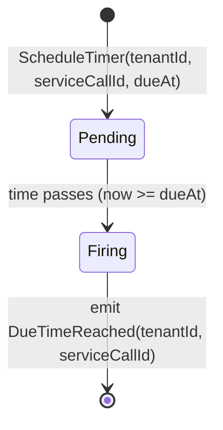
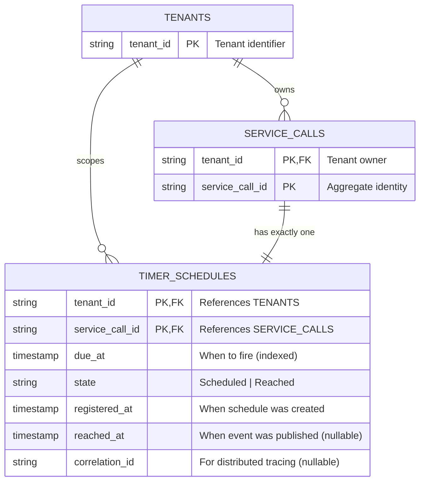

# ADR-0003: Timer Strategy

Status: Accepted

## Problem

The Service Agent domain requires scheduled execution of service calls: a user submits a service call with a `dueAt` timestamp, and the system must initiate execution at or shortly after that time.

**Core Requirements:**

1. **Schedule registration**: Accept `(tenantId, serviceCallId, dueTimeMs)` and persist durably
2. **Due detection**: Identify when `dueTimeMs <= now` and emit signal to trigger execution
3. **Durability**: Survive process crashes/restarts without losing scheduled timers
4. **At-least-once delivery**: Emit due signal at least once; duplicates acceptable (Orchestration guards)
5. **Idempotency**: Multiple schedule requests for same `(tenantId, serviceCallId)` don't create duplicates

**Domain Constraints:**

- Single-shot timers (no recurring/CRON)
- No cancellation/rescheduling after execution starts
- Multi-tenant aware: all timers scoped by `tenantId`
- Accuracy: "best effort after due" — seconds-level delays acceptable
- Integration: consume `[ScheduleTimer]` commands, publish `[DueTimeReached]` events via broker

**Key Question:** How do we implement durable, at-least-once, single-shot timers that remain broker-agnostic (per ADR-0002)?

---

## Context

### Timer Module Responsibility

Timer is an **Infrastructure supporting module** that tracks future due times and emits `[DueTimeReached]` events when time arrives. It must remain broker-agnostic and stateless with respect to domain logic.

**Timer Lifecycle (per serviceCallId):**



**Message Contract:**

- **Input**: `ScheduleTimer` command → `{ tenantId, serviceCallId, dueAt: ISO8601 }`
- **Output**: `DueTimeReached` event → `{ tenantId, serviceCallId, reachedAt?: ISO8601 }`
- **Storage Key**: `(tenantId, serviceCallId)` ensures idempotency

### Broker Landscape

[ADR-0002: Broker Selection][ADR-0002] evaluated broker options and concluded **all brokers require external Timer service**. NATS JetStream chosen for MVP, but Timer must remain **broker-agnostic** for architectural flexibility.

### MVP Constraints

- **Single instance** (no distributed coordination)
- **Tenant count**: dozens to low hundreds
- **Time horizon**: minutes to hours (not days/weeks)
- **Accuracy**: seconds-level granularity acceptable

**Out of Scope:**

- Distributed coordination (defer to scale phase)
- CRON/recurring schedules
- Timer cancellation
- Sub-second precision

---

## Approach: First Principles Analysis

### How do we detect when `now >= dueAt`?

**Option 1: External Notification (Push)**

- Examples: `pg_cron`, OS schedulers, cloud scheduler services
- **Problem**: Couples to specific infrastructure (PostgreSQL extensions, cloud providers)
- **Verdict**: ❌ Violates broker-agnostic and portability requirements

**Option 2: Self-Checking (Poll)**

- Worker loop queries storage periodically: `WHERE dueAt <= now`
- **Benefits**: Portable, simple, no external dependencies, meets "seconds acceptable" requirement
- **Verdict**: ✅ Only viable path for our constraints

### Can we optimize with in-memory scheduling?

**Idea**: Load schedules into memory, use `setTimeout`-like timers for exact wake-ups.

**Analysis:**

- **Benefit**: More efficient (wake only when needed)
- **Cost**: Complexity—reload on startup, subscribe to new schedules, crash edge cases
- **MVP Reality**: Polling every 5s is simple and meets requirements
- **Verdict**: ❌ Premature optimization

### Conclusion

**Converged Design:**

```txt
1. Subscribe to ScheduleTimer commands from broker
2. On command: Persist to storage (upsert by tenantId, serviceCallId)
3. Worker loop (every 5s):
   - Query: SELECT WHERE dueAt <= now AND state = 'Scheduled'
   - For each: Publish DueTimeReached, update state = 'Reached'
4. On restart: Resume worker loop (durable in DB)
```

**Why this design:**
- **Polling wins**: Only option that satisfies all constraints (durable, portable, broker-agnostic)
- **5-second interval**: Balances latency (acceptable for MVP) with CPU cost (minimal)
- **State field**: Enables idempotent processing (query excludes already-fired timers)
- **Two-step process**: Find-then-mark pattern ensures at-least-once delivery

**Requirements satisfied:**

- ✅ Durability: Storage persists across crashes
- ✅ Detection: Polling finds due schedules
- ✅ At-least-once: Broker handles delivery semantics
- ✅ Idempotency: Upsert on `(tenantId, serviceCallId)` + state filtering
- ✅ Broker-agnostic: Standard DB queries, no special features
- ✅ Portable: No external dependencies (works on any platform with SQLite)

---

## Decision

**Adopt periodic polling (5-second interval) as the Timer detection mechanism.**

**Rationale:** 

First principles analysis shows this as the only viable path satisfying all MVP constraints:
- **Durable**: Database survives crashes (unlike in-memory setTimeout)
- **Broker-agnostic**: No dependency on broker-specific timer features
- **Portable**: Works on any platform (no cloud scheduler lock-in)
- **Simple**: ~50 lines of code vs 500+ for in-memory timer wheel
- **Meets requirements**: Seconds-level accuracy is acceptable per domain constraints

**Why NOT alternatives:**
- ❌ `setTimeout`: Lost on restart (durability violated)
- ❌ Cloud schedulers: Couples to AWS/GCP (portability violated)
- ❌ `pg_cron`: Couples to PostgreSQL (we use SQLite for MVP)
- ❌ In-memory timer wheel: Premature optimization (complexity without benefit)

**Acceptable trade-offs:**
- **Latency**: Up to 5 seconds delay (acceptable per domain constraints)
- **CPU**: Query every 5s (~0.001% CPU on modern hardware)
- **Scalability**: Single instance handles thousands of timers (adequate for MVP)

**Evolution path:** Can optimize later with distributed coordination or in-memory scheduling when scale demands it.

---

## Key Design Choices

### 1. Storage Model: Shared DB with Strong Boundaries

**Choice**: Single SQLite database (`event_service.db`) with Timer owning `timer_schedules` table.

**Why shared database in MVP:**
- **Simplicity**: Single database setup, no distributed transaction concerns
- **Local development**: One file, easy to reset and debug
- **Testing**: Fast integration tests without multiple database orchestration

**Why strong boundaries despite shared database:**
- Prepares for future service extraction (Phase N)
- Enforces architectural discipline (no implicit coupling via JOINs)
- Makes dependencies explicit via events (better than hidden DB queries)

**Boundaries (enforced in code):**

- ❌ **No Cross-Module JOINs**: Timer queries ONLY its own table
  - **Why**: Prevents coupling to Orchestration's schema changes
  - **Enforced**: Code reviews + architecture tests
  
- ✅ **Denormalized Storage**: Timer stores all needed data from `ScheduleTimer` event
  - **Why**: Timer can operate independently without querying other tables
  - **Trade-off**: Some data duplication, but enables service extraction
  
- ✅ **Event-Driven Communication**: Timer receives data via broker, not DB queries
  - **Why**: Loose coupling, supports future physical separation
  - **Pattern**: Command → Event → New Command (async workflow)
  
- ⚠️ **Foreign Keys**: For integrity only (can be removed when extracting to separate service)
  - **Why keep now**: Prevents orphaned timers during MVP development
  - **Why remove later**: Foreign keys don't work across services

**Migration Path:**

```txt
Phase 1 (MVP): Single event_service.db + strong code boundaries
              ↓ (Preserves architectural discipline)
Phase N: Extract to separate timer.db (already event-driven, denormalized)
         ↓ (No code changes needed, just database split)
Final: timer.db + timer_service running independently
```

---

### 2. Data Model

**Why this schema design:**

**Composite Primary Key `(tenantId, serviceCallId)`:**
- **Why composite**: Ensures one timer per ServiceCall (business invariant)
- **Why tenantId first**: Enables tenant-scoped queries and future sharding
- **Why not auto-increment ID**: Application-generated IDs enable idempotency (see ADR-0010)

**State field (`Scheduled | Reached`):**
- **Why two states only**: Minimal state machine (simpler correctness proofs)
- **Why not delete after firing**: Audit trail + debugging (can see when timer fired)
- **Why Reached not Fired**: "Reached due time" is domain language (matches DueTimeReached event)

**Timestamps (dueAt, registeredAt, reachedAt):**
- **Why dueAt indexed**: Critical for polling query performance (sub-millisecond scans)
- **Why registeredAt**: Latency metrics (reachedAt - registeredAt = total delay)
- **Why reachedAt nullable**: Only set after successful firing (audit trail)

**CorrelationId (optional):**
- **Why optional**: System-initiated timers lack correlation context
- **Why stored**: Enables end-to-end tracing from request → timer → execution
- **Why not in primary key**: Not part of business identity (two timers can share correlationId)

**Entity-Relationship Diagram**:



**Table: `timer_schedules`**

```typescript
type TimerSchedule = {
  // Composite Primary Key
  readonly tenantId: TenantId;        // Why first: Tenant-scoped queries
  readonly serviceCallId: ServiceCallId; // Why: One timer per ServiceCall

  // Schedule
  readonly dueAt: timestamp;          // Why indexed: Polling query performance
  state: "Scheduled" | "Reached";     // Why: Idempotent processing via state filter

  // Audit
  readonly registeredAt: timestamp;   // Why: Latency metrics
  reachedAt?: timestamp;              // Why nullable: Only set after firing

  // Observability
  readonly correlationId?: string;    // Why optional: System timers lack context
};
```

**Indexes:**

- **Composite: `(state, dueAt)`** — For polling query (CRITICAL for performance)
  - **Why state first**: Filters ~99% of rows (most timers are Reached)
  - **Why dueAt second**: Enables range scan on remaining Scheduled timers
  - **Performance**: O(log n) index seek + O(k) range scan (k = due timers)
  
- **Unique: `(tenantId, serviceCallId)`** — Primary key (business invariant)
  - **Why unique**: Prevents duplicate timers for same ServiceCall
  - **Why composite**: Multi-tenancy isolation at index level

**Critical Polling Query:**

```sql
-- Why this query structure:
-- 1. state = 'Scheduled' filter leverages index (excludes Reached)
-- 2. due_at <= datetime('now') uses index range scan (efficient)
-- 3. ORDER BY due_at ASC fires oldest timers first (fairness)
-- 4. LIMIT 100 prevents memory issues on large batches (safety)

SELECT tenant_id, service_call_id, due_at, correlation_id
FROM timer_schedules
WHERE state = 'Scheduled' AND due_at <= datetime('now')
ORDER BY due_at ASC
LIMIT 100;
```

---

### 3. Command Handler vs Polling Worker

**Observation**: Timer has two distinct responsibilities with different characteristics.

**Command Handler (Reactive, Lightweight):**

- **Trigger**: External (commands from broker)
- **Action**: Persist schedule to DB
- **Duration**: Milliseconds
- **Scaling**: Horizontal (stateless)

**Polling Worker (Autonomous, Heavy):**

- **Trigger**: Internal (every 5 seconds)
- **Action**: Query DB, publish events, update state
- **Duration**: Seconds
- **Scaling**: Single instance (MVP)

**Benefits of Separation:**

1. Different performance profiles (low-latency writes vs batch processing)
2. Isolated failures (command fails ≠ polling fails)
3. Independent testing strategies
4. Clear scaling paths (command handler scales horizontally, worker stays single instance)

**MVP Deployment**: Both in same process, different threads.

---

### 4. State Transition Pattern

**Critical Decision**: How to handle `Publish → Update` atomicity?

**Pattern: Publish-then-update** (accept at-least-once duplicates)

```typescript
for (const schedule of dueSchedules) {
  // Envelope is self-contained with all routing metadata
  const envelope = {
    id: generateEnvelopeId(),
    type: 'DueTimeReached',
    tenantId: schedule.tenantId,
    correlationId: schedule.correlationId,  // Optional
    timestampMs: now,
    payload: DueTimeReached(schedule)
  };
  
  await eventBus.publish([envelope]);              // First
  await db.update("SET state = 'Reached' WHERE ..."); // Second
}
```

**Failure Scenarios:**

| Scenario                       | Outcome                    | Acceptable? |
| ------------------------------ | -------------------------- | ----------- |
| Publish succeeds, update fails | Duplicate event next poll  | ✅ Yes      |
| Update succeeds, publish fails | Event never sent           | ❌ No       |
| Crash after publish            | Duplicate event on restart | ✅ Yes      |

**Rationale:**

- Aligns with "at-least-once delivery" requirement
- Orchestration already guards duplicates via state checks
- Simpler than outbox pattern
- Worst case: duplicate (safe) vs lost event (unsafe)

**Consequence**: Orchestration MUST be idempotent on `DueTimeReached`.

---

### 5. Idempotency Edge Case

**Question**: What if duplicate `ScheduleTimer` arrives after timer already fired?

**Decision**: Ignore if state = 'Reached'

```sql
INSERT INTO timer_schedules (...)
VALUES (?, ?, ?, 'Scheduled')
ON CONFLICT (tenant_id, service_call_id)
DO UPDATE SET due_at = EXCLUDED.due_at
WHERE timer_schedules.state = 'Scheduled';
-- WHERE clause prevents updating 'Reached' schedules
```

**Rationale**: Domain constraint "no rescheduling after execution starts."

---

## Consequences

### MVP Scope (What We Build)

**Core Functionality:**

- ✅ Command Handler: Accept `ScheduleTimer` via broker
- ✅ Polling Worker: 5-second interval loop
- ✅ Storage: `timer_schedules` table in shared DB
- ✅ State Model: `Scheduled` → `Reached`
- ✅ Idempotency: UPSERT on `(tenantId, serviceCallId)`
- ✅ At-least-once: Publish-then-update pattern

**Minimal Error Handling:**

- Transient errors: Retry with exponential backoff
- Permanent errors: Log and skip
- Critical errors: Fail-fast (exit process)

**Deployment:**

- Single process (command handler + worker)
- Single instance (no HA)

**What This Gives Us**: Satisfies all 5 core requirements for dozens to hundreds of tenants.

---

### Deferred to Future

- ⏳ In-memory optimization (setTimeout)
- ⏳ Retention cleanup job
- ⏳ Advanced observability (Prometheus, Grafana)
- ⏳ Leader election for HA
- ⏳ Separate Timer service extraction

**Why Defer**: MVP constraints make simple solution sufficient. Build what we need, not what we might need.

---

### Scale Limits (When MVP Breaks)

**The design stops being sufficient when:**

1. **Tenant count > ~500**: Polling query becomes I/O bound → partition by tenant
2. **Schedule density > 1000/min**: Can't process batch in 5s → reduce interval or increase batch size
3. **Time horizon extends to days/weeks**: Table grows large → tiered storage (near-term in memory)
4. **HA required (99.9% uptime)**: Single instance is SPOF → leader election
5. **Command rate > 100/sec**: Write contention → horizontal scaling of command handler

**Key Insight**: These limits are **well beyond MVP scope**. Room to grow before needing complexity.

---

### Integration Impact

**Orchestration Module:**

- ✅ **Required**: Idempotent handling of `DueTimeReached` events
- ✅ **Required**: State machine guards duplicate events

**Execution Module:**

- ✅ No direct coupling (Timer → Orchestration → Execution)

**API Module:**

- ✅ No direct coupling (API → Orchestration → Timer)
- ⚠️ **Future**: If API needs "when will this execute?" query, Timer must expose read model

---

### Operational Requirements

**Deployment:**

- Single binary: `timer-service`
- Database: SQLite file (backup via file copy)
- Broker: NATS JetStream

**Monitoring:**

- Metrics: `timer.commands.received`, `timer.schedules.processed`, `timer.polling.duration`
- Alerts: No polls in 30s, permanent error rate > 1%

**Configuration:**

```bash
TIMER_POLLING_INTERVAL=5000        # 5s default
TIMER_BATCH_SIZE=100               # Max per poll
TIMER_DB_PATH=./event_service.db
TIMER_BROKER_URL=nats://localhost:4222
```

---

## References

- [ADR-0002]: Broker selection (NATS JetStream, all require external Timer)
- [ScheduleTimer]: Message contract in `docs/design/messages.md`
- [DueTimeReached]: Message contract in `docs/design/messages.md`
- [ADR-0004]: Database selection (SQLite for MVP)

[ADR-0002]: ./ADR-0002-broker.md
[ScheduleTimer]: ../design/messages.md#scheduletimer
[DueTimeReached]: ../design/messages.md#duetimereached
[ADR-0004]: ./ADR-0004-database.md
