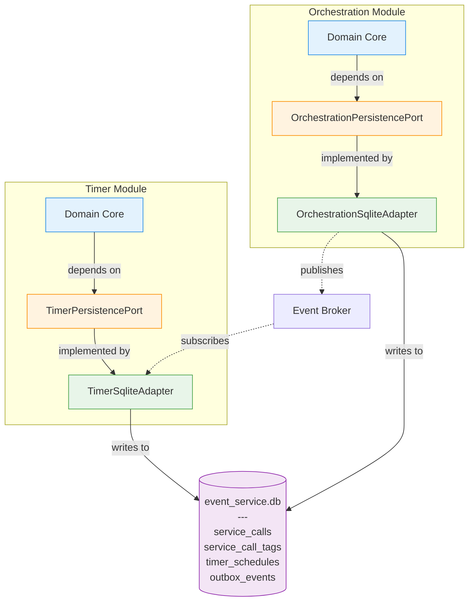
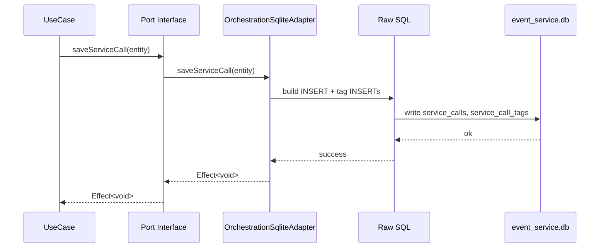

# ADR-0004: Database Structure

Status: Accepted

## Problem

SQLite has been selected as the persistence engine for MVP ([ADR-0001], [ADR-0003]). Now we must decide **how to structure SQLite database(s)**: single shared file or separate files per module?

**Key Question:** Does physical file structure matter if modules already have logical isolation (module-specific ports/adapters per hexagonal architecture)?

---

## Context

### What's Already Decided

**[ADR-0003] committed Timer to shared database:**

- Single `event_service.db` file with Timer owning `timer_schedules` table
- No cross-module JOINs (Timer queries only its own table)
- Event-driven communication (Timer receives data via broker, not DB queries)
- Foreign keys optional (data denormalized from events)

**Question:** Should we extend this system-wide or use separate files per module?

### Hexagonal Architecture Already Enforces Logical Isolation

Per design docs (`docs/design/modules-and-interactions.md`, `docs/design/ports.md`):

- Each module defines its own port interface (e.g., `OrchestrationPersistencePort`, `TimerPersistencePort`)
- Each module implements its own adapter (e.g., `OrchestrationSqliteAdapter`, `TimerSqliteAdapter`)
- Modules communicate via events only, never direct adapter calls

For a deeper architectural explanation (layers, dependency inversion, sequence flow), see: `../design/hexagonal-architecture-layers.md`.



**Key Insight:** Modules already have logical isolation (separate ports/adapters). This ADR decides: do they also need physical isolation (separate DB files)?

**Repository Pattern (Why no separate class?):** The persistence adapter already fulfills the Repository role: it implements the domain-shaped port, maps aggregates ⇄ rows, owns transactional SQL, and hides the storage technology. Adding a distinct `*Repository` abstraction now would just forward calls and increase indirection. We will introduce a separate repository layer only if new cross‑cutting concerns (e.g. caching, split read/write paths, multi-store composition) emerge.

### Event-Driven = No Cross-Module Transactions Needed

Orchestration writes domain + outbox atomically (one transaction). Timer receives event asynchronously and writes in separate transaction. No distributed transactions needed.

### Evolution Pressure

[ADR-0001] migration paths suggest Timer extraction likely early. Separate DB files simplify extraction (just move file); shared file requires data migration.

## Options

### Option 1: Single Shared Database

Single `event_service.db` file containing all tables. Each module has its own adapter accessing different tables.

```txt
./data/event_service.db
├── service_calls       # Orchestration
├── service_call_tags   # Orchestration
├── timer_schedules     # Timer
└── outbox_events       # Shared
```

**Pros:**

- ✅ Operational simplicity: Single file to backup/restore/monitor
- ✅ Shared outbox: One dispatcher reads all events
- ✅ Aligns with ADR-0003's existing choice
- ✅ Atomic transactions within module (domain + outbox)

**Cons:**

- ❌ Boundary violations possible: Modules can accidentally query other modules' tables (code discipline required)
- ❌ Extraction complexity: Must split DB and migrate data when extracting Timer service
- ❌ Testing: Modules share connection (harder to isolate)

### Option 2: Separate Databases per Module

Each module owns its own SQLite file. Physical isolation enforces boundaries.

```txt
./data/
├── orchestration.db
│   ├── service_calls
│   ├── service_call_tags
│   └── outbox_events
└── timer.db
    ├── timer_schedules
    └── outbox_events
```

**Pros:**

- ✅ Physical boundaries: Impossible to access other modules' tables (filesystem enforced)
- ✅ Extraction simplicity: Move `timer.db` file, no data migration, zero downtime
- ✅ Testing isolation: Each module tests independently with in-memory DB
- ✅ Clear ownership: Each module fully owns storage

**Cons:**

- ❌ Multiple outbox tables: Dispatcher must read from multiple files
- ❌ Operational overhead: Multiple files to backup/monitor (minor)
- ❌ Contradicts ADR-0003: Requires updating existing decision

## Decision

**Adopt Option 1: Single Shared Database (`event_service.db`).**

**Rationale:**

1. **Validates ADR-0003**: Timer already committed to shared file; extending system-wide provides consistency
2. **MVP simplicity**: Single file to deploy/backup/monitor; simpler testing; faster iteration
3. **Logical boundaries sufficient**: Hexagonal architecture (module-specific ports/adapters) + event-driven communication already enforce isolation; code reviews + tests enforce table ownership
4. **Migration path preserved**: Modules already have separate adapters; extraction = split DB + migrate data (manageable one-time cost)

**Non-negotiable:** Each module MUST have its own port interface and adapter implementation. Communication via EventBus only.

## Implementation Notes

**File Location:** `./data/event_service.db` (configurable via `DB_PATH` env var)

**WAL Mode:** Enable Write-Ahead Logging for read/write concurrency (`PRAGMA journal_mode=WAL`)

**Module Wiring:**

```typescript ignore
const db = new Database(process.env.DB_PATH || './data/event_service.db')
const orchAdapter = new OrchestrationSqliteAdapter(db)
const timerAdapter = new TimerSqliteAdapter(db)
```

**Testing:** In-memory DBs for unit tests (module-isolated); file-based for E2E

**Migrations:** Module-scoped files (`packages/orchestration/migrations/*.sql`), shared runner

### Vertical Slice (Orchestration → SQLite)

This slice shows how a single domain use case interacts with persistence through its port. It reinforces that the shared database file does not weaken logical boundaries.

1. Use Case (Domain): constructs entity & calls port
2. Port (Interface): domain-shaped contract
3. Adapter (Implements Port): acts as Repository (aggregate mapping + transactional SQL + (future) outbox append)
4. SQLite (Physical): shared file `event_service.db`



Example (condensed):

```typescript ignore
// Domain use case (depends on port only)
export const submitServiceCall = (req: SubmitServiceCallRequest) =>
	Effect.gen(function* () {
		const entity = ServiceCall.create(req)
		const port = yield* OrchestrationPersistencePort
		yield* port.saveServiceCall(entity)
		return entity
	})

// Port
export interface OrchestrationPersistencePort {
	saveServiceCall(entity: ServiceCall): Effect<void, PersistenceError>
}

// Adapter (simplified)
export class OrchestrationSqliteAdapter implements OrchestrationPersistencePort {
	constructor(private db: Database) {}
	saveServiceCall(entity: ServiceCall) {
		return Effect.tryPromise(() =>
			this.db.transaction(async (tx) => {
				await tx.run(
					`INSERT INTO service_calls (tenant_id, service_call_id, name, status, created_at)
                     VALUES (?, ?, ?, ?, ?)`,
					[entity.tenantId, entity.id, entity.name, entity.status, entity.createdAt],
				)
			})
		)
	}
}
```

Key Points:

- Domain depends only on the port
- Adapter is the only layer aware of SQL & concrete DB (adapter == repository)
- Replacing SQLite (e.g., Postgres) only swaps adapter implementation
- Shared file does not imply shared adapter or port

## Consequences

### What We Gain

- ✅ Operational simplicity: Single file to backup/monitor
- ✅ Development velocity: Zero-config local setup, fast tests
- ✅ Performance: No network latency, excellent read concurrency (WAL)
- ✅ Consistency: Atomic domain + outbox within module

### What We Accept

- 📏 **Boundary enforcement via discipline**: Shared file means modules CAN accidentally query other tables; mitigated by code reviews, tests, hexagonal ports/adapters
- 📏 **Service extraction requires data migration**: One-time cost when extracting Timer; acceptable because modules already have separate adapters (logical isolation ready)
- 📏 **Storage limits**: SQLite practical limit ~100s of GB; MVP scale (1-10 GB) is 1-2 orders of magnitude below

### Migration Triggers (When to Reconsider)

- 🚦 **Distributed writes**: Extract Orchestration to separate service → need Postgres
- 🚦 **Scale pressure**: DB >50 GB OR write throughput >10K/sec
- 🚦 **Ops requirements**: Team requires Postgres-specific tooling

### Service Extraction Path

When extracting Timer:

1. Create `timer.db` and run migrations
2. Copy `timer_schedules` data from `event_service.db`
3. Deploy Timer service with `TimerSqliteAdapter(timer.db)`
4. Drop `timer_schedules` from `event_service.db`

Logical boundaries (ports/adapters) make extraction mechanical.

---

## Related Decisions

- [ADR-0001: Topology][ADR-0001] — Modular Monolith enables embedded DB
- [ADR-0003: Timer Strategy][ADR-0003] — Timer already committed to shared SQLite
- [ADR-0005: Schema & Indexing][ADR-0005] — Multi-tenant schema applies to all modules
- [ADR-0008: Outbox Pattern][ADR-0008] — Outbox table per module (or shared) for transactional append
- [ADR-0010: Identity Generation][ADR-0010] — Database stores IDs but does NOT generate them (application-generated)

---

[ADR-0001]: ./ADR-0001-topology.md
[ADR-0003]: ./ADR-0003-timer.md
[ADR-0005]: ./ADR-0005-schema.md
[ADR-0008]: ./ADR-0008-outbox.md
[ADR-0010]: ./ADR-0010-identity.md
