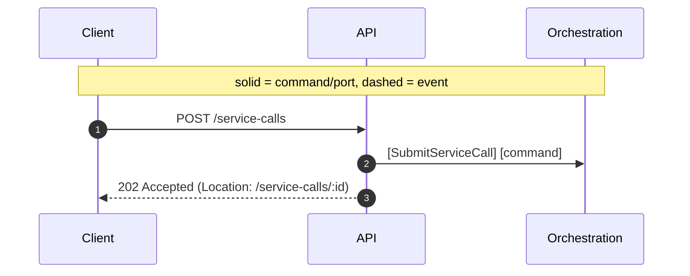
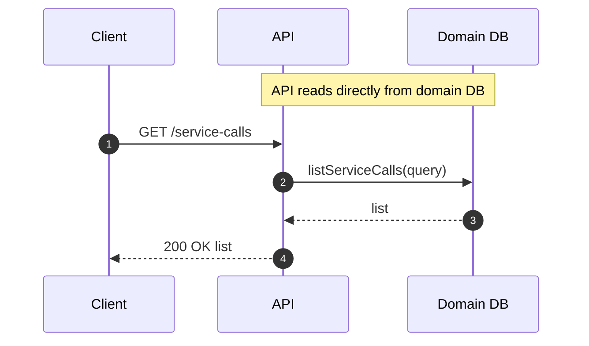

# API (Edge) Context

Responsibility

- Accept external requests, validate, publish commands, and query DB for UI.

Interfaces

- POST `/api/tenants/:tenantId/service-calls` [SubmitServiceCall]
- GET `/api/tenants/:tenantId/service-calls` (list with filters)
- GET `/api/tenants/:tenantId/service-calls/:serviceCallId` (detail)

Sequence (Submit)

Sequence (Query List)

Inputs/Outputs Recap

- Inputs: HTTP requests (submit, list, detail)
- Outputs: HTTP responses
- Ports: EventBus (publish commands), Persistence (read-only for queries)

Messages

- [SubmitServiceCall]

## Ports Used

- [EventBusPort]: see `../ports.md#eventbusport`
- [PersistencePort]: see `../ports.md#persistence`

[SubmitServiceCall]: ../messages.md#submitservicecall
[EventBusPort]: ../ports.md#eventbusport
[PersistencePort]: ../ports.md#persistenceport-domain-db
