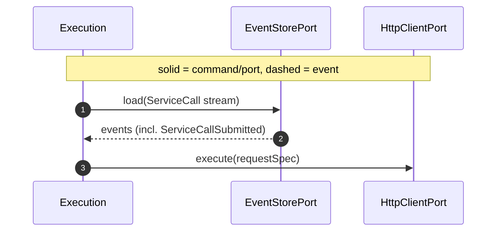
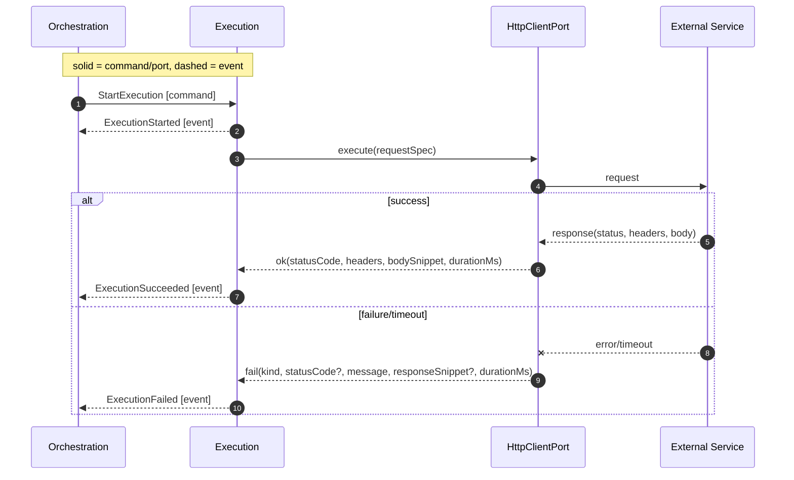
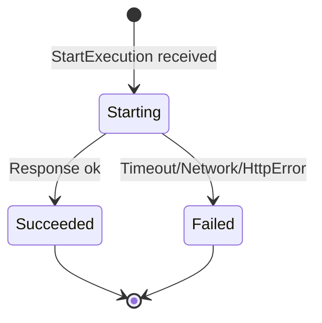

# Execution Context

Responsibility

- Perform a single attempt of the external call using protocol adapters.
- Emit `ExecutionStarted`, then either `ExecutionSucceeded` or `ExecutionFailed`.

Interfaces

- Command in: [StartExecution] { tenantId, serviceCallId }
- Ports: HttpClientPort, EventStore, Clock

Behavior

-- On [StartExecution]:

- Emit [ExecutionStarted] { startedAt }.
- Call HttpClientPort with requestSpec (fetched via correlation, or provided by contract in a future iteration).
- Map adapter result to either [ExecutionSucceeded] { finishedAt, responseMeta } or [ExecutionFailed] { finishedAt, errorMeta }.
- Exactly one terminal outcome emission per StartExecution.

Notes

- Non-2xx are failures in MVP.
- Stateless; idempotent on duplicate StartExecution (ignore if already started for same id).

Load from stream

- Before calling the external service, Execution resolves the `requestSpec` by loading the `ServiceCall` stream from [EventStorePort] and folding events in order (in MVP, the [ServiceCallSubmitted] event carries `requestSpec`). No local state is persisted; optionally, future iterations may pass a minimal request spec in the command to avoid the read.

Resolve RequestSpec

Inputs/Outputs Recap

- Inputs: [StartExecution] (command)
- Outputs:
  - [ExecutionStarted],
  - [ExecutionSucceeded] OR [ExecutionFailed] (events)
- Ports:
  - [HttpClientPort],
  - [EventStorePort],
  - [ClockPort]
- Storage: none (stateless)

Sequence (StartExecution → HTTP → Outcome)

State (Attempt lifecycle)

Messages

- [StartExecution]
- [ExecutionStarted]
- [ExecutionSucceeded]
- [ExecutionFailed]

## Ports Used

- HttpClientPort: see `../ports.md#httpclientport`
- EventStore: see `../ports.md#eventstoreport`
- Clock: see `../ports.md#clockport`

[StartExecution]: ../messages.md#startexecution
[ExecutionStarted]: ../messages.md#executionstarted
[ExecutionSucceeded]: ../messages.md#executionsucceeded
[ExecutionFailed]: ../messages.md#executionfailed
[ServiceCallSubmitted]: ../messages.md#servicecallsubmitted
[EventStorePort]: ../ports.md#eventstoreport
[HttpClientPort]: ../ports.md#httpclientport
[ClockPort]: ../ports.md#clockport
