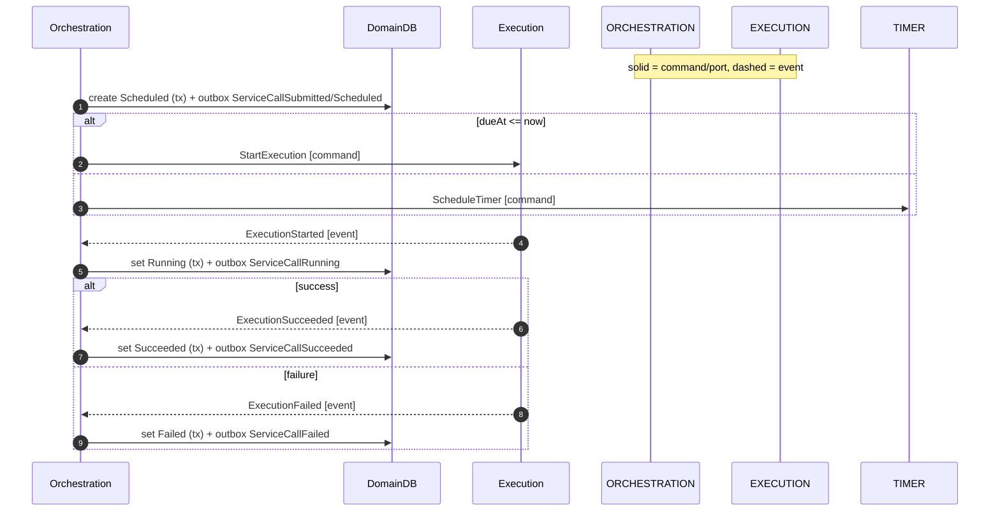

# Orchestration Context

Responsibility

- Own the `ServiceCall` lifecycle and invariants.
- Single writer: validate commands/process events, write domain DB, publish domain events after commit via outbox.
- Decide scheduling, guard start conditions, and finalize outcomes.

Core Model

- **Aggregate**: ServiceCall
  - Identity: `(tenantId, serviceCallId)`
  - State: name, submittedAt, dueAt, requestSpec, status (Scheduled|Running|Succeeded|Failed), tags, startedAt?, finishedAt?, outcome meta
  - Invariants: single attempt, legal transitions, terminal immutability, dueAt eligibility

Commands (intent)

- [SubmitServiceCall] `{ tenantId, name, dueAt, requestSpec, tags? }`
- [StartExecution] `{ tenantId, serviceCallId, requestSpec }` (issued to Execution)
- [ScheduleTimer] `{ tenantId, serviceCallId, dueAt }` (issued to Timer)

Events (facts)

- [ServiceCallSubmitted] `{ name, requestSpec\*, submittedAt, tags? }`
- [ServiceCallScheduled] `{ dueAt }`
- [ServiceCallRunning] `{ startedAt }`
- [ServiceCallSucceeded] `{ finishedAt, responseMeta }`
- [ServiceCallFailed] `{ finishedAt, errorMeta }`
- Process events consumed: [DueTimeReached], [ExecutionStarted], [ExecutionSucceeded], [ExecutionFailed]

Policies

- On [ServiceCallSubmitted] / [ServiceCallScheduled]:
  IF `dueAt <= now` THEN issue [StartExecution]; ELSE issue [ScheduleTimer].
- On [DueTimeReached]:
  IF `status == Scheduled` AND `dueAt <= now`
  THEN issue [StartExecution].
- On outcomes: apply to drive terminal state.
- Watchdog: if `status == Running` past timeout, mark Failed:Timeout.

Ports

- Persistence (domain DB read/write)
- OutboxPublisher (append domain events within tx)
- EventBus (publish commands, consume process events)
- TimerPort.schedule({ id, tenantId, dueTimeMs })
- Clock.now() for guards

Out-of-Scope (here)

- HTTP specifics, retry policies, cancellation.

Acceptance (MVP)

- For any submitted ServiceCall, the context ensures exactly one of Succeeded/Failed is eventually reached and observable.

Sequence (Scheduled → StartExecution → Outcome)

Inputs/Outputs Recap

- Inputs:
  - [SubmitServiceCall] (command),
  - [DueTimeReached] (event),
  - [ExecutionStarted] OR [ExecutionSucceeded] OR [ExecutionFailed] (events)
- Outputs:
  - [ServiceCallSubmitted], [ServiceCallScheduled], [ServiceCallRunning], [ServiceCallSucceeded], [ServiceCallFailed] (events via outbox)
  - [StartExecution], [ScheduleTimer] (commands)
- Ports: [PersistencePort], [OutboxPublisherPort], [EventBus], [TimerPort], [ClockPort]
- Read Side: API reads domain DB; no projections

Messages

- [DueTimeReached]
- [ScheduleTimer]
- [ServiceCallFailed]
- [ServiceCallRunning]
- [ServiceCallScheduled]
- [ServiceCallSubmitted]
- [ServiceCallSucceeded]
- [StartExecution]
- [SubmitServiceCall]

State access

- On handling commands or due/process events, Orchestration reads/writes the domain DB using conditional updates to enforce legal transitions. Domain events are appended to the outbox within the same transaction and published after commit.

<!-- Ports -->

[ClockPort]: ../ports.md#clockport
[EventBus]: ../ports.md#eventbusport
[OutboxPublisherPort]: ../ports.md#outboxpublisher
[PersistencePort]: ../ports.md#persistenceport-domain-db
[TimerPort]: ../ports.md#timerport

<!-- Events -->

[DueTimeReached]: ../messages.md#duetimereached
[ExecutionFailed]: ../messages.md#executionfailed
[ExecutionStarted]: ../messages.md#executionstarted
[ExecutionSucceeded]: ../messages.md#executionsucceeded
[ServiceCallFailed]: ../messages.md#servicecallfailed
[ServiceCallRunning]: ../messages.md#servicecallrunning
[ServiceCallScheduled]: ../messages.md#servicecallscheduled
[ServiceCallSubmitted]: ../messages.md#servicecallsubmitted
[ServiceCallSucceeded]: ../messages.md#servicecallsucceeded

<!-- Commands -->

[ScheduleTimer]: ../messages.md#scheduletimer
[StartExecution]: ../messages.md#startexecution
[SubmitServiceCall]: ../messages.md#submitservicecall
