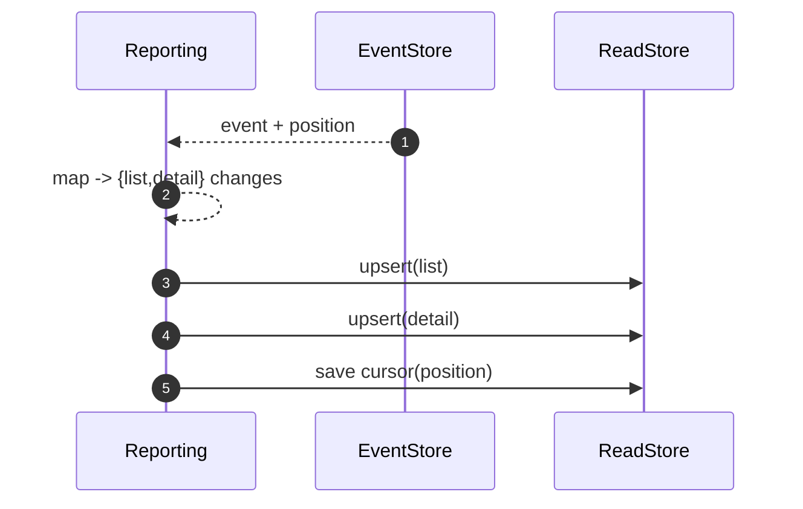

# Reporting Context

Responsibility

- Maintain denormalized read models for queries (Executions List, Execution Detail).

Read Models

- Executions List: per tenant row per service call with summary fields.
- Execution Detail: full timeline for a single service call.

Data Flow

- Consume domain events from `EventStorePort` in-order per aggregate and project into `ReadStore`.
- Track a projection position/cursor for idempotent, resumable processing.

Ports

- EventStore.subscribe(fromPosition?)
- ReadStore.upsert, ReadStore.transact

Sequence (Consume → Project → Upsert)

Queries

- API layer queries `ReadStore` via Reporting to serve endpoints.

## Ports Used

- [EventStore](../ports.md#eventstoreport) (consume)
- [ReadStore](../ports.md#readstore)
