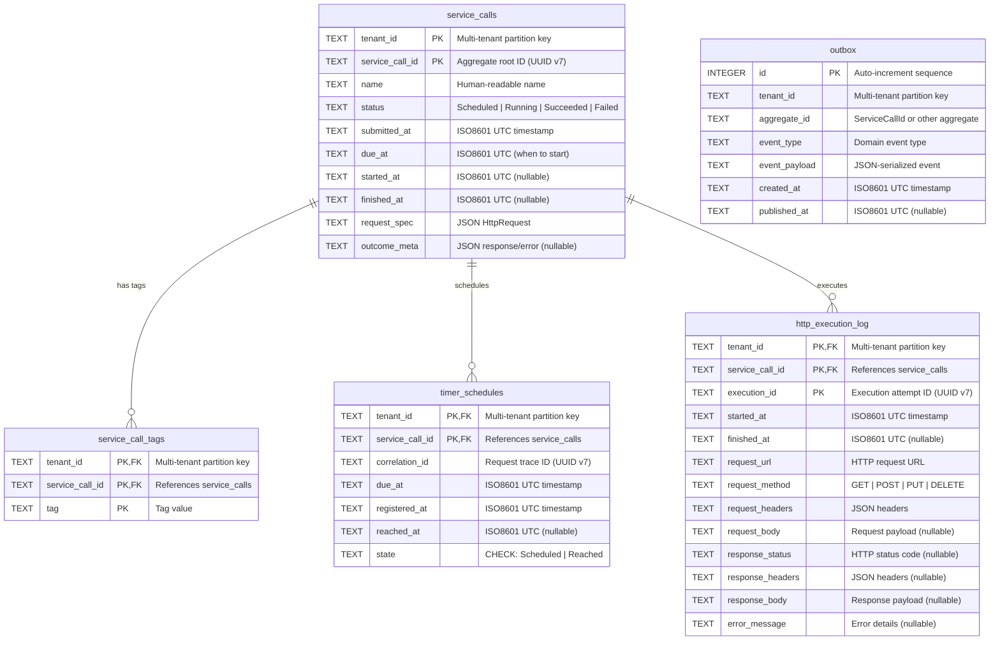

# Database Schema

[← Back to Design Docs](README.md) | [← Documentation Home](../index.md)

---

## Purpose

Complete reference for the SQLite database schema, including entity relationships, indexes, constraints, and multi-tenancy patterns. This document provides the **centralized view** of the entire database; module-specific schema details are documented in their respective packages.

**Related ADRs:**

- [ADR-0004: Database Structure](../decisions/ADR-0004-database.md) — Single shared database decision
- [ADR-0005: Schema & Indexing](../decisions/ADR-0005-schema.md) — Schema design patterns
- [ADR-0010: Identity](../decisions/ADR-0010-identity.md) — ID generation strategy

---

## Entity Relationship Diagram (Desired Final State)



**Legend:**

- **PK** = Primary Key
- **FK** = Foreign Key
- **nullable** = Column allows NULL values
- **CHECK** = Database constraint validates allowed values

**Migration Status:**

- ✅ `service_calls` — Stub exists (tenant_id, service_call_id only)
- ❌ `service_call_tags` — Not yet created
- ✅ `timer_schedules` — Fully migrated (all columns present)
- ✅ `http_execution_log` — Stub exists (tenant_id, service_call_id, execution_id only)
- ✅ `outbox` — Fully migrated (all columns present)

---

## Tables

### `service_calls`

**Owner:** Orchestration module

**Purpose:** Aggregate root for ServiceCall lifecycle (Scheduled → Running → Succeeded/Failed). Orchestration owns this table and is the single writer for all domain state.

**Current Status:** ⚠️ Stub table (only identity columns)

**Desired Schema:**

```sql
CREATE TABLE service_calls (
    tenant_id TEXT NOT NULL,
    service_call_id TEXT NOT NULL,
    name TEXT NOT NULL,
    status TEXT NOT NULL,
    submitted_at TEXT NOT NULL,
    due_at TEXT NOT NULL,
    started_at TEXT,
    finished_at TEXT,
    request_spec TEXT NOT NULL,
    outcome_meta TEXT,
    PRIMARY KEY (tenant_id, service_call_id),
    CHECK (status IN ('Scheduled', 'Running', 'Succeeded', 'Failed'))
) STRICT;
```

**Key Relationships:**

- Referenced by `timer_schedules` (Timer module schedules timers for ServiceCalls)
- Referenced by `http_execution_log` (Execution module logs HTTP attempts)
- Referenced by `service_call_tags` (API module enables tag-based queries)

**Why Co-Located:** Single writer principle (Orchestration) makes extraction unnecessary until scale requires it. Tags join table requires co-location for JOIN efficiency.

**Module Documentation:** (Future) `packages/orchestration/docs/schema.md`

---

### `service_call_tags`

**Owner:** Orchestration module (API queries it)

**Purpose:** Normalized tag storage for filtering ServiceCalls by user-defined labels. Enables efficient tag-based queries without JSON parsing.

**Current Status:** ❌ Not yet created

**Desired Schema:**

```sql
CREATE TABLE service_call_tags (
    tenant_id TEXT NOT NULL,
    service_call_id TEXT NOT NULL,
    tag TEXT NOT NULL,
    PRIMARY KEY (tenant_id, service_call_id, tag),
    FOREIGN KEY (tenant_id, service_call_id)
        REFERENCES service_calls(tenant_id, service_call_id)
        ON DELETE CASCADE
) STRICT;

CREATE INDEX idx_service_call_tags_tag
ON service_call_tags(tenant_id, tag, service_call_id);
```

**Key Relationships:**

- Many-to-one with `service_calls` (each ServiceCall can have multiple tags)
- Queried by API module for tag filtering: `WHERE tag IN (?)`

**Why Co-Located:** JOIN performance with `service_calls` requires same database. API queries like "all calls with tag X" need atomic reads across both tables.

**Design Rationale:** See [ADR-0005](../decisions/ADR-0005-schema.md) for normalized tags vs JSON decision.

---

### `timer_schedules`

**Owner:** Timer module

**Purpose:** Track scheduled timers and their firing state. Supports polling-based due-time detection with two-operation pattern (find due → mark fired) for at-least-once delivery.

**Current Status:** ✅ Fully migrated (migration `0003_timer_schedules_schema`)

**Schema Summary:**

- Composite PK: `(tenant_id, service_call_id)` — one timer per ServiceCall
- State machine: `Scheduled` → `Reached` (CHECK constraint enforced)
- Indexes: `(tenant_id, state, due_at)` for polling, `(correlation_id)` for tracing

**Key Relationships:**

- Many-to-one with `service_calls` (Timer doesn't own ServiceCall, just references it)
- FK with `ON DELETE CASCADE` (orphaned timers automatically removed)

**Why Potentially Separate DB:** Timer is infrastructure service with no domain logic. Could move to `timer.db` for independent scaling. FK to `service_calls` would become eventual consistency via events.

**Module Documentation:** [`packages/timer/docs/schema.md`](../../packages/timer/docs/schema.md) — Complete query patterns, index coverage analysis, performance tuning

---

### `http_execution_log`

**Owner:** Execution module

**Purpose:** Audit trail for HTTP execution attempts. Logs request/response details for debugging, compliance, and retry analysis.

**Current Status:** ⚠️ Stub table (only identity columns)

**Desired Schema:**

```sql
CREATE TABLE http_execution_log (
    tenant_id TEXT NOT NULL,
    service_call_id TEXT NOT NULL,
    execution_id TEXT NOT NULL,
    started_at TEXT NOT NULL,
    finished_at TEXT,
    request_url TEXT NOT NULL,
    request_method TEXT NOT NULL,
    request_headers TEXT NOT NULL,
    request_body TEXT,
    response_status TEXT,
    response_headers TEXT,
    response_body TEXT,
    error_message TEXT,
    PRIMARY KEY (tenant_id, service_call_id, execution_id),
    FOREIGN KEY (tenant_id, service_call_id)
        REFERENCES service_calls(tenant_id, service_call_id)
        ON DELETE CASCADE,
    CHECK (request_method IN ('GET', 'POST', 'PUT', 'DELETE', 'PATCH'))
) STRICT;
```

**Key Relationships:**

- Many-to-one with `service_calls` (multiple execution attempts per ServiceCall possible in future)
- Currently: single-attempt constraint (Orchestration invariant), FK ensures referential integrity

**Why Co-Located:** Execution log is dependent data (follows ServiceCall lifecycle). No independent queries; always accessed via `service_call_id`. Could extract to `execution.db` if audit/compliance requires separate storage.

**Module Documentation:** (Future) `packages/execution/docs/schema.md`

---

### `outbox`

**Owner:** Platform (shared infrastructure)

**Purpose:** Event publication queue implementing outbox pattern (ADR-0008). Ensures domain events are persisted atomically with domain writes, then published asynchronously to broker.

**Current Status:** ✅ Fully migrated (migration `0001_bootstrap_schema`)

**Schema Summary:**

- Auto-increment PK for insertion order
- Partial index on `(published_at, created_at) WHERE published_at IS NULL` for polling
- No FK to domain tables (supports multiple aggregate types)

**Key Relationships:**

- No foreign keys (infrastructure table, not domain entity)
- `aggregate_id` references ServiceCall IDs, Timer IDs, etc. (polymorphic)

**Why Shared Infrastructure:** Outbox pattern requires single dispatcher reading from one table. Splitting outbox per module would require multiple dispatchers and complicate ordering guarantees.

**Design Rationale:** See [ADR-0008: Outbox Pattern](../decisions/ADR-0008-outbox.md) for detailed implementation notes.

---

## Module Boundaries & Database Extraction

While all tables currently live in a single SQLite file (`event_service.db`), the architecture is designed to support future extraction of modules into separate databases. This section explains which tables could be separated and what constraints prevent it.

### Extraction Readiness

| Table                 | Owner Module  | Extraction Complexity | Blocker                                        |
| --------------------- | ------------- | --------------------- | ---------------------------------------------- |
| `service_calls`       | Orchestration | 🔴 High               | Referenced by all other domain tables (FK)     |
| `service_call_tags`   | Orchestration | 🔴 High               | Requires JOIN with `service_calls` for queries |
| `timer_schedules`     | Timer         | 🟡 Medium             | FK to `service_calls` (could use events)       |
| `http_execution_log`  | Execution     | 🟢 Low                | FK to `service_calls` (could use events)       |
| `outbox`              | Platform      | 🔴 High               | Shared infrastructure (all modules append)     |

**Key Principle:** Think of each table as if it could live in its own database, even though we use a single file today. This mental model ensures clean module boundaries and event-driven communication.

### Why `service_calls` + `service_call_tags` Must Co-Locate

**Query Pattern** (API module):

```sql
-- Find ServiceCalls with tag "urgent" and status "Scheduled"
SELECT sc.* 
FROM service_calls sc
JOIN service_call_tags sct ON sc.tenant_id = sct.tenant_id 
                           AND sc.service_call_id = sct.service_call_id
WHERE sc.tenant_id = ?
  AND sc.status = 'Scheduled'
  AND sct.tag = 'urgent';
```

**Why co-location required:**

- JOIN efficiency requires both tables in same database
- Atomic reads for consistency (no eventual consistency acceptable for read queries)
- Orchestration owns both tables (single writer principle)

**Extraction path:** If ServiceCall table grows too large, consider horizontal partitioning (shard by `tenant_id`), not vertical splitting.

---

### Why `timer_schedules` Could Separate

**Current constraint:** FK to `service_calls` ensures referential integrity

```sql
FOREIGN KEY (tenant_id, service_call_id) 
    REFERENCES service_calls(tenant_id, service_call_id) 
    ON DELETE CASCADE
```

**Extraction strategy:**

1. Replace FK with event-driven consistency:
    - Orchestration publishes `ServiceCallDeleted` event
    - Timer consumes event and deletes orphaned timers
2. Timer validates `service_call_id` existence via query to Orchestration (tolerate stale data)
3. Move `timer_schedules` table to `timer.db`

**Why extract:** Timer is infrastructure service (no business logic). Could scale independently for high-frequency polling workloads.

**When to extract:** When timer polling becomes bottleneck or Timer needs separate deployment lifecycle.

---

### Why `http_execution_log` Could Separate

**Current constraint:** FK to `service_calls` (audit trail follows aggregate)

**Extraction strategy:**

1. Remove FK constraint (Execution doesn't need to validate ServiceCall existence)
2. Accept eventual consistency: execution logs may temporarily reference deleted ServiceCalls
3. Move `http_execution_log` to `execution.db` (or dedicated audit database)

**Why extract:** Compliance requirements may mandate separate audit storage (retention policies, immutability, access controls).

**When to extract:** When audit/compliance requires separate database or execution logs grow faster than domain data.

---

### Why `outbox` Must Remain Shared

**Outbox pattern requirements:**

- Single dispatcher reads from one table (ordering guarantees)
- All modules append events atomically with domain writes
- Cross-module event ordering relies on single `created_at` timeline

**If we split outbox:**

- Each module gets own outbox table (`orchestration_outbox`, `timer_outbox`, etc.)
- Dispatcher must poll multiple tables (complex ordering across tables)
- Cross-module causality becomes harder to reason about

**Alternative considered (rejected):** Per-module outbox with distributed dispatcher. Complexity not justified for MVP scale.

**When to revisit:** When single outbox table becomes write contention bottleneck (unlikely with WAL mode).

---

## Multi-Tenancy Patterns

All tables follow strict multi-tenancy isolation patterns (enforced at application level, not database level).

### Primary Key Design

Every domain table uses `(tenant_id, ...)` as composite primary key:

- Prevents cross-tenant data access at database level
- Ensures per-tenant uniqueness of aggregate IDs
- Example: `(tenant_id, service_call_id)` allows same UUID across tenants

### Index Design

All query indexes lead with `tenant_id`:

- SQLite B-tree structure groups tenant data together (cache locality)
- Partition-local queries scan minimal index range
- Example: `idx_timer_schedules_due_at(tenant_id, state, due_at)`

### Query Discipline

- **MUST:** Every query filters by `tenant_id` (enforced by port interfaces)
- **NEVER:** Global queries (except infrastructure: migrations, outbox dispatcher)
- **VALIDATION:** Application-level (database doesn't enforce `tenant_id` presence)

### Foreign Key Multi-Tenancy

FKs include `tenant_id` to preserve referential integrity within tenant:

```sql
FOREIGN KEY (tenant_id, service_call_id) 
    REFERENCES service_calls(tenant_id, service_call_id)
```

**Why composite FK:** Prevents cross-tenant FK references (SQLite validates both columns match).

### Testing Requirements

Every port adapter MUST test tenant isolation:

- **Pattern:** Insert data for two tenants, query one, verify no leakage
- **Example:** See [Timer multi-tenant isolation test](../../packages/timer/docs/schema.md#multi-tenant-isolation-test)

**Test template:**

1. Arrange: Insert rows for `tenant_a` and `tenant_b`
2. Act: Query with `tenant_id = tenant_a`
3. Assert: Results contain ONLY `tenant_a` rows (zero `tenant_b` rows)

---

## Database Configuration

**File Location:** `./data/event_service.db` (configurable via `DB_PATH` env var)

**SQLite Pragmas** (set on connection initialization):

```sql
-- Database-level (persistent, set in migration 0001_bootstrap_schema.ts)
PRAGMA journal_mode = WAL;  -- Write-Ahead Logging for read/write concurrency

-- Session-level (set on every connection in client.ts)
PRAGMA foreign_keys = ON;   -- Enable FK constraint enforcement
PRAGMA synchronous = NORMAL; -- Balanced durability/performance
PRAGMA busy_timeout = 5000;  -- 5s wait on lock contention
```

**STRICT Mode:**

- All tables use `STRICT` keyword (SQLite 3.37+)
- Enforces type affinity (TEXT, INTEGER, REAL, BLOB)
- Prevents type coercion bugs (e.g., storing number in TEXT column)

**Write-Ahead Logging (WAL):**

- Enables concurrent reads during writes
- Writers don't block readers (important for polling queries)
- Checkpoint mode: automatic (SQLite manages WAL file size)
- See [ADR-0004](../decisions/ADR-0004-database.md#implementation-notes) for rationale

---

## Schema Evolution

**Migration Strategy:**

- Module-scoped migrations in `packages/<module>/migrations/`
- Shared migration runner in `packages/platform/src/database/`
- Migration history tracked in `effect_sql_migrations` table

**Current Migrations:**

- `0001_bootstrap_schema` (Platform) — Database config + stub tables + outbox
- `0003_timer_schedules_schema` (Timer) — Add domain columns to `timer_schedules`

**SQLite Constraints:**

- No `DROP COLUMN` support (recreate table with `CREATE ... AS SELECT`)
- No `ALTER COLUMN` type changes (recreate table pattern)
- `CHECK` constraints cannot be added after table creation (recreate required)

**Safe Migration Pattern** (ALTER vs CREATE/RENAME):

```sql
-- Step 1: Create new table with desired schema
CREATE TABLE timer_schedules_new (
    tenant_id TEXT NOT NULL,
    service_call_id TEXT NOT NULL,
    -- ... new columns ...
    PRIMARY KEY (tenant_id, service_call_id)
) STRICT;

-- Step 2: Copy data from old table (with transformations if needed)
INSERT INTO timer_schedules_new 
SELECT tenant_id, service_call_id, ... 
FROM timer_schedules;

-- Step 3: Drop old table
DROP TABLE timer_schedules;

-- Step 4: Rename new table
ALTER TABLE timer_schedules_new RENAME TO timer_schedules;

-- Step 5: Recreate indexes
CREATE INDEX idx_timer_schedules_due_at 
ON timer_schedules(tenant_id, state, due_at);
```

**Non-Breaking Changes** (simple ALTER TABLE):

- Adding nullable columns: `ALTER TABLE ... ADD COLUMN ... NULL`
- Adding indexes: `CREATE INDEX ...`
- Renaming tables: `ALTER TABLE ... RENAME TO ...`

**Breaking Changes** (require recreate):

- Changing column types
- Adding NOT NULL columns (without default)
- Adding CHECK constraints
- Dropping columns

---

## Performance Considerations

**Index Strategy:**

- Cover common query patterns (WHERE, ORDER BY)
- Lead with `tenant_id` for partition locality
- Use partial indexes for filtered queries (e.g., `WHERE published_at IS NULL`)
- Validate with `EXPLAIN QUERY PLAN` before production

**Query Patterns:**

- Prefer index-covered queries (no table scan)
- Use `LIMIT` for polling queries (bounded result sets)
- Batch operations when possible (reduce transaction overhead)

**Polling Efficiency:**

- Timer: `WHERE tenant_id = ? AND state = 'Scheduled' AND due_at <= ?` (index-covered)
- Outbox: `WHERE published_at IS NULL ORDER BY created_at` (partial index)
- Both use `LIMIT` to prevent unbounded result sets

**Transaction Isolation:**

- Default: SERIALIZABLE (SQLite default with WAL)
- Concurrent reads allowed during writes (WAL benefit)
- Lock contention handled via `busy_timeout` pragma

---

## Testing

### Test Strategy by Layer

**Unit Tests** (in-memory SQLite):

- Fast iteration with `:memory:` databases
- Per-module adapter tests in `packages/<module>/src/adapters/*.test.ts`
- Test layers isolate dependencies (no real broker, no real clock)

**Integration Tests** (file-based SQLite):

- Realistic I/O with `./data/test-*.db` files
- Multi-tenant isolation tests (prevent cross-tenant leakage)
- FK constraint enforcement tests (CASCADE behavior)
- Migration idempotency tests (re-run same migration)

### Required Test Coverage

Every module adapter MUST test:

1. **Multi-tenant isolation:** Query tenant A doesn't return tenant B data
2. **FK constraints:** CASCADE deletes propagate correctly
3. **Idempotency:** Duplicate commands/events handled correctly

### Test Cleanup

- **In-memory:** Automatic (connection close drops database)
- **File-based:** Explicit cleanup in `afterEach` hooks
- **Parallel isolation:** Unique DB file per test suite (`test-${suiteName}-${timestamp}.db`)

**Module-specific test patterns:** See module schema docs for detailed examples.

---

## Module-Specific Schema Docs

Detailed schema documentation per module:

- **Timer:** [`packages/timer/docs/schema.md`](../../packages/timer/docs/schema.md)
  - Timer polling query patterns
  - State transition semantics
  - Idempotency guarantees

- **Orchestration:** (Future) `packages/orchestration/docs/schema.md`
  - ServiceCall aggregate schema
  - Tag query patterns
  - Status transition rules

- **Execution:** (Future) `packages/execution/docs/schema.md`
  - Execution log schema
  - Retry tracking patterns

---

## References

- [ADR-0004: Database Structure](../decisions/ADR-0004-database.md) — Single shared database decision
- [ADR-0005: Schema & Indexing](../decisions/ADR-0005-schema.md) — Schema design patterns (Status: Proposed)
- [ADR-0008: Outbox Pattern](../decisions/ADR-0008-outbox.md) — Event publication strategy
- [ADR-0010: Identity](../decisions/ADR-0010-identity.md) — UUID v7 generation strategy
- [Hexagonal Architecture Layers](hexagonal-architecture-layers.md) — Port/Adapter pattern
