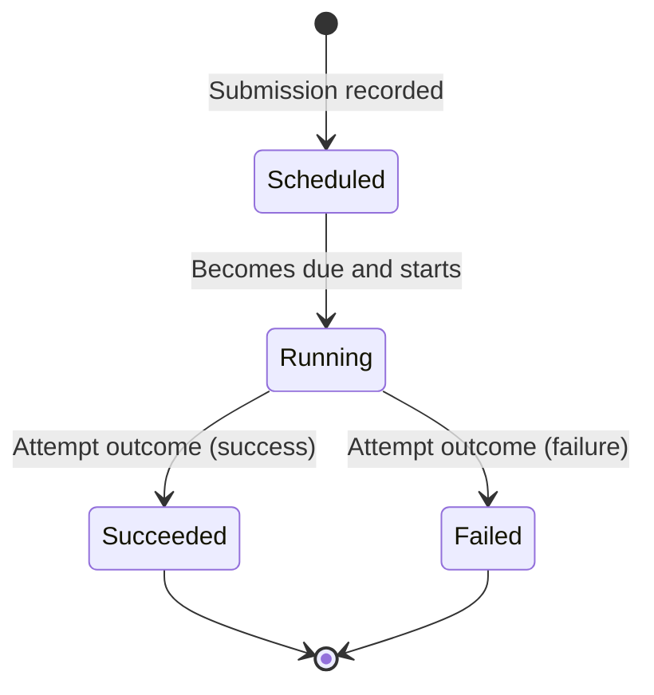

# Domain (Problem Space)

## Purpose

Contract the discovery into problem-space essentials: constraints, core concepts, and high-level workflows, independent of implementation or solution structures.

**Why this document exists:**
- **Shared Understanding**: Establishes ubiquitous language between stakeholders and developers
- **Problem-First Thinking**: Defines WHAT we're solving before HOW we solve it
- **Scope Boundaries**: Makes explicit what's in/out of MVP to prevent scope creep
- **Design Validation**: Implementation decisions must trace back to problem-space requirements

## Constraints (MVP)

**Why these constraints:**

- **Single attempt per Service Call; no retries/cancellations**
  - **Why**: Simplifies state machine (no retry counters, backoff strategies)
  - **Trade-off**: Less resilient, but avoids complexity of idempotent retry logic
  - **Evolution path**: Can add retries in Phase 2 without breaking current design

- **HTTP is the only supported protocol**
  - **Why**: 80% of use cases, standardized request/response semantics
  - **Trade-off**: Can't call gRPC/GraphQL services in MVP
  - **Evolution path**: Protocol abstraction already in place (RequestSpec extensible)

- **Due time semantics: execute at/after `dueAt`; if `dueAt <= now`, eligible immediately**
  - **Why**: Prevents blocked queue if timer fires late (system resilience)
  - **Trade-off**: "Fire ASAP" vs "Fire at exact time" — chose pragmatism
  - **Business impact**: Acceptable for async service calls (not real-time events)

- **Multi-tenancy: every action is tenant-scoped; all queries filter by `tenantId`**
  - **Why**: Data isolation enforced at application layer (defense in depth)
  - **Trade-off**: Every operation pays tenant-filtering cost, but prevents data leakage
  - **Security**: Type system prevents cross-tenant access (TenantId brand)

- **Minimal persistence of bodies/headers (size-limited snippets; redaction allowed)**
  - **Why**: PII/GDPR compliance, storage efficiency
  - **Trade-off**: Can't fully debug failed requests, but keeps storage bounded

- **Event-driven messaging with at-least-once delivery tolerance**
  - **Why**: Resilience over strict ordering (crash-tolerant, broker-agnostic)
  - **Trade-off**: Consumers must be idempotent, but system survives broker restarts

- **DB is the source of truth; Orchestration is the only writer of domain state**
  - **Why**: Single Writer Principle prevents race conditions and conflicting writes
  - **Trade-off**: All reads must query Orchestration's tables (no projections in MVP)
  - **Correctness**: Guarantees consistent state transitions (see ADR-0004)

## Core Concepts (Ubiquitous Language)

**Why establish ubiquitous language:**
- Prevents miscommunication between domain experts and developers
- Ensures code names match business vocabulary (ServiceCall, not Task/Job)
- Enables non-technical stakeholders to understand code structure

**Domain Entities:**

- **Tenant**: Logical owner of Service Calls
  - **Why separate from User**: Multi-organization support (one user, many tenants)
  - **Security boundary**: All data partitioned by TenantId

- **Service Call**: Intention to invoke an external service with a request spec and a due time
  - **Why "Service Call" not "HTTP Request"**: Protocol-agnostic terminology
  - **Aggregate root**: All state transitions center on ServiceCall lifecycle

- **Due Time** (`dueAt`): Earliest instant at which execution may start
  - **Why "earliest"**: System fires at-or-after, not at-exact-time (resilience over precision)
  - **Type**: DateTime.Utc (timezone-agnostic, prevents DST bugs)

- **Execution**: The single attempt to perform the Service Call
  - **Why single attempt**: MVP constraint, simplifies failure handling

- **Outcome/Status**: Scheduled | Running | Succeeded | Failed
  - **Why these states**: Minimal state machine, no intermediate states (simpler correctness proofs)

- **Tag**: Label(s) associated at submission for later filtering
  - **Why tags**: Enables batch queries without complex schema (extensibility point)

Glossary (Problem-Space)

- Intention: the user’s desire to have a call executed.
- Eligibility: the condition that time has reached or passed `dueAt`.
- Attempt: one try to turn intention into an outcome.
- Outcome: the terminal result of an attempt (Succeeded/Failed).

> [!NOTE] **Tenancy**
>
> - **Scope**:
>   All operations are tenant-scoped.
>   Every command, event, and query includes `tenantId`.
>   Cross-tenant access is not permitted.
> - **Identity**:
>   The primary business identity is `(tenantId, serviceCallId)`.
>   Idempotency keys are per-tenant.
> - **Isolation**:
>   Read models and stores are logically partitioned by `tenantId`
>   Physical isolation (DB per tenant) is not required for MVP but must remain feasible.
> - **Storage/indexing**:
>   All primary indexes include `tenantId` first;
>   common secondary indexes: `(tenantId, status)`, `(tenantId, dueAt)`, `(tenantId, tags)`.
>   API queries the domain tables directly; no projections are maintained for MVP.
> - **Messaging**:
>   Topics/queues are either shared with `tenantId` in message envelopes or logically partitioned per tenant.
>   Consumers must filter by `tenantId`.
> - **API/auth**:
>   Authentication/authorization is out-of-scope for MVP;
>   however, all API routes embed `:tenantId` and handlers enforce scoping and idempotency within the tenant.
> - **Timers**:
>   Registrations carry `(tenantId, serviceCallId, dueAt)`.
>   Timer emissions include `tenantId` to preserve scoping on wakeup.
> - **Observability**:
>   Logs/metrics/traces annotate `tenantId` for correlation;

## High-Level Workflows

**Why document workflows at problem-space level:**
- Define business process independent of technical implementation
- Validate that solution architecture maps back to business needs
- Identify missing use cases or edge conditions early

**Core Workflows:**

- **Submission**
  - A tenant submits a Service Call with `name`, `requestSpec`, `dueAt`, and optional `tags`
  - Orchestration validates, persists `Scheduled` state in the domain DB, and emits domain events after commit
  - **Why validation first**: Fail fast before persisting invalid data (saves storage, prevents orphaned timers)
  - **Why events after commit**: Outbox pattern prevents dual-write problem (see ADR-0008)

- **Scheduling**
  - Orchestration ensures a timer exists for `dueAt` (or starts immediately when `dueAt <= now`)
  - **Why separate Timer module**: Decouples time-tracking from business logic (testability, maintainability)
  - **Why immediate execution**: If already past due time, no reason to wait (UX optimization)

- **Becoming Due**
  - At/after `dueAt`, the Service Call becomes eligible to start; Timer emits a due signal; Orchestration decides to start
  - **Why Timer "signals" vs "executes"**: Timer doesn't make business decisions, only reports time passage
  - **Why Orchestration decides**: Guards against duplicate firing, validates state transition (Scheduled → Running)

- **Execution**
  - Exactly one attempt is performed, producing either success (response metadata) or failure (error metadata)
  - Orchestration is the single writer for `Running` and terminal states
  - **Why single writer**: Prevents race conditions in state transitions (correctness guarantee)
  - **Why capture metadata**: Enables debugging, latency analysis, and outcome auditing

- **Observation**
  - The tenant can list and filter calls by status, tags, and date; API serves queries directly from the domain DB with proper indexes
  - **Why direct DB queries**: Simpler than CQRS projections for MVP (acceptable read latency)
  - **Why filter by status/tags**: Common UX patterns (show pending, show failed, etc.)

Business State Diagram (Problem-Space)

Quality Attributes

- Correctness: one attempt; legal transitions only; Orchestration is the only writer.
- Observability: state transitions produce domain events published after DB commit (via outbox); correlation IDs propagate across messages.
- Evolvability: protocol-agnostic value objects; IO behind ports; broker-first without ES/CQRS.

Out-of-Scope (MVP)

- Retries/backoff, cancellation, editing requests, CRON-like schedules, authentication/egress policy.

Implementation Notes (Non-normative)

- Idempotency: API computes `serviceCallId` deterministically from `(tenantId, idempotencyKey)`; Orchestration enforces uniqueness on `(tenantId, serviceCallId)`.
- Due-time guard: Orchestration checks `dueAt <= now` when starting; Timer may deliver duplicates; transitions are conditional (e.g., only `Scheduled → Running`).
- Privacy: bodies/headers are redacted/truncated before persistence and when included in events.
