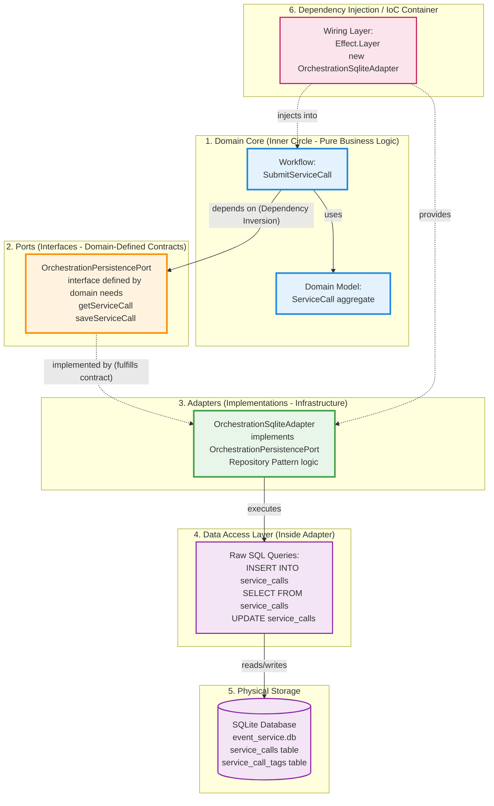
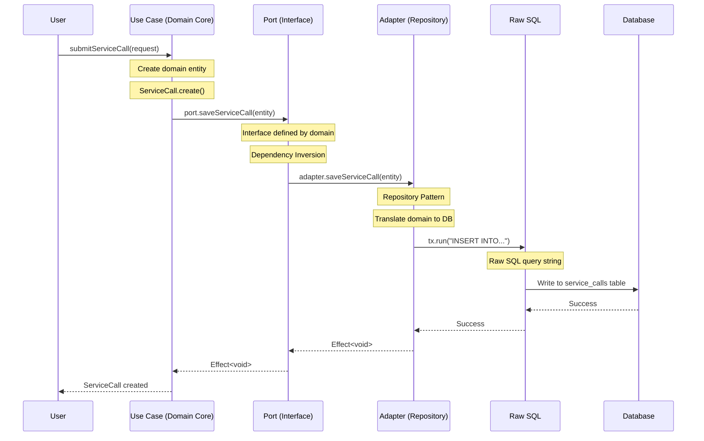

# Hexagonal Architecture: Layers & Dependency Flow

This document explains how database, repositories, ports, adapters, and dependency injection work together in our hexagonal architecture.

## The Relationship Map



---

## Layer-by-Layer Explanation

### Layer 1: Domain Core (Business Logic)

**What it is:** Pure business logic with no infrastructure dependencies. Includes domain models and workflows (application orchestration using DMMF patterns).

**Example:**

```typescript
// packages/orchestration/src/workflows/submit-service-call.workflow.ts
export const submitServiceCallWorkflow = (
  request: SubmitServiceCallRequest,
): Effect<ServiceCall, ValidationError | PersistenceError> =>
  Effect.gen(function* (_) {
    // 1. Create domain entity
    const serviceCall = ServiceCall.create(request);

    // 2. Workflow depends on PORT (interface), NOT adapter
    const port = yield* _(OrchestrationPersistencePort);

    // 3. Save via port (workflow doesn't know it's SQLite)
    yield* _(port.saveServiceCall(serviceCall));

    return serviceCall;
  });
```

**Key Point:** Workflows know WHAT they need (persistence), not HOW it's implemented. Workflows compose domain models with ports following Domain Modeling Made Functional (DMMF) principles.

---

### Layer 2: Ports (Interfaces - Dependency Inversion Principle)

**What it is:** Interfaces defined BY the domain FOR the domain's needs.

**Example:**

```typescript
// packages/orchestration/src/ports/persistence.ts
export interface OrchestrationPersistencePort {
  // Interface shaped by DOMAIN needs, not DB capabilities
  getServiceCall(
    tenantId: TenantId,
    id: ServiceCallId,
  ): Effect<ServiceCall | null, PersistenceError>;

  saveServiceCall(serviceCall: ServiceCall): Effect<void, PersistenceError>;

  listServiceCalls(
    tenantId: TenantId,
    filters: ListFilters,
  ): Effect<ServiceCall[], PersistenceError>;
}

// Tag for Effect dependency injection
export const OrchestrationPersistencePort =
  Context.GenericTag<OrchestrationPersistencePort>(
    "@orchestration/PersistencePort",
  );
```

**Key Point:** This is **Dependency Inversion** - the domain defines the interface it needs; infrastructure must adapt to it.

---

### Layer 3: Adapters (Infrastructure Implementations)

**What it is:** Implementations that connect domain to external systems (DB, HTTP, message brokers).

**Repository Pattern:** Adapters often implement the Repository pattern - encapsulating data access logic.

**Example:**

```typescript
// packages/orchestration/src/adapters/sqlite-persistence.ts
export class OrchestrationSqliteAdapter
  implements OrchestrationPersistencePort
{
  constructor(private readonly db: Database) {}

  // Adapter translates domain model to/from DB
  saveServiceCall(serviceCall: ServiceCall): Effect<void, PersistenceError> {
    return Effect.gen(function* (_) {
      // Repository pattern: encapsulate data access
      yield* _(
        Effect.tryPromise({
          try: () =>
            this.db.transaction(async (tx) => {
              // Raw SQL happens HERE (Layer 4)
              await tx.run(
                `INSERT INTO service_calls (
                  tenant_id, service_call_id, name, status, created_at
                ) VALUES (?, ?, ?, ?, ?)`,
                [
                  serviceCall.tenantId,
                  serviceCall.id,
                  serviceCall.name,
                  serviceCall.status,
                  serviceCall.createdAt,
                ],
              );

              // Save tags in same transaction
              for (const tag of serviceCall.tags) {
                await tx.run(
                  `INSERT INTO service_call_tags (
                    tenant_id, service_call_id, tag
                  ) VALUES (?, ?, ?)`,
                  [serviceCall.tenantId, serviceCall.id, tag],
                );
              }
            }),
          catch: (error) => new PersistenceError({ cause: error }),
        }),
      );
    });
  }

  getServiceCall(
    tenantId: TenantId,
    id: ServiceCallId,
  ): Effect<ServiceCall | null, PersistenceError> {
    return Effect.gen(function* (_) {
      const row = yield* _(
        Effect.tryPromise({
          try: () =>
            this.db.get(
              `SELECT * FROM service_calls 
               WHERE tenant_id = ? AND service_call_id = ?`,
              [tenantId, id],
            ),
          catch: (error) => new PersistenceError({ cause: error }),
        }),
      );

      if (!row) return null;

      // Map DB row to domain model
      return ServiceCall.fromPersistence(row);
    });
  }
}
```

**Key Point:** Adapter knows both the domain (implements port) and infrastructure (uses DB/SQL). This is the **translation layer**.

---

### Layer 4: Raw SQL (Data Access Details)

**What it is:** The actual database operations - SQL strings, query builders, ORMs.

**Why it's inside the adapter:**

- Domain shouldn't know SQL exists
- Adapter encapsulates ALL persistence details
- Easy to swap implementations (SQLite → Postgres, SQL → NoSQL)

**Example:**

```typescript
// Inside adapter method
await tx.run(
  `INSERT INTO service_calls (
    tenant_id, service_call_id, name, status, created_at
  ) VALUES (?, ?, ?, ?, ?)`,
  [serviceCall.tenantId, serviceCall.id, serviceCall.name, ...]
);
```

**Key Point:** SQL is an implementation detail hidden inside the adapter.

---

### Layer 5: Physical Database

**What it is:** The actual storage system (SQLite file, Postgres server, MongoDB, etc.).

**In our case:**

```txt
./data/event_service.db  (SQLite file)
├── service_calls table
├── service_call_tags table
├── timer_schedules table
└── outbox_events table
```

**Key Point:** Domain is completely unaware of what DB technology is used.

---

### Layer 6: Dependency Injection / IoC (Wiring)

**What it is:** The mechanism that connects ports (interfaces) to adapters (implementations) at runtime.

**Effect's approach:**

```typescript
// Main application setup
import { Layer, Effect } from "effect";

// 1. Create the database connection
const db = new Database("./data/event_service.db");

// 2. Create the adapter instance
const sqliteAdapter = new OrchestrationSqliteAdapter(db);

// 3. Wire adapter to port (Dependency Injection)
const OrchestrationPersistenceLayer = Layer.succeed(
  OrchestrationPersistencePort,
  sqliteAdapter,
);

// 4. Provide layer to use cases
const program = submitServiceCall(request).pipe(
  Effect.provide(OrchestrationPersistenceLayer),
);

// 5. Run the program
Effect.runPromise(program);
```

**Traditional DI container approach:**

```typescript
// Similar concept with other DI frameworks
container.bind(OrchestrationPersistencePort).to(OrchestrationSqliteAdapter);

// Or with Angular
@Injectable()
class UseCase {
  constructor(
    @Inject(OrchestrationPersistencePort)
    private readonly persistence: OrchestrationPersistencePort,
  ) {}
}
```

**Key Point:** DI/IoC is HOW we inject concrete implementations (adapters) into abstractions (ports) at runtime. The domain depends on abstractions, DI provides the concrete implementations.

---

## The Complete Flow (Request to Database)



---

## Key Principles Summary

### 1. **Dependency Inversion Principle (DIP)**

- **Domain defines** what it needs (port/interface)
- **Infrastructure implements** what domain needs (adapter)
- Domain depends on abstraction (port), NOT implementation (adapter)

```typescript
// ✅ Good: Domain depends on interface
function useCase(port: PersistencePort) { ... }

// ❌ Bad: Domain depends on implementation
function useCase(adapter: SqliteAdapter) { ... }
```

### 2. **Repository Pattern**

- Encapsulates data access logic
- Provides collection-like interface (`get`, `save`, `list`)
- Hides SQL/DB details from domain
- **In our architecture:** Repository = Adapter implementation

### 3. **Ports (Interfaces)**

- Defined BY domain FOR domain needs
- Named from domain perspective (`PersistencePort`, not `DatabaseGateway`)
- Methods use domain language (`saveServiceCall`, not `insertRow`)

### 4. **Adapters (Implementations)**

- Connect domain to external systems
- Know both domain (implements port) and infrastructure (uses DB)
- Translation layer: domain models ↔ DB rows

### 5. **Inversion of Control (IoC)**

- Domain doesn't create adapters
- External wiring layer (DI container, Effect layers) provides them
- Enables testing (inject mock adapters), flexibility (swap implementations)

---

## Testing Example: Why This Matters

**Production:**

```typescript
// Real adapter talks to SQLite
const prodLayer = Layer.succeed(
  PersistencePort,
  new OrchestrationSqliteAdapter(db),
);

const program = submitServiceCall(request).pipe(Effect.provide(prodLayer));
```

**Testing:**

```typescript
// Mock adapter for fast tests
class InMemoryPersistenceAdapter implements OrchestrationPersistencePort {
  private store = new Map<string, ServiceCall>();

  saveServiceCall(entity: ServiceCall): Effect<void> {
    return Effect.sync(() => {
      this.store.set(entity.id, entity);
    });
  }

  getServiceCall(tenantId, id): Effect<ServiceCall | null> {
    return Effect.succeed(this.store.get(id) || null);
  }
}

// Inject mock instead of real DB
const testLayer = Layer.succeed(
  PersistencePort,
  new InMemoryPersistenceAdapter(),
);

const program = submitServiceCall(request).pipe(
  Effect.provide(testLayer), // Same use case, different adapter!
);
```

**Key Point:** Because domain depends on PORT (interface), we can inject ANY adapter (SQLite, Postgres, in-memory, mock) without changing domain code.

---

## Architecture Benefits

| Concept                        | Benefit                                      |
| ------------------------------ | -------------------------------------------- |
| **Ports (Interfaces)**         | Domain isolated from infrastructure changes  |
| **Adapters (Implementations)** | Swap implementations without domain changes  |
| **Repository Pattern**         | Encapsulate data access, hide SQL complexity |
| **DI/IoC**                     | Enable testing (mock adapters), flexibility  |
| **Dependency Inversion**       | Domain stable, infrastructure flexible       |

---

## Your Project's Stack

For `event-service-agent-kata`:

```txt
Domain Core (packages/orchestration/src/domain/)
    ↓ depends on
Port Interface (packages/orchestration/src/ports/persistence.ts)
    ↑ implemented by
Adapter (packages/orchestration/src/adapters/sqlite-persistence.ts)
    ↓ uses
Raw SQL (INSERT, UPDATE, SELECT strings)
    ↓ operates on
SQLite Database (./data/event_service.db)
    ↑ wired together by
Effect Layers (Dependency Injection)
```

Each layer has clear responsibilities and dependencies flow inward (infrastructure depends on domain, never reverse).
