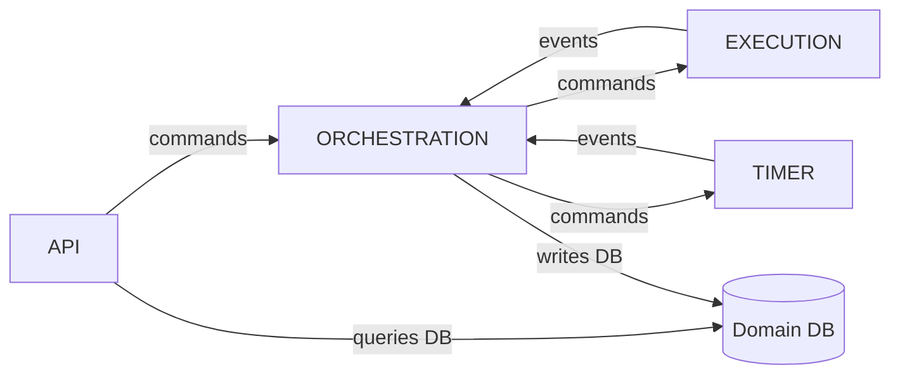
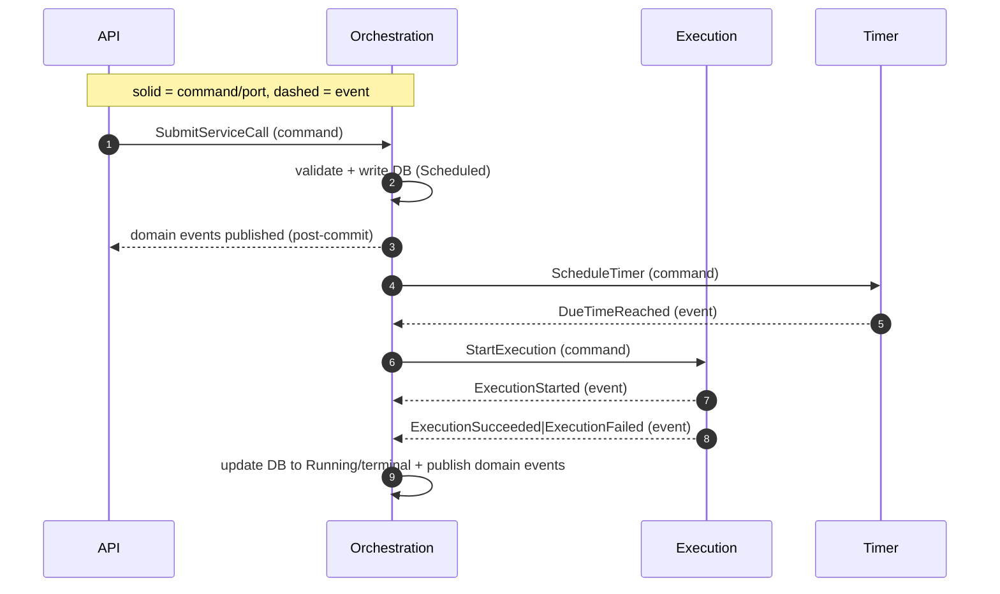
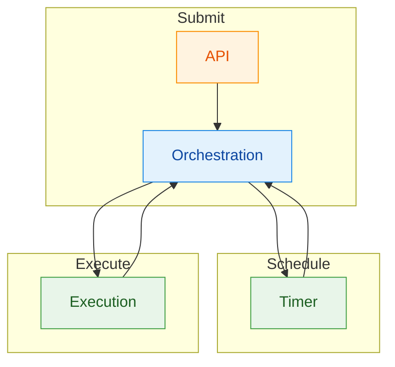

# Modules & Interactions (within the Service Agent BC)

[← Back to Design Docs](README.md) | [← Documentation Home](../index.md)

---

Scope

- This document describes modules inside a single bounded context: the Service Agent (Service Call Management). These are technical/organizational modules around one domain model and ubiquitous language.

Overview

- [Edge/API] (Delivery): Validates HTTP, publishes commands, queries DB for UI.
- [Orchestration] (Core, single writer): Owns `ServiceCall` lifecycle, invariants, and DB writes.
- [Execution] (Supporting): Performs HTTP call, emits outcome process events.
- [Timer] (Infrastructure): Schedules and emits [DueTimeReached] as process events.

Module Interaction Map

Swimlane (Module Roles & Flows)

Responsibility Matrix (lightweight)

- API: validation, idempotency surface, HTTP mapping, read DB for UI
- Orchestration: invariants, policy, single-writer DB transitions, outbox
- Execution: HTTP call, emit process events
- Timer: due handling, emit process events

Message Index

- Orchestration (commands in, domain events out):
  - Commands in: [SubmitServiceCall], [DueTimeReached], [ExecutionStarted] OR [ExecutionSucceeded] OR [ExecutionFailed]
  - Commands out: [StartExecution], [ScheduleTimer]
  - Domain events out: [ServiceCallSubmitted], [ServiceCallScheduled], [ServiceCallRunning], [ServiceCallSucceeded], [ServiceCallFailed]
- Execution:
  - Commands in: [StartExecution]
  - Events out: [ExecutionStarted], [ExecutionSucceeded], [ExecutionFailed]
- Timer:
  - Commands in: [ScheduleTimer]
  - Events out: [DueTimeReached]
- API (Edge):
  - Commands out: [SubmitServiceCall]

EDA without ES/CQRS (MVP)

- DB is source of truth; Orchestration is the only writer.
- Broker transports commands/events; API reads DB directly (no projections).
- Outbox ensures domain events are published after commit.

Ports Used (overview)

- Orchestration: [ClockPort], [PersistencePort], [OutboxPublisherPort], [EventBusPort], [TimerPort]
- Execution: [HttpClientPort], [EventBusPort], [ClockPort]
- Timer: [ClockPort], [EventBusPort]
- API: [PersistencePort] (read-only)

<!-- Events -->

[DueTimeReached]: ./messages.md#duetimereached
[ExecutionFailed]: ./messages.md#executionfailed
[ExecutionStarted]: ./messages.md#executionstarted
[ExecutionSucceeded]: ./messages.md#executionsucceeded
[ServiceCallFailed]: ./messages.md#servicecallfailed
[ServiceCallRunning]: ./messages.md#servicecallrunning
[ServiceCallScheduled]: ./messages.md#servicecallscheduled
[ServiceCallSubmitted]: ./messages.md#servicecallsubmitted
[ServiceCallSucceeded]: ./messages.md#servicecallsucceeded

<!-- Commands -->

[ScheduleTimer]: ./messages.md#scheduletimer
[StartExecution]: ./messages.md#startexecution
[SubmitServiceCall]: ./messages.md#submitservicecall

<!-- Context -->

[Edge/API]: ./modules/api.md
[Execution]: ./modules/execution.md
[Orchestration]: ./modules/orchestration.md
[Timer]: ./modules/timer.md

<!-- Ports -->

[ClockPort]: ./ports.md#clockport
[HttpClientPort]: ./ports.md#httpclientport
[PersistencePort]: ./ports.md#persistenceport-domain-db
[EventBusPort]: ./ports.md#eventbusport
[OutboxPublisherPort]: ./ports.md#outboxpublisher
[TimerPort]: ./ports.md#timerport
