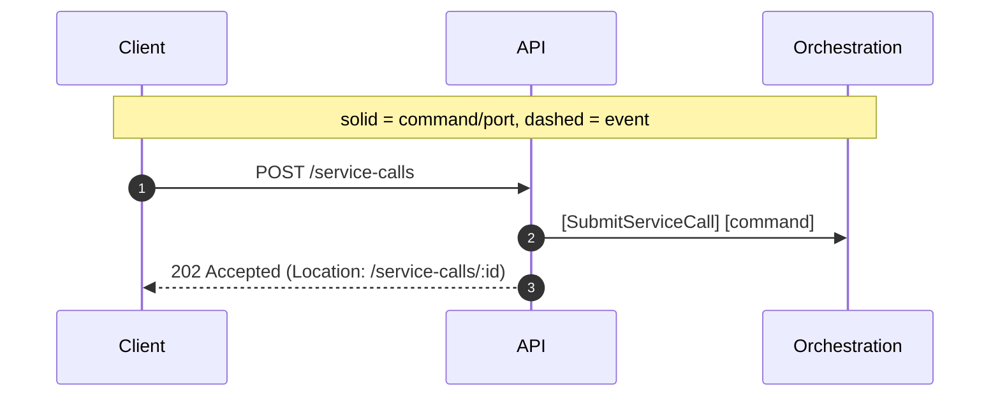
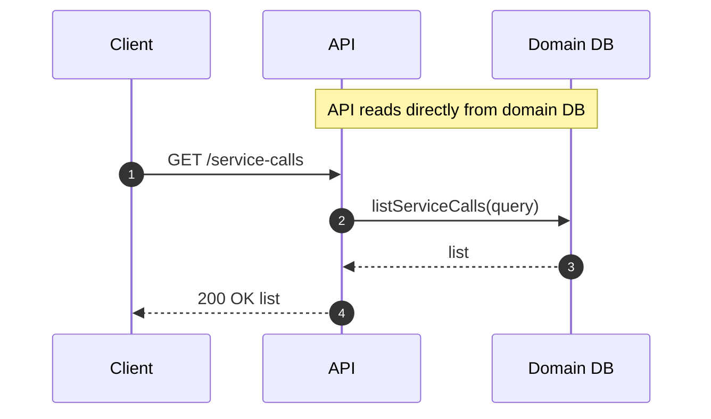

# API (Edge) Module

Responsibility

- Accept external requests, validate, publish commands, and query DB for UI.

Interfaces

- POST `/api/tenants/:tenantId/service-calls` [SubmitServiceCall]
- GET `/api/tenants/:tenantId/service-calls` (list with filters)
- GET `/api/tenants/:tenantId/service-calls/:serviceCallId` (detail)

Sequence (Submit)



Sequence (Query List)



Identity & Context

**IDs Generated:**

- **CorrelationId** — Generated per request for tracing (UUID v7)
- **ServiceCallId** — Accept from client (idempotency) OR generate if omitted (UUID v7)

**IDs Validated:**

- **TenantId** — From path parameter `:tenantId` (must be valid UUID v7)
- **ServiceCallId** — From request body or query param (if provided, must be valid UUID v7)

**Pattern:**

```typescript
// Entry point: validate and generate IDs
const correlationId = Schema.make(CorrelationId)(crypto.randomUUID());

const tenantId = yield * Schema.decode(TenantId)(req.params.tenantId); // Validate!

const serviceCallId = req.body.serviceCallId
  ? yield * Schema.decode(ServiceCallId)(req.body.serviceCallId) // Validate client ID
  : yield * ServiceCallId.makeUUID7(); // Generate server ID

// Pass to domain via RequestContext
const ctx = RequestContext({ tenantId, correlationId });
```

**Rationale:** API is the validation boundary. All external input must be validated before entering domain. Uses Effect Schema for ID validation and generation. See [ADR-0010][] for identity generation strategy and [ADR-0011][] for schema patterns.

Inputs/Outputs Recap

- Inputs: HTTP requests (submit, list, detail)
- Outputs: HTTP responses
- Ports: EventBus (publish commands), Persistence (read-only for queries)

Messages

- [SubmitServiceCall]

## Ports Used

- [EventBusPort]: see `../ports.md#eventbusport`
- [PersistencePort]: see `../ports.md#persistenceport-domain-db`

[SubmitServiceCall]: ../messages.md#submitservicecall
[EventBusPort]: ../ports.md#eventbusport
[PersistencePort]: ../ports.md#persistenceport-domain-db
[ADR-0010]: ../../decisions/ADR-0010-identity.md
[ADR-0011]: ../../decisions/ADR-0011-message-schemas.md
