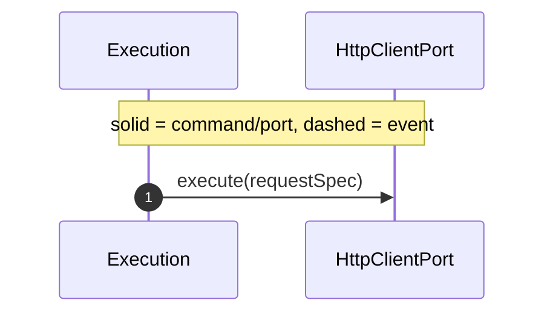
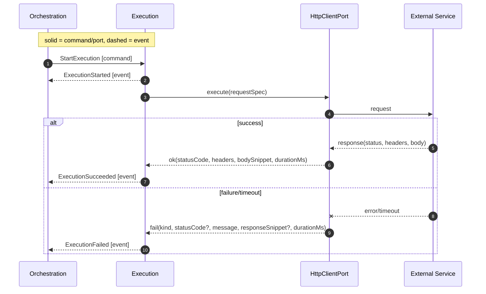
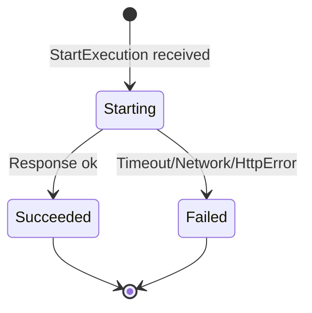

# Execution Module

Responsibility

- Perform a single attempt of the external call using protocol adapters.
- Emit `ExecutionStarted`, then either `ExecutionSucceeded` or `ExecutionFailed`.

Interfaces

- Command in: [StartExecution] { tenantId, serviceCallId, requestSpec }
- Ports: HttpClientPort, EventBus (publish), Clock

Behavior

-- On [StartExecution]:

- Emit [ExecutionStarted] { startedAt }.
- Call HttpClientPort with requestSpec (provided in command).
- Map adapter result to either [ExecutionSucceeded] { finishedAt, responseMeta } or [ExecutionFailed] { finishedAt, errorMeta }.
- Exactly one terminal outcome emission per StartExecution.

Notes

- Non-2xx are failures in MVP.
- Stateless; idempotent on duplicate StartExecution (publisher partitioning keeps order; duplicates harmless to Orchestration).
- Reliability (MVP): producer acks + retry; Orchestration watchdog times out long-running executions to a Failed state.

Resolve RequestSpec

- Provided in [StartExecution]; no DB or event-store read required.

Resolve RequestSpec

Inputs/Outputs Recap

- Inputs: [StartExecution] (command)
- Outputs:
  - [ExecutionStarted],
  - [ExecutionSucceeded] OR [ExecutionFailed] (events)
- Ports:
  - [HttpClientPort],
  - [EventBusPort],
  - [ClockPort]
- Storage: none (stateless)

Sequence (StartExecution HTTP Outcome)

State (Attempt lifecycle)

Messages

- [ExecutionFailed]
- [ExecutionStarted]
- [ExecutionSucceeded]
- [StartExecution]

## Ports Used

- [ClockPort]
- [EventBusPort]
- [HttpClientPort]

<!-- Commands -->

[StartExecution]: ../messages.md#startexecution

<!-- Messages -->

[ExecutionFailed]: ../messages.md#executionfailed
[ExecutionStarted]: ../messages.md#executionstarted
[ExecutionSucceeded]: ../messages.md#executionsucceeded

<!-- Ports -->

[ClockPort]: ../ports.md#clockport
[EventBusPort]: ../ports.md#eventbusport
[HttpClientPort]: ../ports.md#httpclientport
