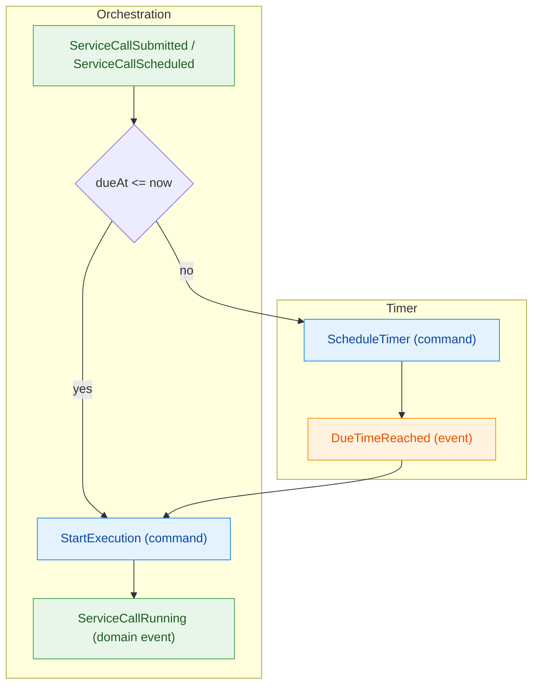
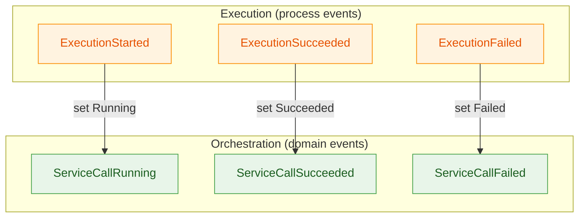
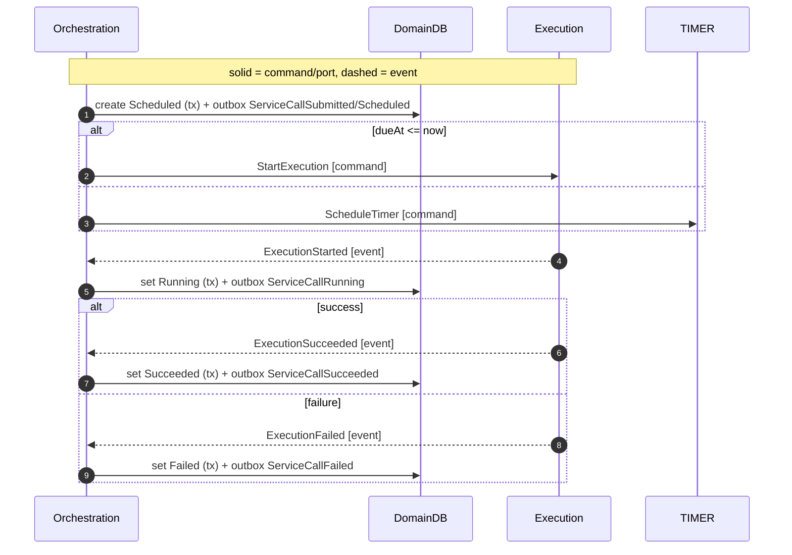

# Orchestration Module

Responsibility

- Own the `ServiceCall` lifecycle and invariants.
- Single writer: validate commands/process events, write domain DB, publish domain events after commit via outbox.
- Decide scheduling, guard start conditions, and finalize outcomes.

Core Model

- **Aggregate**: ServiceCall
  - Identity: `(tenantId, serviceCallId)`
  - State: name, submittedAt, dueAt, requestSpec, status (Scheduled|Running|Succeeded|Failed), tags, startedAt?, finishedAt?, outcome meta
  - Invariants: single attempt, legal transitions, terminal immutability, dueAt eligibility

Commands (intent)

- [SubmitServiceCall] `{ tenantId, name, dueAt, requestSpec, tags? }`
- [StartExecution] `{ tenantId, serviceCallId, requestSpec }` (issued to Execution)
- [ScheduleTimer] `{ tenantId, serviceCallId, dueAt }` (issued to Timer)

Events (facts)

- [ServiceCallSubmitted] `{ name, requestSpec\*, submittedAt, tags? }`
- [ServiceCallScheduled] `{ dueAt }`
- [ServiceCallRunning] `{ startedAt }`
- [ServiceCallSucceeded] `{ finishedAt, responseMeta }`
- [ServiceCallFailed] `{ finishedAt, errorMeta }`
- Process events consumed: [DueTimeReached], [ExecutionStarted], [ExecutionSucceeded], [ExecutionFailed]

Policies

- On [ServiceCallSubmitted] / [ServiceCallScheduled]:
  IF `dueAt <= now` THEN issue [StartExecution]; ELSE issue [ScheduleTimer].
- On [DueTimeReached]:
  IF `status == Scheduled` AND `dueAt <= now`
  THEN issue [StartExecution].
- On outcomes: apply to drive terminal state.
- Watchdog: if `status == Running` past timeout, mark Failed:Timeout.

Identity & Context

**IDs Generated:**

- **ServiceCallId** — If not provided by API, generates UUID v7 (fallback, typically API provides)
- **EnvelopeId** — Generated when publishing commands/events (UUID v7)

**IDs Received:**

- **TenantId** — From incoming [SubmitServiceCall] command (via RequestContext)
- **ServiceCallId** — From incoming commands or self-generated
- **CorrelationId** — From incoming commands (via RequestContext, pass-through to published events)

**Pattern:**

```typescript
// Typical: ServiceCallId provided by API in SubmitServiceCall command
// correlationId is Option<CorrelationId> from command schema
const { tenantId, serviceCallId, correlationId, ...commandData } = command;

// Extract metadata from incoming command envelope (provided by adapter)
const commandMetadata = yield * MessageMetadata;

// Fallback: If command lacks ServiceCallId (shouldn't happen per ADR-0010)
const finalServiceCallId = serviceCallId ?? yield * ServiceCallId.makeUUID7();

// Construct domain event (validated via Schema)
const event = new ServiceCallSubmitted({
  tenantId,
  serviceCallId: finalServiceCallId,
  name: commandData.name,
  // ... other fields
});

// Publish with MessageMetadata Context
// - correlationId: pass through from command (already Option<CorrelationId>)
// - causationId: use incoming command envelope ID for causality tracking
yield *
  eventBus.publishServiceCallSubmitted(event).pipe(
    Effect.provideService(MessageMetadata, {
      correlationId, // From command (pass-through)
      causationId: commandMetadata.causationId, // From command envelope
    })
  );
```

**Pattern** (orchestration-event-bus.adapter.ts - future implementation):

```typescript
// Adapter extracts MessageMetadata from Context
const metadata = yield * MessageMetadata;

// Generate envelope ID (UUID v7)
const envelopeId = yield * EnvelopeId.makeUUID7();

// Construct envelope via Schema class
const envelope: MessageEnvelope.Type = new MessageEnvelope({
  id: envelopeId,
  type: event._tag,
  payload: event,
  tenantId: event.tenantId,
  timestampMs: yield * clock.now(),
  correlationId: metadata.correlationId,
  causationId: metadata.causationId,
  aggregateId: Option.some(event.serviceCallId),
});

yield * eventBus.publish([envelope]);
```

**Rationale:** Orchestration is the aggregate owner (ServiceCall). It receives ServiceCallId from API (preferred per ADR-0010) or generates via UUID7 if missing. Adapter generates EnvelopeId (UUID v7) for broker deduplication. Workflow provides `MessageMetadata` Context with correlationId from HTTP request and causationId from triggering command envelope. See ADR-0010 for identity generation strategy, ADR-0011 for schema patterns, and ADR-0013 for MessageMetadata Context pattern.

Ports

- Persistence (domain DB read/write)
- OutboxPublisher (append domain events within tx)
- EventBus (publish commands, consume process events)
- TimerPort.schedule({ id, tenantId, dueTimeMs })
- Clock.now() for guards

Out-of-Scope (here)

- HTTP specifics, retry policies, cancellation.

Acceptance (MVP)

- For any submitted ServiceCall, the context ensures exactly one of Succeeded/Failed is eventually reached and observable.

Scheduling Path (Due  StartExecution  Running)



Event Mapping (Process  Domain)



Sequence (Scheduled  StartExecution  Outcome)



Inputs/Outputs Recap

- Inputs:
  - [SubmitServiceCall] (command),
  - [DueTimeReached] (event),
  - [ExecutionStarted] OR [ExecutionSucceeded] OR [ExecutionFailed] (events)
- Outputs:
  - [ServiceCallSubmitted], [ServiceCallScheduled], [ServiceCallRunning], [ServiceCallSucceeded], [ServiceCallFailed] (events via outbox)
  - [StartExecution], [ScheduleTimer] (commands)
- Ports: [PersistencePort], [OutboxPublisherPort], [EventBusPort], [TimerPort], [ClockPort]
- Read Side: API reads domain DB; no projections

Messages

- [DueTimeReached]
- [ScheduleTimer]
- [ServiceCallFailed]
- [ServiceCallRunning]
- [ServiceCallScheduled]
- [ServiceCallSubmitted]
- [ServiceCallSucceeded]
- [StartExecution]
- [SubmitServiceCall]

State access

- On handling commands or due/process events, Orchestration reads/writes the domain DB using conditional updates to enforce legal transitions. Domain events are appended to the outbox within the same transaction and published after commit.

<!-- Ports -->

[ClockPort]: ../ports.md#clockport
[EventBusPort]: ../ports.md#eventbusport
[OutboxPublisherPort]: ../ports.md#outboxpublisher
[PersistencePort]: ../ports.md#persistenceport-domain-db
[TimerPort]: ../ports.md#timerport

<!-- Events -->

[DueTimeReached]: ../messages.md#duetimereached
[ExecutionFailed]: ../messages.md#executionfailed
[ExecutionStarted]: ../messages.md#executionstarted
[ExecutionSucceeded]: ../messages.md#executionsucceeded
[ServiceCallFailed]: ../messages.md#servicecallfailed
[ServiceCallRunning]: ../messages.md#servicecallrunning
[ServiceCallScheduled]: ../messages.md#servicecallscheduled
[ServiceCallSubmitted]: ../messages.md#servicecallsubmitted
[ServiceCallSucceeded]: ../messages.md#servicecallsucceeded

<!-- Commands -->

[ScheduleTimer]: ../messages.md#scheduletimer
[StartExecution]: ../messages.md#startexecution
[SubmitServiceCall]: ../messages.md#submitservicecall

<!-- ADRs -->

[ADR-0010]: ../../decisions/ADR-0010-identity.md
[ADR-0011]: ../../decisions/ADR-0011-message-schemas.md
