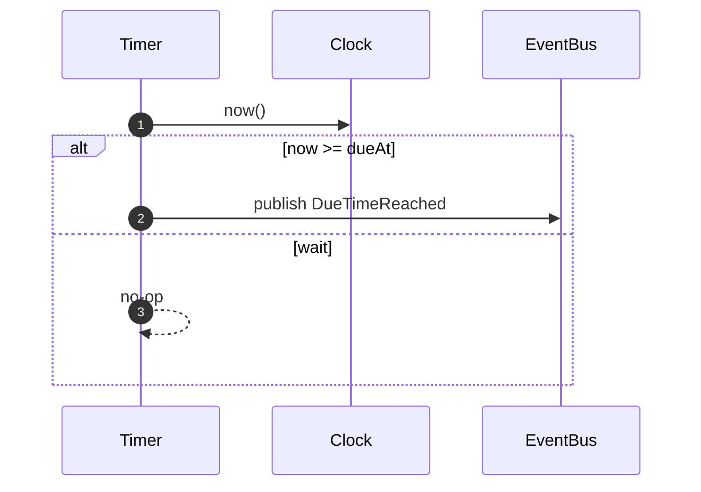

# Timer Module

## Responsibility

Track future due times and emit [DueTimeReached] events when time arrives.

**Why Timer exists as a separate module:**

- **Separation of Concerns**: Orchestration focuses on business workflows; Timer focuses on time-based infrastructure
- **Testability**: Time-dependent behavior isolated behind ClockPort, enabling deterministic testing
- **Resilience**: Polling-based design survives crashes without losing scheduled timers (database is source of truth)
- **Broker-Agnostic**: Timer implementation doesn't depend on broker-specific timer features (portability)

**What Timer does NOT do:**

- ❌ Owns ServiceCall aggregate (Orchestration owns it)
- ❌ Makes business decisions (just signals "time's up")
- ❌ Handles retries or cancellations (out of scope per domain constraints)
- ❌ Guarantees exact-time firing (seconds-level delay acceptable per ADR-0003)

## Model

TimerEntry: `(tenantId, serviceCallId, dueAt, registeredAt, status)`

**Why this structure:**

- `(tenantId, serviceCallId)` composite key ensures idempotency (upsert semantics)
- `dueAt` enables efficient polling queries (`WHERE dueAt <= now AND status = 'Scheduled'`)
- `registeredAt` provides audit trail and latency metrics (`reachedAt - registeredAt`)
- `status` field enables two-operation pattern (find due → mark fired) for at-least-once delivery

## Identity & Context

**IDs Generated:**

- **EnvelopeId** — Generated when publishing [DueTimeReached] events (UUID v7)
  - **Why Timer generates**: Every message needs unique envelope ID for broker deduplication
  - **Why UUID v7**: Time-ordered for chronological event sorting and broker index locality

**IDs Received (from [ScheduleTimer] command):**

- **TenantId** — Multi-tenant partition key (embedded in envelope)
  - **Why received**: Timer doesn't provision tenants; just enforces multi-tenant scoping
- **ServiceCallId** — Aggregate root identifier (embedded in envelope)
  - **Why received**: Timer doesn't own ServiceCall aggregate; Orchestration does
- **CorrelationId** — Request trace ID (optional, embedded in envelope)
  - **Why optional**: System-initiated timers lack correlation; user-initiated timers carry it through
  - **Why preserved**: Enables end-to-end tracing from original request → scheduled timer → execution

**Pattern:**

```typescript
// Receive IDs from ScheduleTimer command
const { tenantId, serviceCallId, dueAt } = command

// Store TimerEntry keyed by (tenantId, serviceCallId)
await db.upsert({ tenantId, serviceCallId, dueAt, status: 'Scheduled' })

// When firing: construct domain event (validated via Schema)
const event = new DueTimeReached({
	tenantId,
	serviceCallId,
	reachedAt: firedAt, // DateTime.Utc (not ISO string)
})

// Publish with MessageMetadata Context (workflow provides)
yield *
	eventBus.publishDueTimeReached(event).pipe(
		Effect.provideService(MessageMetadata, {
			correlationId: timer.correlationId, // From timer aggregate
			causationId: Option.none(), // Time-triggered
		})
	)
```

**Real Implementation** (timer-event-bus.adapter.ts):

```typescript
// Adapter extracts MessageMetadata from Context
const metadata = yield * MessageMetadata

// Generate envelope ID (UUID v7)
const envelopeId = yield * EnvelopeId.makeUUID7()

// Construct envelope via Schema class (direct instantiation)
const envelope: MessageEnvelope.Type = new MessageEnvelope({
	id: envelopeId,
	type: dueTimeReached._tag,
	payload: dueTimeReached, // Domain event (already validated)
	tenantId: dueTimeReached.tenantId,
	timestampMs: yield * clock.now(),
	correlationId: metadata.correlationId, // From Context
	causationId: metadata.causationId, // From Context
	aggregateId: Option.some(dueTimeReached.serviceCallId),
})

yield * eventBus.publish([envelope])
```

**Rationale — Why Timer is Stateless Regarding Identity:**

Timer doesn't own the ServiceCall aggregate—it's an infrastructure service that signals when time elapses. All meaningful identities (TenantId, ServiceCallId, CorrelationId) flow **through** Timer from Orchestration.

**Why EnvelopeId generation happens in adapter, not workflow:**

- Workflow deals with pure domain events (DueTimeReached schema)
- Adapter wraps domain event in infrastructure envelope (MessageEnvelope)
- This separation keeps domain pure and testable without envelope concerns

**Why causationId is None for timer events:**

- Timer firing is **time-triggered**, not **message-triggered**
- No parent command/event caused the timer to fire—time passage did
- Causation chain: ScheduleTimer command → timer persisted (causation ends)
- New causation chain: DueTimeReached event → ExecuteServiceCall command (starts fresh)

See ADR-0010 for identity generation strategy, ADR-0011 for schema patterns, and ADR-0013 for MessageMetadata Context pattern.

## Policies

**On [ScheduleTimer] command received:**

- Store or update TimerEntry keyed by `(tenantId, serviceCallId)` with `dueAt`
- **Why upsert**: Idempotent—multiple schedule commands for same key don't create duplicates
- **Why composite key**: Multi-tenancy isolation + per-ServiceCall timer identity

**Scheduler loop (polling worker):**

- At each tick, query for entries with `dueAt <= now` and `status == Scheduled`
- **Why inclusive <=**: Catch timers at exact millisecond boundary (clock precision varies)
- **Why status filter**: Exclude already-fired timers (Reached state) from reprocessing
- For each due timer: publish [DueTimeReached], then mark as `status = Reached`
- **Why this order**: At-least-once delivery—if publish fails, timer remains Scheduled for retry
- **Why mark after publish**: Prevents event loss (better duplicate than loss per domain requirements)

See ADR-0003 for detailed polling strategy rationale and ADR-0006 for idempotency guarantees.

## Ports

Timer depends on these port abstractions:

- **[ClockPort]** — Provides current time for due-time evaluation
  - **Why abstraction**: Enables deterministic testing (TestClock.adjust for time control)
  - **Why not Date.now()**: Effect-based for composability and tracing

- **[EventBusPort]** — Publishes [DueTimeReached] events to broker
  - **Why abstraction**: Broker-agnostic (works with NATS, Kafka, or in-memory)
  - **Why Event pattern**: Async, decoupled communication (Orchestration polls for events independently)

**Why Timer has minimal ports:**

- Timer is infrastructure service, not domain service
- Needs only time and messaging—no business logic dependencies
- Keeps module cohesive and easy to test in isolation

Sequence (Schedule Due Publish)



## Inputs/Outputs

- **Inputs**: [ScheduleTimer]
- **Outputs**: [DueTimeReached]

[ScheduleTimer]: ../messages.md#scheduletimer
[DueTimeReached]: ../messages.md#duetimereached

<!-- ADRs -->

[ADR-0010]: ../../decisions/ADR-0010-identity.md
[ADR-0011]: ../../decisions/ADR-0011-message-schemas.md
[DueTimeReached]: ../messages.md#duetimereached
[ClockPort]: ../ports.md#clockport
[EventBusPort]: ../ports.md#eventbusport
