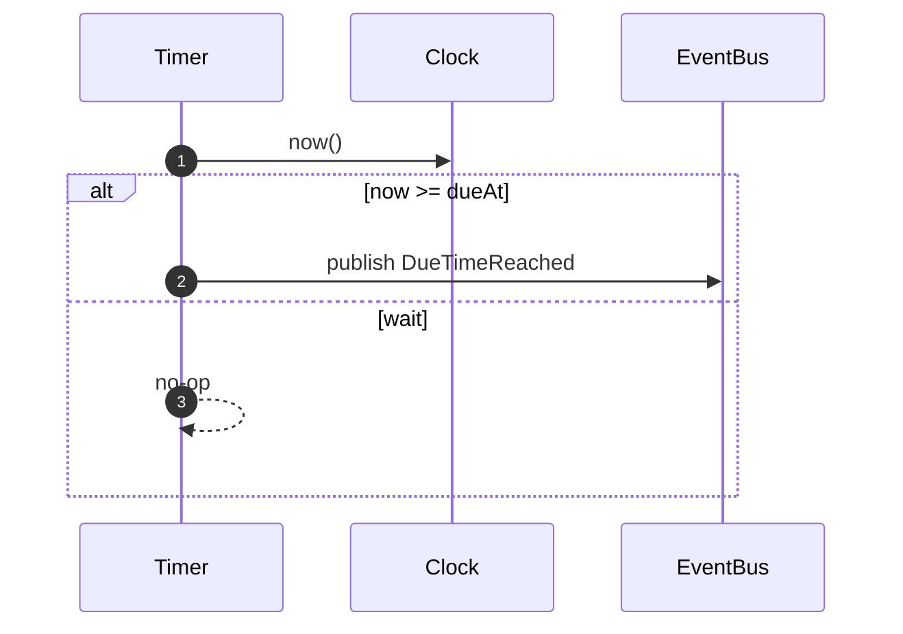

# Timer Module

Responsibility

- Track future due times and emit [DueTimeReached] when time arrives.

Model

- TimerEntry: `(tenantId, serviceCallId, dueAt, registeredAt, status)`

Identity & Context

**IDs Generated:**

- **EnvelopeId** — Generated when publishing [DueTimeReached] events (UUID v7)

**IDs Received (from [ScheduleTimer] command):**

- **TenantId** — Multi-tenant partition key (via RequestContext)
**IDs Received (from [ScheduleTimer] command):**

- **TenantId** — Multi-tenant partition key (embedded in envelope)
- **ServiceCallId** — Aggregate root identifier (embedded in envelope)
- **CorrelationId** — Request trace ID (optional, embedded in envelope)

**Pattern:**

```typescript
// Receive IDs from ScheduleTimer command
const { tenantId, serviceCallId, correlationId, dueAt } = command;

// Store TimerEntry keyed by (tenantId, serviceCallId)
await db.upsert({ tenantId, serviceCallId, dueAt, status: "armed" });

// When firing: construct domain event
const event = new DueTimeReached({
  tenantId,
  serviceCallId,
  reachedAt: Iso8601DateTime.make(DateTime.formatIso(firedAt)),
});

// Encode to DTO
const dto = yield* DueTimeReached.encode(event);

// Wrap in validated envelope (makeEnvelope generates EnvelopeId)
const envelope = yield* makeEnvelope('DueTimeReached', dto, {
  tenantId,
  correlationId: Option.getOrUndefined(correlationId),
  timestampMs: firedAt.epochMillis,
  aggregateId: serviceCallId,  // For per-aggregate ordering
});

// Publish - envelope contains all metadata, no separate context needed
yield* bus.publish([envelope]);
```

**Rationale:** Timer is stateless regarding identity (doesn't own ServiceCall aggregate). All IDs flow through from Orchestration via [ScheduleTimer]. Timer only generates EnvelopeId (via `makeEnvelope` helper) for broker deduplication. Envelope is self-contained with all routing metadata (tenantId, correlationId) - no separate context parameter needed. Domain event is validated via Effect Schema before encoding to DTO. See [ADR-0010][] for identity generation strategy and [ADR-0011][] for schema patterns.

Policies

- On [ScheduleTimer]: store or update TimerEntry keyed by `(tenantId, serviceCallId)` with `dueAt`.
- Scheduler loop: at tick, for entries with `dueAt <= now` and `status == armed`, publish [DueTimeReached] and mark as fired.

Ports

- Clock.now() to evaluate eligibility
- EventBus.publish([DueTimeReached]) on fire

Sequence (Schedule Due Publish)



Inputs/Outputs

- Inputs: [ScheduleTimer]
- Outputs: [DueTimeReached]

# Ports

- [ClockPort]
- [EventBusPort]

[ScheduleTimer]: ../messages.md#scheduletimer
[DueTimeReached]: ../messages.md#duetimereached

<!-- ADRs -->

[ADR-0010]: ../../decisions/ADR-0010-identity.md
[ADR-0011]: ../../decisions/ADR-0011-message-schemas.md
[DueTimeReached]: ../messages.md#duetimereached
[ClockPort]: ../ports.md#clockport
[EventBusPort]: ../ports.md#eventbusport
