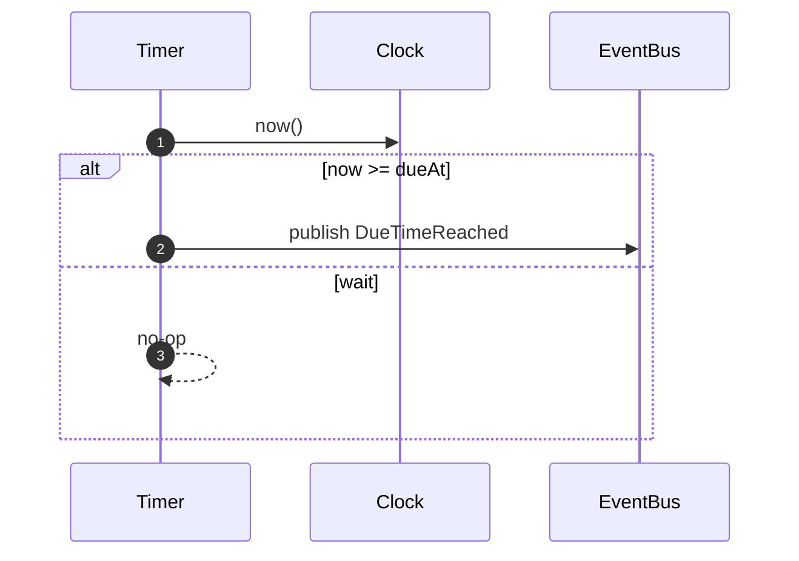

# Timer Module

Responsibility

- Track future due times and emit [DueTimeReached] when time arrives.

Model

- TimerEntry: `(tenantId, serviceCallId, dueAt, registeredAt, status)`

Identity & Context

**IDs Generated:**

- **EnvelopeId** — Generated when publishing [DueTimeReached] events (UUID v7)

**IDs Received (from [ScheduleTimer] command):**

- **TenantId** — Multi-tenant partition key (via RequestContext)
**IDs Received (from [ScheduleTimer] command):**

- **TenantId** — Multi-tenant partition key (embedded in envelope)
- **ServiceCallId** — Aggregate root identifier (embedded in envelope)
- **CorrelationId** — Request trace ID (optional, embedded in envelope)

**Pattern:**

```typescript
// Receive IDs from ScheduleTimer command
const { tenantId, serviceCallId, dueAt } = command;

// Store TimerEntry keyed by (tenantId, serviceCallId)
await db.upsert({ tenantId, serviceCallId, dueAt, status: "Scheduled" });

// When firing: construct domain event (validated via Schema)
const event = new DueTimeReached({
  tenantId,
  serviceCallId,
  reachedAt: firedAt,  // DateTime.Utc (not ISO string)
});

// Publish with MessageMetadata Context (workflow provides)
yield* eventBus.publishDueTimeReached(event).pipe(
  Effect.provideService(MessageMetadata, {
    correlationId: timer.correlationId,  // From timer aggregate
    causationId: Option.none(),          // Time-triggered
  })
);
```

**Real Implementation** (timer-event-bus.adapter.ts):

```typescript
// Adapter extracts MessageMetadata from Context
const metadata = yield* MessageMetadata;

// Generate envelope ID (UUID v7)
const envelopeId = yield* EnvelopeId.makeUUID7();

// Construct envelope via Schema class (direct instantiation)
const envelope: MessageEnvelope.Type = new MessageEnvelope({
  id: envelopeId,
  type: dueTimeReached._tag,
  payload: dueTimeReached,  // Domain event (already validated)
  tenantId: dueTimeReached.tenantId,
  timestampMs: yield* clock.now(),
  correlationId: metadata.correlationId,  // From Context
  causationId: metadata.causationId,      // From Context
  aggregateId: Option.some(dueTimeReached.serviceCallId),
});

yield* eventBus.publish([envelope]);
```

**Rationale:** Timer is stateless regarding identity (doesn't own ServiceCall aggregate). All IDs flow through from Orchestration via [ScheduleTimer]. Timer generates EnvelopeId (UUID v7) in adapter for broker deduplication. Workflow provides `MessageMetadata` Context with correlationId from timer aggregate and `causationId: None` (time-triggered, not command-caused). Adapter extracts metadata and constructs envelope via Schema class (no helper needed). See ADR-0010 for identity generation strategy, ADR-0011 for schema patterns, and ADR-0013 for MessageMetadata Context pattern.

Policies

- On [ScheduleTimer]: store or update TimerEntry keyed by `(tenantId, serviceCallId)` with `dueAt`.
- Scheduler loop: at tick, for entries with `dueAt <= now` and `status == armed`, publish [DueTimeReached] and mark as fired.

Ports

- Clock.now() to evaluate eligibility
- EventBus.publish([DueTimeReached]) on fire

Sequence (Schedule Due Publish)



Inputs/Outputs

- Inputs: [ScheduleTimer]
- Outputs: [DueTimeReached]

## Ports

- [ClockPort]
- [EventBusPort]

[ScheduleTimer]: ../messages.md#scheduletimer
[DueTimeReached]: ../messages.md#duetimereached

<!-- ADRs -->

[ADR-0010]: ../../decisions/ADR-0010-identity.md
[ADR-0011]: ../../decisions/ADR-0011-message-schemas.md
[DueTimeReached]: ../messages.md#duetimereached
[ClockPort]: ../ports.md#clockport
[EventBusPort]: ../ports.md#eventbusport
