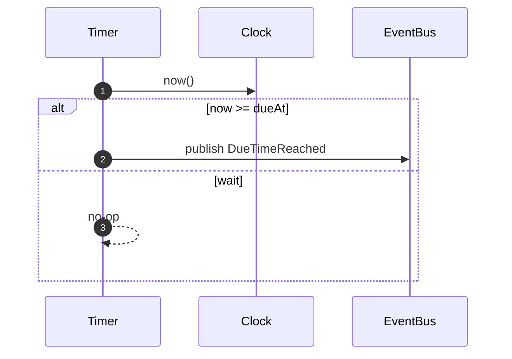

# Timer Module

Responsibility

- Track future due times and emit [DueTimeReached] when time arrives.

Model

- TimerEntry: `(tenantId, serviceCallId, dueAt, registeredAt, status)`

Policies

- On [ScheduleTimer]: store or update TimerEntry keyed by `(tenantId, serviceCallId)` with `dueAt`.
- Scheduler loop: at tick, for entries with `dueAt <= now` and `status == armed`, publish [DueTimeReached] and mark as fired.

Ports

- Clock.now() to evaluate eligibility
- EventBus.publish([DueTimeReached]) on fire

Sequence (Schedule Due Publish)

Inputs/Outputs

- Inputs: [ScheduleTimer]
- Outputs: [DueTimeReached]

# Ports:

- [ClockPort]
- [EventBusPort]

[ScheduleTimer]: ../messages.md#scheduletimer
[DueTimeReached]: ../messages.md#duetimereached
[ClockPort]: ../ports.md#clockport
[EventBusPort]: ../ports.md#eventbusport
