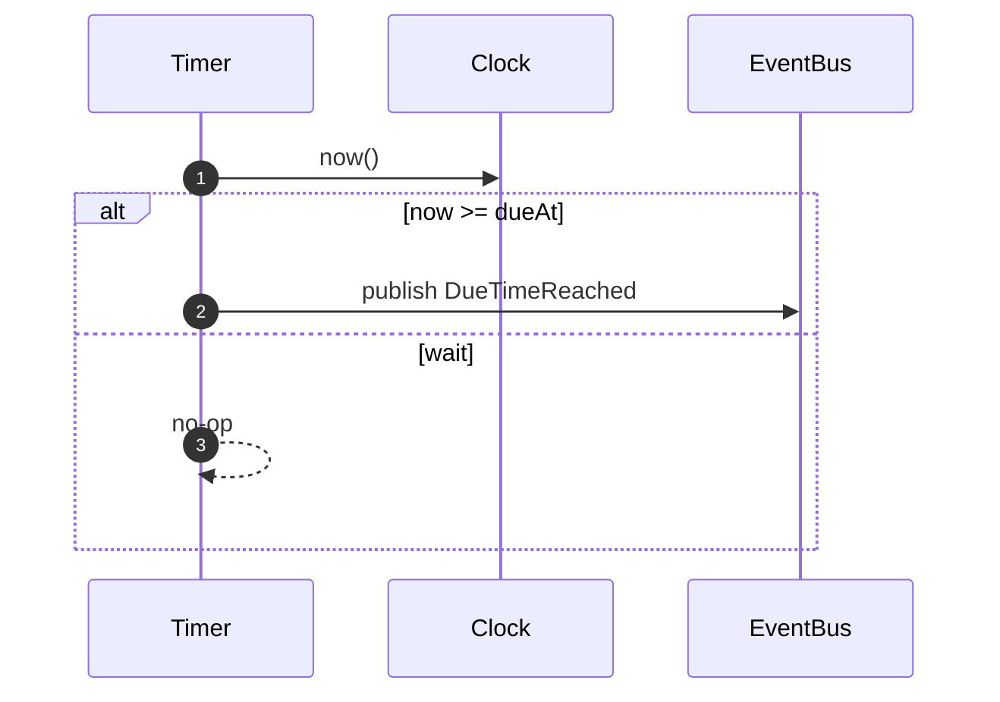

# Timer Module

Responsibility

- Track future due times and emit [DueTimeReached] when time arrives.

Model

- TimerEntry: `(tenantId, serviceCallId, dueAt, registeredAt, status)`

Identity & Context

**IDs Generated:**

- **EnvelopeId** — Generated when publishing [DueTimeReached] events (UUID v7)

**IDs Received (from [ScheduleTimer] command):**

- **TenantId** — Multi-tenant partition key (via RequestContext)
- **ServiceCallId** — Aggregate root identifier (via RequestContext)
- **CorrelationId** — Request trace ID (via RequestContext)

**Pattern:**

```typescript
// Receive IDs from ScheduleTimer command
const { tenantId, serviceCallId, correlationId, dueAt } = command;

// Store TimerEntry keyed by (tenantId, serviceCallId)
await db.upsert({ tenantId, serviceCallId, dueAt, status: "armed" });

// When firing: generate EnvelopeId
const envelopeId = Schema.make(EnvelopeId)(crypto.randomUUID());
const envelope = MessageEnvelope({
  envelopeId,
  tenantId,
  correlationId,
  payload: DueTimeReached({ serviceCallId, dueAt, firedAt }),
});
```

**Rationale:** Timer is stateless regarding identity (doesn't own ServiceCall aggregate). All IDs flow through from Orchestration via [ScheduleTimer]. Timer only generates EnvelopeId for broker deduplication. See [ADR-0010][] for identity generation strategy.

Policies

- On [ScheduleTimer]: store or update TimerEntry keyed by `(tenantId, serviceCallId)` with `dueAt`.
- Scheduler loop: at tick, for entries with `dueAt <= now` and `status == armed`, publish [DueTimeReached] and mark as fired.

Ports

- Clock.now() to evaluate eligibility
- EventBus.publish([DueTimeReached]) on fire

Sequence (Schedule Due Publish)



Inputs/Outputs

- Inputs: [ScheduleTimer]
- Outputs: [DueTimeReached]

# Ports:

- [ClockPort]
- [EventBusPort]

[ScheduleTimer]: ../messages.md#scheduletimer
[DueTimeReached]: ../messages.md#duetimereached

<!-- ADRs -->

[ADR-0010]: ../../decisions/ADR-0010-identity.md
[DueTimeReached]: ../messages.md#duetimereached
[ClockPort]: ../ports.md#clockport
[EventBusPort]: ../ports.md#eventbusport
