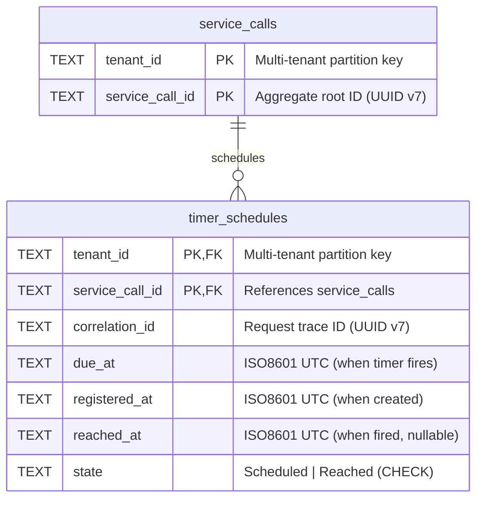

# Timer Module: Database Schema

[← Back to Timer Module](../README.md) | [← Centralized Schema](../../../docs/design/database-schema.md)

---

## Purpose

Implementation-focused documentation for Timer module's `timer_schedules` table. Covers query patterns, index tuning, and testing strategies. For high-level schema overview and cross-module relationships, see [Centralized Database Schema](../../../docs/design/database-schema.md).

**Related Documentation:**

- [Timer Module Design](../../../docs/design/modules/timer.md) — Module responsibilities and policies
- [ADR-0003: Timer](../../../docs/decisions/ADR-0003-timer.md) — Polling-based timer design
- [ADR-0006: Idempotency](../../../docs/decisions/ADR-0006-idempotency.md) — Idempotency guarantees

---

## Entity Relationship Diagram (Timer-Focused)



**Relationship:**

- Timer module **does not own** `service_calls` table (owned by Orchestration)
- Timer receives `ServiceCallId` from `ScheduleTimer` command
- Foreign key ensures timer cannot exist without parent ServiceCall
- `ON DELETE CASCADE` removes timer when ServiceCall deleted

**Extraction Potential:** Timer table could move to separate `timer.db` if FK replaced with event-driven consistency (see [Module Boundaries](../../../docs/design/database-schema.md#module-boundaries--database-extraction)).

---

## Schema Definition

```sql
CREATE TABLE timer_schedules (
    tenant_id TEXT NOT NULL,
    service_call_id TEXT NOT NULL,
    correlation_id TEXT NOT NULL,
    due_at TEXT NOT NULL,
    registered_at TEXT NOT NULL,
    reached_at TEXT,
    state TEXT NOT NULL DEFAULT 'Scheduled',
    PRIMARY KEY (tenant_id, service_call_id),
    FOREIGN KEY (tenant_id, service_call_id)
        REFERENCES service_calls(tenant_id, service_call_id)
        ON DELETE CASCADE,
    CHECK (state IN ('Scheduled', 'Reached'))
) STRICT;

CREATE INDEX idx_timer_schedules_due_at
ON timer_schedules(tenant_id, state, due_at);

CREATE INDEX idx_timer_schedules_correlation_id
ON timer_schedules(correlation_id);
```

---

## Column Semantics

### Identity Columns

**`tenant_id` (TEXT, NOT NULL, PK, FK)**

- Multi-tenant partition key
- Part of composite primary key for per-tenant uniqueness
- Received from `ScheduleTimer` command (not generated by Timer)
- Every query MUST filter by `tenant_id` (enforced by `TimerPersistencePort`)

**`service_call_id` (TEXT, NOT NULL, PK, FK)**

- Aggregate root identifier (UUID v7)
- Part of composite primary key (one timer per ServiceCall per tenant)
- Received from `ScheduleTimer` command (Orchestration owns ServiceCall)
- Foreign key to `service_calls` ensures referential integrity

**`correlation_id` (TEXT, NOT NULL)**

- Request trace ID for end-to-end observability
- Received from `ScheduleTimer` command (propagated from original HTTP request)
- Indexed for trace queries ("find all timers for request X")
- **Why NOT NULL**: Timer must carry correlation ID for observability (system-generated if missing)

### Time Columns

**`due_at` (TEXT, NOT NULL)**

- ISO8601 UTC timestamp when timer should fire
- Format: `YYYY-MM-DDTHH:MM:SS.sssZ` (Effect DateTime serialization)
- Polled by scheduler: `WHERE due_at <= now()`
- Indexed for efficient polling queries

**`registered_at` (TEXT, NOT NULL)**

- ISO8601 UTC timestamp when timer was created
- Audit trail for latency metrics: `reached_at - registered_at`
- Immutable after creation

**`reached_at` (TEXT, nullable)**

- ISO8601 UTC timestamp when timer fired
- `NULL` while `state = 'Scheduled'`
- Set atomically when transitioning to `state = 'Reached'`
- Used for audit trail and retention policies

### State Column

**`state` (TEXT, NOT NULL, DEFAULT 'Scheduled')**

- Current timer state: `Scheduled` or `Reached`
- CHECK constraint prevents invalid states
- State machine: `Scheduled` → `Reached` (only valid transition)
- Indexed for polling query: `WHERE state = 'Scheduled'`

**State Semantics:**

- **`Scheduled`**: Timer awaiting due time, will be polled by scheduler
- **`Reached`**: Timer fired, `DueTimeReached` event published, no further processing

**Why no `Canceled` state:**

- Out of scope per domain requirements (ADR-0003)
- Cancellation handled by deleting timer row (CASCADE from ServiceCall deletion)

---

## Indexes

### Primary Index: Polling Query

```sql
CREATE INDEX idx_timer_schedules_due_at
ON timer_schedules(tenant_id, state, due_at);
```

**Purpose:** Efficient polling for due timers

**Covers queries:**

```sql
-- Main polling query (per-tenant)
SELECT * FROM timer_schedules
WHERE tenant_id = ?
  AND state = 'Scheduled'
  AND due_at <= ?
ORDER BY due_at ASC
LIMIT 100;

-- Global polling query (all tenants, if needed)
SELECT * FROM timer_schedules
WHERE state = 'Scheduled'
  AND due_at <= ?
ORDER BY tenant_id, due_at ASC
LIMIT 1000;
```

**Index Structure:**

- **Column 1 (`tenant_id`):** Partition key, groups tenant data together
- **Column 2 (`state`):** Filter key, eliminates `Reached` timers
- **Column 3 (`due_at`):** Range scan, supports `due_at <= ?` filter and `ORDER BY`

**Performance Characteristics:**

- ✅ **No table scan:** Index satisfies all WHERE clauses
- ✅ **Sorted results:** Index is pre-sorted by `due_at` (ORDER BY is free)
- ✅ **LIMIT efficiency:** Early termination after 100 rows
- ✅ **Multi-tenant locality:** Same-tenant timers co-located in B-tree

**EXPLAIN QUERY PLAN:**

```text
SEARCH timer_schedules USING INDEX idx_timer_schedules_due_at (tenant_id=? AND state=? AND due_at<?)
```

**Why this index design:**

1. **`tenant_id` first:** Multi-tenancy isolation, partition locality
2. **`state` second:** Filter out `Reached` timers early (reduces range scan size)
3. **`due_at` third:** Range comparison + ORDER BY (efficient B-tree range scan)

**Alternative considered (rejected):**

- Index on `(state, due_at, tenant_id)` — Would work for global query, but breaks per-tenant locality
- Index on `(due_at, state, tenant_id)` — Would skip scanning future timers, but forces global ordering (not multi-tenant friendly)

### Secondary Index: Correlation Tracking

```sql
CREATE INDEX idx_timer_schedules_correlation_id
ON timer_schedules(correlation_id);
```

**Purpose:** Observability queries (trace requests end-to-end)

**Covers queries:**

```sql
-- Find all timers for a specific request trace
SELECT * FROM timer_schedules
WHERE correlation_id = ?;
```

**Use Cases:**

- Debugging: "What timers were scheduled for request X?"
- Tracing: "Follow request flow from HTTP → Timer → Execution"
- Metrics: "How many timers created per request?"

**Performance:**

- ✅ Single-value equality search (efficient B-tree lookup)
- ✅ Low cardinality within tenant (few timers per request)
- ⚠️ No tenant filter (scans all tenants for correlation ID)

**Why separate index:**

- Correlation queries are rare (observability, not business logic)
- Don't pollute primary polling index with extra column
- Acceptable to scan all tenants for debugging use case

---

## Query Patterns

### 1. Schedule Timer (Upsert)

```sql
-- Domain: Create or update timer for (tenant_id, service_call_id)
INSERT INTO timer_schedules (
    tenant_id,
    service_call_id,
    correlation_id,
    due_at,
    registered_at,
    state
) VALUES (?, ?, ?, ?, ?, 'Scheduled')
ON CONFLICT (tenant_id, service_call_id)
DO UPDATE SET
    due_at = excluded.due_at,
    correlation_id = excluded.correlation_id,
    registered_at = excluded.registered_at,
    state = 'Scheduled',
    reached_at = NULL;
```

**Idempotency:**

- `ON CONFLICT` ensures idempotent upsert (ADR-0006)
- Multiple `ScheduleTimer` commands for same key don't duplicate
- Resets `reached_at` to NULL and `state` to `Scheduled` (reschedule semantics)

**Index Usage:**

- Primary key index `(tenant_id, service_call_id)` detects conflict

**Effect on Index:**

- `idx_timer_schedules_due_at` updated (B-tree rebalance if `due_at` changes)
- `idx_timer_schedules_correlation_id` updated (correlation ID may change)

### 2. Find Due Timers (Polling)

```sqlite
-- Domain: Poll for timers ready to fire (per-tenant)
SELECT
    tenant_id,
    service_call_id,
    correlation_id,
    due_at,
    registered_at,
    state
FROM timer_schedules
WHERE tenant_id = ?
  AND state = 'Scheduled'
  AND due_at <= ?
ORDER BY due_at ASC
LIMIT 100;
```

**Execution Plan:**

```text
SEARCH timer_schedules USING INDEX idx_timer_schedules_due_at
  (tenant_id=? AND state=? AND due_at<?)
```

**Performance:**

- Index scan (not table scan)
- Early termination after 100 rows
- O(log N + K) where K = result set size (bounded by LIMIT)

**Multi-Tenant Safety:**

- `WHERE tenant_id = ?` enforces tenant isolation
- Index leads with `tenant_id` for partition locality

**Polling Frequency:**

- Timer scheduler polls every N seconds (configurable)
- Query cost: ~constant time (index-covered, LIMIT bounded)
- Scales with number of due timers, not total timers

### 3. Mark Timer Fired (Update)

```sqlite
-- Domain: Transition timer to Reached state after publishing event
UPDATE timer_schedules
SET state = 'Reached',
    reached_at = ?
WHERE tenant_id = ?
  AND service_call_id = ?
  AND state = 'Scheduled';
```

**Concurrency Safety:**

- `WHERE state = 'Scheduled'` prevents double-firing
- If concurrent update, second UPDATE affects 0 rows (idempotent)
- Primary key `(tenant_id, service_call_id)` provides row-level lock

**Index Usage:**

- Primary key index for WHERE clause (tenant_id, service_call_id)
- `idx_timer_schedules_due_at` updated (state changed, reindex)

**Two-Operation Pattern:**

1. **Find due timers** (SELECT query above)
2. **Mark fired** (this UPDATE query)

**Why separate operations (not atomic CTE):**

- Enables batch processing (find many, mark many)
- Allows event publishing between operations (at-least-once delivery)
- If publish fails, timer remains `Scheduled` for retry

**At-Least-Once Guarantee:**

- Publish event → Mark fired (this order)
- If crash after publish, timer remains `Scheduled` → retries → duplicate event (acceptable)
- If crash before publish, timer remains `Scheduled` → retries → no event loss

### 4. Find Timers by Correlation (Observability)

```sqlite
-- Observability: Trace request flow
SELECT
    tenant_id,
    service_call_id,
    correlation_id,
    due_at,
    registered_at,
    reached_at,
    state
FROM timer_schedules
WHERE correlation_id = ?;
```

**Execution Plan:**

```text
SEARCH timer_schedules USING INDEX idx_timer_schedules_correlation_id (correlation_id=?)
```

**Use Cases:**

- Debugging: "Did timer fire for request X?"
- Tracing: "How long between schedule and fire?"
- Metrics: "Timer latency distribution per request"

**Performance:**

- Index scan (efficient B-tree lookup)
- Scans all tenants (no tenant filter)
- Rare query (observability, not hot path)

---

## Multi-Tenancy Implementation

**Port interface enforces tenant scoping:**

```typescript ignore
export interface TimerPersistencePort {
	// Tenant ID required as first parameter
	findDue(tenantId: TenantId, now: DateTime.Utc): Effect.Effect<Chunk<TimerEntry>, PersistenceError>

	// Tenant ID embedded in TimerEntry domain object
	scheduleTimer(entry: TimerEntry): Effect.Effect<void, PersistenceError>

	// Tenant ID required for all mutations
	markFired(
		tenantId: TenantId,
		serviceCallId: ServiceCallId,
		reachedAt: DateTime.Utc,
	): Effect.Effect<void, PersistenceError>
}
```

**Query implementation pattern:**

```typescript ignore
namespace CorrectExamples {
	// ✅ Correct: Tenant-scoped query (all WHERE clauses include tenant_id)
	const timers = await db.query('SELECT * FROM timer_schedules WHERE tenant_id = ? AND state = ?', [
		tenantId,
		'Scheduled',
	])
}
namespace WrongExamples {
	// ❌ Wrong: Global query (would leak cross-tenant data)
	const timers = await db.query('SELECT * FROM timer_schedules WHERE state = ?', ['Scheduled'])
}
```

**Why this matters for Timer:**

- Composite PK `(tenant_id, service_call_id)` groups tenant data in B-tree
- Index `idx_timer_schedules_due_at(tenant_id, state, due_at)` scans per-tenant range
- Polling query touches minimal pages (tenant A's timers are contiguous)

**General multi-tenancy patterns:** See [Centralized Schema: Multi-Tenancy Patterns](../../../docs/design/database-schema.md#multi-tenancy-patterns)

---

## Testing Patterns

### Multi-Tenant Isolation Test

```typescript ignore
it.effect('should not return timers from other tenants', () =>
	Effect.gen(function* () {
		const persistence = yield* TimerPersistencePort
		const clock = yield* ClockPort
		const now = yield* clock.now()

		// Arrange: Schedule timers for two tenants
		const tenantA = TenantId.make('tenant-a')
		const tenantB = TenantId.make('tenant-b')

		yield* persistence.scheduleTimer(
			new TimerEntry({
				tenantId: tenantA,
				serviceCallId: ServiceCallId.make(),
				correlationId: CorrelationId.make(),
				dueAt: now,
				registeredAt: now,
			}),
		)

		yield* persistence.scheduleTimer(
			new TimerEntry({
				tenantId: tenantB,
				serviceCallId: ServiceCallId.make(),
				correlationId: CorrelationId.make(),
				dueAt: now,
				registeredAt: now,
			}),
		)

		// Act: Query tenant A
		const results = yield* persistence.findDue(tenantA, now)

		// Assert: Only tenant A's timer returned
		expect(Chunk.size(results)).toBe(1)
		expect(Chunk.unsafeHead(results).tenantId).toEqual(tenantA)
	}),
)
```

### Index Coverage Test (EXPLAIN QUERY PLAN)

```typescript ignore
import { SqlClient } from '@effect/sql'

it.effect('should use index for polling query', () =>
	Effect.gen(function* () {
		const sql = yield* SqlClient.SqlClient

		// Query plan for polling query
		const plan = yield* sql<{
			detail: string
		}>`EXPLAIN QUERY PLAN
            SELECT * FROM timer_schedules
            WHERE tenant_id = 'tenant-a'
              AND state = 'Scheduled'
              AND due_at <= '2025-11-14T10:00:00Z'
            ORDER BY due_at ASC
            LIMIT 100`

		// Assert: Index scan (not table scan)
		expect(plan[0].detail).toContain('USING INDEX idx_timer_schedules_due_at')
		expect(plan[0].detail).not.toContain('SCAN') // No full table scan
	}),
)
```

### FK Constraint Test

```typescript ignore
it.effect('should cascade delete timer when ServiceCall deleted', () =>
	Effect.gen(function* () {
		const persistence = yield* TimerPersistencePort
		const sql = yield* SqlClient.SqlClient

		// Arrange: Create ServiceCall and Timer
		const tenantId = TenantId.make('tenant-a')
		const serviceCallId = ServiceCallId.make()

		yield* sql`
		INSERT INTO service_calls (tenant_id, service_call_id) 
        VALUES (${tenantId}, ${serviceCallId});
		`

		yield* persistence.scheduleTimer(
			new TimerEntry({
				tenantId,
				serviceCallId,
				correlationId: CorrelationId.make(),
				dueAt: yield* ClockPort.pipe(Effect.flatMap((c) => c.now())),
				registeredAt: yield* ClockPort.pipe(Effect.flatMap((c) => c.now())),
			}),
		)

		// Act: Delete ServiceCall
		yield* sql`
		DELETE FROM service_calls 
        WHERE tenant_id = ${tenantId} 
        AND service_call_id = ${serviceCallId};
		`

		// Assert: Timer automatically deleted (CASCADE)
		const timers = yield* sql<{
			count: number
		}>`
		SELECT COUNT(*) as count FROM timer_schedules 
        WHERE tenant_id = ${tenantId} 
        AND service_call_id = ${serviceCallId};
		`

		expect(timers[0].count).toBe(0)
	}),
)
```

---

## Performance Characteristics

### Query Complexity

| Query                   | Index Used                           | Complexity   | Notes                                    |
| ----------------------- | ------------------------------------ | ------------ | ---------------------------------------- |
| Schedule Timer (upsert) | PK `(tenant_id, service_call_id)`    | O(log N)     | B-tree insert/update                     |
| Find Due Timers         | `idx_timer_schedules_due_at`         | O(log N + K) | K = LIMIT (bounded)                      |
| Mark Fired              | PK `(tenant_id, service_call_id)`    | O(log N)     | Single-row update                        |
| Find by Correlation     | `idx_timer_schedules_correlation_id` | O(log N + M) | M = timers per correlation (typically 1) |

### Scaling Assumptions

**Rows per tenant:**

- MVP: ~1,000 active timers per tenant
- Production: ~100,000 active timers per tenant
- B-tree depth: ~4 levels (100K rows), ~5 levels (1M rows)

**Polling frequency:**

- Development: Every 10 seconds
- Production: Every 1 second
- Query cost: ~constant (index scan + LIMIT 100)

**Database size:**

- 100 bytes per row (average)
- 1M timers = ~100 MB data + ~20 MB indexes
- SQLite handles 1M rows efficiently on modern hardware

### Bottlenecks

**Potential bottlenecks (future considerations):**

1. **Write contention:** Many concurrent `scheduleTimer` calls
   - Mitigation: SQLite WAL mode (concurrent reads during writes)
   - Mitigation: Connection pooling (reduce lock contention)
2. **Polling hot path:** Frequent polling queries
   - Mitigation: Index coverage (no table scan)
   - Mitigation: LIMIT bounds result set
3. **Index maintenance:** B-tree rebalance on insert/update
   - Acceptable: O(log N) insertion cost
   - Alternative: Batch upserts (amortized cost)

**Not a bottleneck:**

- ✅ Read scalability (WAL mode supports concurrent readers)
- ✅ Query performance (index-covered, LIMIT-bounded)
- ✅ Disk I/O (indexes fit in memory for MVP/production scale)

---

## Migration History

### Migration: `0003_timer_schedules_schema.ts`

**Applied:** 2025-11-14

**Changes:**

- Added domain columns to `timer_schedules` stub table
- Created indexes for polling and correlation queries
- Enforced CHECK constraint on `state` column

**Migration Pattern:**

```typescript ignore
// Step 1: Create new table with full schema
yield * sql`CREATE TABLE timer_schedules_new (...)`

// Step 2: Copy data (if any exists)
yield * sql`INSERT INTO timer_schedules_new SELECT ... FROM timer_schedules`

// Step 3: Drop old table
yield * sql`DROP TABLE timer_schedules`

// Step 4: Rename new table
yield * sql`ALTER TABLE timer_schedules_new RENAME TO timer_schedules`

// Step 5: Create indexes
yield * sql`CREATE INDEX idx_timer_schedules_due_at ...`
yield * sql`CREATE INDEX idx_timer_schedules_correlation_id ...`
```

**Why recreate table:**

- SQLite doesn't support `ALTER COLUMN` (type changes)
- SQLite doesn't support adding CHECK constraints after creation
- Recreate pattern ensures clean schema with constraints

**Rollback strategy:**

- Not supported (SQLite limitation)
- Forward-only migrations (schema additive when possible)
- Breaking changes require new migration (not rollback)

---

## References

- [Centralized Database Schema](../../../docs/design/database-schema.md) — Full schema with all modules
- [Timer Module Design](../../../docs/design/modules/timer.md) — Domain responsibilities
- [ADR-0003: Timer](../../../docs/decisions/ADR-0003-timer.md) — Polling-based timer design
- [ADR-0004: Database Structure](../../../docs/decisions/ADR-0004-database.md) — Single shared database
- [ADR-0006: Idempotency](../../../docs/decisions/ADR-0006-idempotency.md) — Upsert semantics
